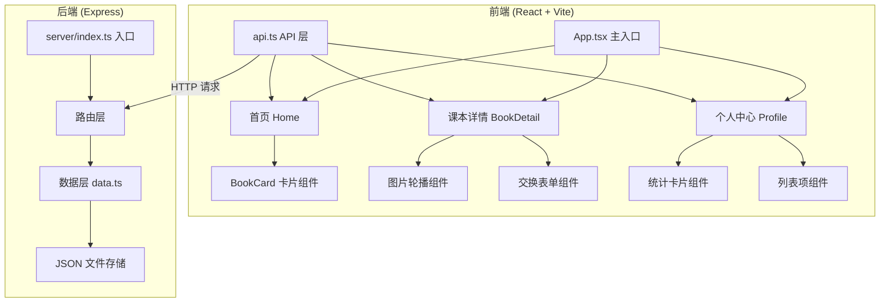
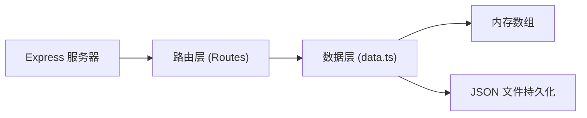
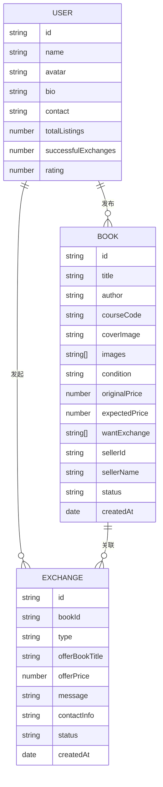

## 1. 架构设计



## 2. 技术说明

- 前端框架：React 18 + TypeScript
- 构建工具：Vite 5
- 后端框架：Express 4
- 数据存储：内存数组 + JSON 文件持久化
- 状态管理：React useState/useReducer（轻量级场景）
- HTTP 客户端：原生 fetch API 封装
- 样式方案：CSS Modules + CSS 变量
- 图标库：lucide-react

## 3. 路由定义

| 路由路径 | 页面用途 |
|---------|---------|
| `/` | 首页 - 课本瀑布流展示 |
| `/book/:id` | 课本详情页（从右侧滑入） |
| `/profile` | 个人中心 - 发布历史、交换记录、收藏 |

## 4. API 定义

### 4.1 课本相关

```typescript
interface Book {
  id: string;
  title: string;
  author: string;
  courseCode: string;
  coverImage: string;
  images: string[];
  condition: '全新' | '九成新' | '八成新' | '七成新' | '一般';
  originalPrice: number;
  expectedPrice?: number;
  wantExchange?: string[];
  sellerId: string;
  sellerName: string;
  sellerAvatar: string;
  sellerBio: string;
  contactInfo: string;
  status: 'active' | 'sold' | 'exchanged' | 'offline';
  createdAt: string;
}
```

| API 路径 | 方法 | 描述 | 请求参数 | 响应格式 |
|---------|------|------|---------|---------|
| `/api/books` | GET | 获取课本列表 | `page`, `limit`, `sort` | `{ books: Book[], total: number }` |
| `/api/books/:id` | GET | 获取单本课本详情 | - | `Book` |
| `/api/books` | POST | 发布新课本 | `Book` 数据 | `{ id: string }` |
| `/api/books/:id` | PUT | 更新课本信息 | 部分 `Book` 字段 | `{ success: boolean }` |
| `/api/books/:id` | DELETE | 删除课本 | - | `{ success: boolean }` |

### 4.2 交换相关

```typescript
interface ExchangeRequest {
  id: string;
  bookId: string;
  type: 'exchange' | 'buy';
  offerBookTitle?: string;
  offerBookAuthor?: string;
  offerPrice?: number;
  message: string;
  contactInfo: string;
  status: 'pending' | 'accepted' | 'rejected' | 'completed';
  createdAt: string;
}
```

| API 路径 | 方法 | 描述 | 请求参数 | 响应格式 |
|---------|------|------|---------|---------|
| `/api/exchanges` | POST | 发起交换请求 | `ExchangeRequest` | `{ id: string }` |
| `/api/exchanges/:id` | GET | 获取交换请求详情 | - | `ExchangeRequest` |

## 5. 服务端架构图



## 6. 数据模型

### 6.1 数据模型定义



### 6.2 数据文件结构

- `server/data/books.json` - 课本数据
- `server/data/exchanges.json` - 交换记录
- `server/data/users.json` - 用户数据（演示版用默认用户）

## 7. 前端组件结构

```
src/
├── api.ts              # API 调用封装
├── App.tsx             # 主应用组件，路由管理
├── main.tsx            # React 入口
├── index.css           # 全局样式
├── components/
│   ├── BookCard.tsx    # 课本卡片组件
│   ├── BookDetail.tsx  # 课本详情组件
│   ├── Navbar.tsx      # 导航栏组件
│   ├── ExchangeForm.tsx # 交换表单组件
│   └── StatCard.tsx    # 统计卡片组件
└── pages/
    ├── Home.tsx        # 首页
    └── Profile.tsx     # 个人中心页
```
