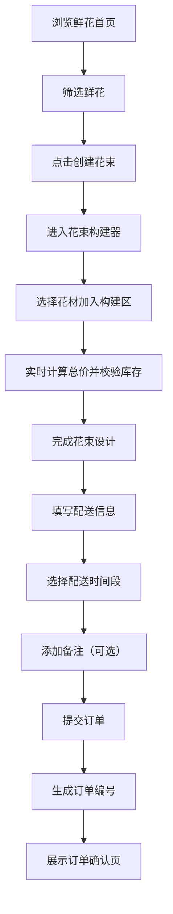

## 1. 产品概述

本产品为社区花店在线订购平台，帮助周边居民便捷浏览鲜花品种、自定义组合花束并预约配送时间。解决了传统花店线下选购不便、花束组合缺乏灵活性、配送预约流程繁琐等问题，为用户提供一站式鲜花订购体验。

- 主要用途：在线浏览鲜花、自定义花束、预约配送、订单管理
- 目标用户：社区周边居民、需要送花的顾客
- 产品价值：提升花店运营效率，为用户提供便捷、个性化的鲜花订购服务

## 2. 核心功能

### 2.1 用户角色

| 角色 | 注册方式 | 核心权限 |
|------|---------|---------|
| 普通用户 | 无需注册，直接使用 | 浏览鲜花、创建花束、提交订单、查看订单确认 |

### 2.2 功能模块

1. **首页（鲜花浏览页）**：鲜花网格展示、分类筛选、价格区间筛选、创建花束入口
2. **花束构建页**：花材选择区、构建预览区、实时价格计算、库存校验
3. **订单确认页**：配送信息填写、时间预约、备注添加、订单提交、订单摘要展示

### 2.3 页面详情

| 页面名称 | 模块名称 | 功能描述 |
|---------|---------|---------|
| 首页 | 鲜花网格展示 | 三列布局展示鲜花卡片，包含高清缩略图、花名、价格、库存 |
| 首页 | 筛选功能 | 按花种类（玫瑰/百合/郁金香/混合）和价格区间筛选，带过渡动画 |
| 花束构建页 | 花材选择区 | 左侧展示可选鲜花列表，点击加入构建区 |
| 花束构建页 | 构建预览区 | 中间展示已选花材数量和布置预览，按比例缩小显示 |
| 花束构建页 | 价格计算区 | 右侧实时显示总价，库存不足时弹出提示 |
| 订单确认页 | 配送表单 | 填写收货地址、选择配送时间段（当天/第二天，9-12/14-18）、特殊备注 |
| 订单确认页 | 订单提交 | 提交后生成订单编号，跳转确认页展示订单摘要 |

## 3. 核心流程

用户在首页浏览鲜花，可通过筛选功能快速找到心仪花材。点击"创建花束"进入构建器，从左侧花材列表选择鲜花加入构建区，系统实时计算总价并校验库存。完成花束设计后进入订单确认页，填写配送信息和预约时间，提交订单后生成订单编号并展示预计配送时段。

## 4. 用户界面设计

### 4.1 设计风格

- **主色调**：浅粉色（#FFE4E6）、米白色（#FFFBEB）、浅绿色（#ECFDF5）渐变
- **辅助色**：玫瑰色（#F43F5E）用于边框高亮和重要按钮
- **按钮风格**：胶囊形状（圆角-full），悬停时有上浮效果和阴影加深
- **卡片风格**：轻微圆角（圆角-lg），带柔和阴影，悬停上浮并加深阴影
- **字体**：使用优雅的衬线字体作为标题，清晰的无衬线字体作为正文
- **布局风格**：卡片式布局，充足的留白，柔和的渐变背景
- **动画效果**：淡入上浮动效、弹性动画、平滑过渡

### 4.2 页面设计概述

| 页面名称 | 模块名称 | UI元素 |
|---------|---------|--------|
| 首页 | 顶部导航 | 花店logo、分类筛选胶囊按钮、价格区间滑块 |
| 首页 | 鲜花网格 | 三列卡片布局，卡片含图片、花名、价格、库存标签 |
| 花束构建页 | 三栏布局 | 左侧花材列表（60%宽度）、中间构建预览区、右侧价格面板（40%宽度） |
| 花束构建页 | 构建区 | 拖拽花材时有弹性动画，已选花材按比例缩小展示 |
| 订单确认页 | 表单区域 | 输入框获得焦点时边框高亮为玫瑰色，时间段选择使用优雅的按钮组 |
| 订单确认页 | 订单摘要 | 卡片式展示花束内容、配送信息、预计送达时间 |

### 4.3 响应式

- **桌面端**：首页三列网格，构建器左右两栏（60%/40%）
- **平板端**：首页两列网格，构建器保持左右布局
- **移动端**：首页单列布局，构建器上下堆叠，表单全宽显示
- **触摸优化**：按钮最小尺寸44x44px，足够的触控间距

### 4.4 性能要求

- 所有列表渲染和筛选操作响应时间低于200ms
- 花束构建器中的价格计算在每次选择变化后50ms内更新
- 图片使用合适尺寸并做懒加载处理
