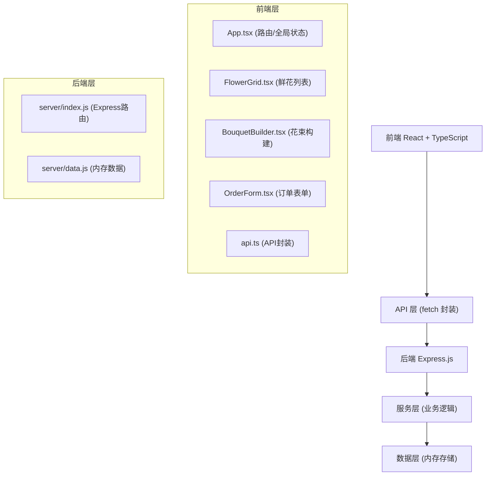
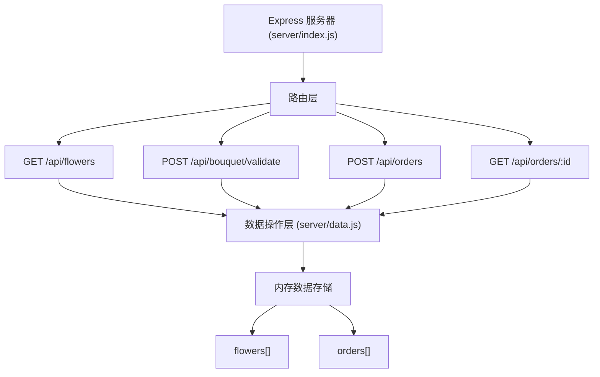
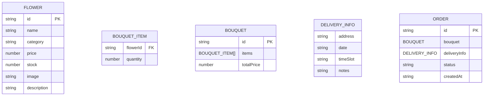

## 1. 架构设计



## 2. 技术描述

- **前端**：React@18 + TypeScript + Vite
- **后端**：Express@4
- **HTTP客户端**：原生 fetch API 封装
- **数据存储**：内存数据存储（server/data.js）
- **唯一ID生成**：uuid
- **跨域处理**：cors
- **构建工具**：Vite
- **开发服务器**：Vite dev server（前端）+ Node.js（后端）

## 3. 路由定义

| 路由 | 用途 |
|------|------|
| / | 首页 - 鲜花浏览与筛选 |
| /builder | 花束构建器 |
| /order | 订单确认与提交 |
| /order/:id | 订单详情页 |

## 4. API 定义

### TypeScript 类型定义

```typescript
// 鲜花类型
interface Flower {
  id: string;
  name: string;
  category: 'rose' | 'lily' | 'tulip' | 'mixed';
  price: number;
  stock: number;
  image: string;
  description: string;
}

// 花束项
interface BouquetItem {
  flowerId: string;
  quantity: number;
  flower: Flower;
}

// 花束
interface Bouquet {
  id: string;
  items: BouquetItem[];
  totalPrice: number;
}

// 配送信息
interface DeliveryInfo {
  address: string;
  date: 'today' | 'tomorrow';
  timeSlot: '9-12' | '14-18';
  notes: string;
}

// 订单
interface Order {
  id: string;
  bouquet: Bouquet;
  deliveryInfo: DeliveryInfo;
  status: 'pending' | 'confirmed' | 'delivered';
  createdAt: string;
}

// API 响应
interface ApiResponse<T> {
  data?: T;
  error?: string;
  success: boolean;
}
```

### API 端点

| 方法 | 路径 | 描述 | 请求体 | 响应 |
|------|------|------|--------|------|
| GET | /api/flowers | 获取所有鲜花 | - | Flower[] |
| GET | /api/flowers?category=&minPrice=&maxPrice= | 筛选鲜花 | query参数 | Flower[] |
| POST | /api/bouquet/validate | 校验花束库存 | { items: BouquetItem[] } | { valid: boolean, message?: string } |
| POST | /api/orders | 创建订单 | { bouquet: Bouquet, deliveryInfo: DeliveryInfo } | Order |
| GET | /api/orders/:id | 获取订单详情 | - | Order |

## 5. 服务器架构



## 6. 数据模型

### 6.1 数据模型定义



### 6.2 初始数据

```javascript
// server/data.js 中的初始鲜花数据
const flowers = [
  {
    id: '1',
    name: '红玫瑰',
    category: 'rose',
    price: 12,
    stock: 50,
    image: '...',
    description: '热情似火的红玫瑰，代表真挚的爱情'
  },
  // ... 更多鲜花数据
];
```

## 7. 项目文件结构

```
auto33/
├── package.json
├── vite.config.ts
├── tsconfig.json
├── index.html
├── src/
│   ├── App.tsx
│   ├── main.tsx
│   ├── index.css
│   ├── components/
│   │   ├── FlowerGrid.tsx
│   │   ├── BouquetBuilder.tsx
│   │   ├── OrderForm.tsx
│   │   ├── FlowerCard.tsx
│   │   └── OrderSummary.tsx
│   ├── api/
│   │   └── api.ts
│   ├── types/
│   │   └── index.ts
│   └── hooks/
│       └── useBouquet.ts
├── server/
│   ├── index.js
│   └── data.js
└── .trae/
    └── documents/
        ├── prd.md
        └── tech-arch.md
```
