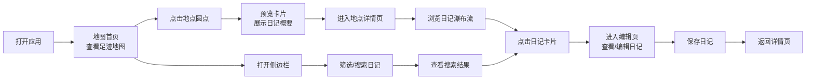

## 1. 产品概述

旅行日记是一款轻量化的旅行记录与分享应用，帮助旅行者以地图为核心记录每一段旅途见闻，解决传统日记本无法自动关联地理信息、不能直观在地图上回顾足迹的痛点。

- 核心价值：让旅行回忆地理可视化，足迹一目了然
- 目标用户：热爱旅行、喜欢记录生活的用户群体
- 产品定位：个人旅行足迹地图与日记管理工具

## 2. 核心功能

### 2.1 功能模块

1. **地图首页**：交互式世界地图、日记地点标记、地点预览卡片
2. **地点详情页**：日记瀑布流列表、分页加载、日记卡片展示
3. **日记编辑页**：照片轮播、富文本编辑、心情标签、保存功能
4. **搜索侧边栏**：日期范围筛选、心情标签筛选、关键词搜索、搜索结果列表

### 2.2 页面详情

| 页面名称 | 模块名称 | 功能描述 |
|-----------|-------------|---------------------|
| 地图首页 | 交互式地图 | 以用户位置为中心，支持拖拽、缩放，彩色圆点标注日记地点，圆点大小表示日记数量 |
| 地图首页 | 地点预览卡片 | 点击圆点弹出，展示第一篇日记标题、缩略图、日期，点击进入详情页 |
| 地点详情页 | 瀑布流列表 | 展示该地点所有日记，卡片淡入上浮动画，0.3秒错峰延迟 |
| 地点详情页 | 日记卡片 | 主图、标题、摘要、心情emoji，悬停上移加深阴影 |
| 日记编辑页 | 照片轮播 | 左右滑动切换，带指示点 |
| 日记编辑页 | 富文本编辑 | 支持插入标题、段落、分割线 |
| 日记编辑页 | 浮动保存按钮 | 点击显示加载旋转图标，保存成功弹出绿色toast |
| 搜索侧边栏 | 筛选功能 | 按日期范围、心情标签、关键词搜索，清空按钮 |

## 3. 核心流程

## 4. 用户界面设计

### 4.1 设计风格

- **主色调**：暖色调大地色系（驼色 #C4A574、赭石 #8B6914、米白 #FAF6F0）
- **辅色调**：柔和点缀色（日落橙 #E07A5F、 Sage绿 #81B29A、天空蓝 #3D405B）
- **卡片样式**：毛玻璃效果（背景模糊 backdrop-filter: blur(16px) + 半透明白色 rgba(255,255,255,0.75)）
- **按钮风格**：圆角设计，悬停轻微上浮（translateY(-2px)）和阴影加深
- **字体**：使用 Playfair Display 作为标题字体（优雅复古），DM Sans 作为正文字体（现代易读）
- **图标风格**：线性风格图标，配合 emoji 表达心情

### 4.2 页面设计概述

| 页面名称 | 模块名称 | UI 元素 |
|-----------|-------------|-------------|
| 地图首页 | 地图区域 | 全屏 Leaflet 地图，暖色调地图样式，彩色渐变圆点标记 |
| 地图首页 | 预览卡片 | 毛玻璃卡片，圆角 16px，阴影柔和，淡入动画 |
| 地点详情页 | 页头 | 地点名称、日记数量、返回按钮 |
| 地点详情页 | 瀑布流 | 两列布局，卡片错落排列，底部迷你进度条 |
| 日记编辑页 | 轮播区 | 图片滑动切换，底部指示点，左滑右滑手势 |
| 日记编辑页 | 编辑区 | 工具栏（标题/段落/分割线），文本编辑框，浮动保存按钮 |
| 搜索侧边栏 | 筛选面板 | 日期选择器、心情标签云、搜索框、结果列表 |

### 4.3 动画效果

- **页面切换**：向左滑动过渡动画（translateX 从 100% 到 0，opacity 从 0 到 1）
- **卡片进入**：从底部淡入上浮（translateY 从 20px 到 0，opacity 从 0 到 1），0.3秒错峰延迟
- **悬停效果**：卡片上移 4px，阴影加深，过渡 0.2s ease-out
- **加载状态**：底部迷你进度条动画（宽度从 0 到 100% 循环）
- **保存按钮**：点击后变为旋转加载图标，成功后绿色对勾 + toast 提示

### 4.4 性能要求

- 瀑布流虚拟滚动，保持 60fps
- 地图标注超过 500 个点时，帧率不低于 30fps
- 图片懒加载，优化内存使用

## 5. 技术架构概览

- **前端框架**：React 18 + TypeScript
- **构建工具**：Vite
- **地图组件**：Leaflet + react-leaflet
- **状态管理**：Zustand（DiaryStore）
- **样式方案**：TailwindCSS 3 + CSS 变量
- **数据存储**：localStorage 持久化
- **路由管理**：React Router DOM
