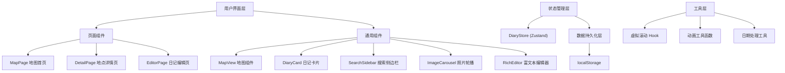
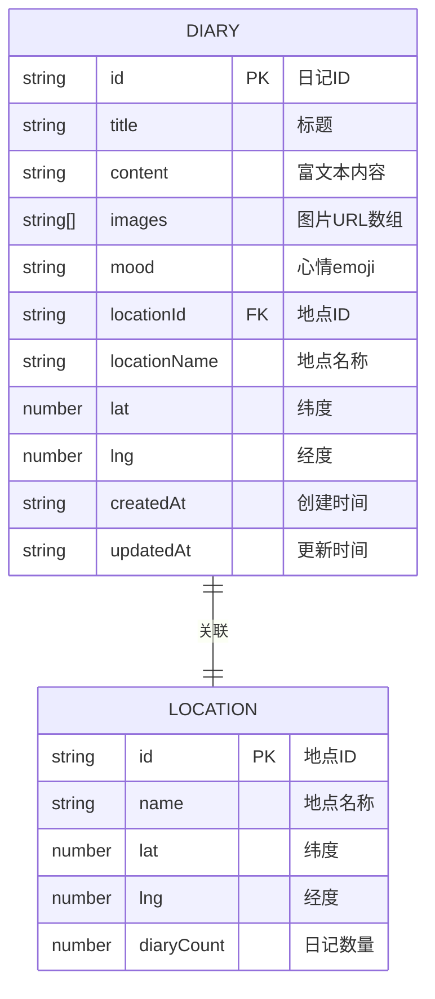

## 1. 架构设计



## 2. 技术描述

- **前端框架**：React 18 + TypeScript
- **构建工具**：Vite 5
- **地图库**：Leaflet 1.9 + react-leaflet 4.2
- **状态管理**：Zustand 4.5
- **路由管理**：React Router DOM 6
- **样式方案**：TailwindCSS 3.4 + CSS 自定义属性
- **图标库**：Lucide React
- **唯一ID**：uuid 9.0
- **数据存储**：浏览器 localStorage（无后端）

## 3. 路由定义

| 路由 | 用途 |
|-------|---------|
| `/` | 地图首页，展示交互式世界地图和日记地点标记 |
| `/location/:locationId` | 地点详情页，展示该地点所有日记的瀑布流列表 |
| `/diary/:diaryId` | 日记编辑页，查看或编辑单篇日记 |
| `/diary/new` | 创建新日记 |

## 4. 数据模型

### 4.1 数据模型定义



### 4.2 TypeScript 类型定义

```typescript
interface Diary {
  id: string;
  title: string;
  content: string;
  images: string[];
  mood: string;
  locationId: string;
  locationName: string;
  lat: number;
  lng: number;
  createdAt: string;
  updatedAt: string;
}

interface Location {
  id: string;
  name: string;
  lat: number;
  lng: number;
  diaryCount: number;
}

interface SearchFilters {
  startDate?: string;
  endDate?: string;
  mood?: string;
  keyword?: string;
}
```

## 5. 文件结构

```
src/
├── components/
│   ├── MapView.tsx          # 地图组件，Leaflet 封装
│   ├── DiaryCard.tsx        # 日记卡片组件
│   ├── SearchSidebar.tsx    # 搜索侧边栏组件
│   ├── ImageCarousel.tsx    # 照片轮播组件
│   ├── RichEditor.tsx       # 富文本编辑器组件
│   ├── LocationPopup.tsx    # 地点预览弹窗
│   ├── Toast.tsx            # Toast 提示组件
│   └── LoadingBar.tsx       # 加载进度条组件
├── pages/
│   ├── MapPage.tsx          # 地图首页
│   ├── DetailPage.tsx       # 地点详情页
│   └── EditorPage.tsx       # 日记编辑页
├── data/
│   └── DiaryStore.ts        # Zustand 状态管理 + 数据操作
├── hooks/
│   ├── useVirtualScroll.ts  # 虚拟滚动 Hook
│   └── useDebounce.ts       # 防抖 Hook
├── utils/
│   ├── animations.ts        # 动画工具函数
│   ├── dateUtils.ts         # 日期处理工具
│   └── mockData.ts          # Mock 数据生成
├── types/
│   └── index.ts             # 类型定义
├── styles/
│   └── globals.css          # 全局样式和 CSS 变量
├── App.tsx                  # 应用根组件
├── main.tsx                 # 入口文件
└── router.tsx               # 路由配置
```

## 6. 核心模块设计

### 6.1 DiaryStore 数据管理

```typescript
// 核心方法
interface DiaryStore {
  diaries: Diary[];
  locations: Location[];
  selectedLocationId: string | null;
  searchFilters: SearchFilters;
  searchResults: Diary[];
  
  // CRUD 操作
  addDiary: (diary: Omit<Diary, 'id' | 'createdAt' | 'updatedAt'>) => void;
  updateDiary: (id: string, updates: Partial<Diary>) => void;
  deleteDiary: (id: string) => void;
  getDiaryById: (id: string) => Diary | undefined;
  
  // 查询操作
  getDiariesByLocation: (locationId: string) => Diary[];
  searchDiaries: (filters: SearchFilters) => Diary[];
  clearSearch: () => void;
  
  // 持久化
  saveToLocalStorage: () => void;
  loadFromLocalStorage: () => void;
}
```

### 6.2 MapView 地图组件

- 使用 `useMap` hook 管理 Leaflet 地图实例
- 自定义 CircleMarker 组件，根据日记数量动态调整半径和颜色
- 监听 zoom 事件，平滑更新标记大小
- 点击标记触发回调，传递 locationId

### 6.3 虚拟滚动实现

- `useVirtualScroll` hook 计算可见区域的卡片索引
- 只渲染可视区域内的 DOM 节点
- 使用 `IntersectionObserver` 监听滚动
- 预留缓冲区避免滚动时闪烁

## 7. 性能优化策略

1. **地图性能**：
   - 使用 Canvas 渲染标记（preferCanvas: true）
   - 标记聚类（MarkerCluster）处理超过 500 个点的场景
   - 防抖处理 zoom 事件

2. **瀑布流性能**：
   - 虚拟滚动减少 DOM 节点
   - 图片懒加载（loading="lazy"）
   - 使用 `content-visibility: auto` 优化离屏渲染

3. **动画性能**：
   - 使用 `transform` 和 `opacity` 实现硬件加速动画
   - 避免布局抖动（Layout Thrashing）
   - 使用 `will-change` 提示浏览器优化

## 8. 初始化数据

应用首次加载时生成 Mock 数据，包含：
- 20+ 个全球热门旅行地点
- 50+ 篇示例日记
- 覆盖不同心情标签和日期范围
