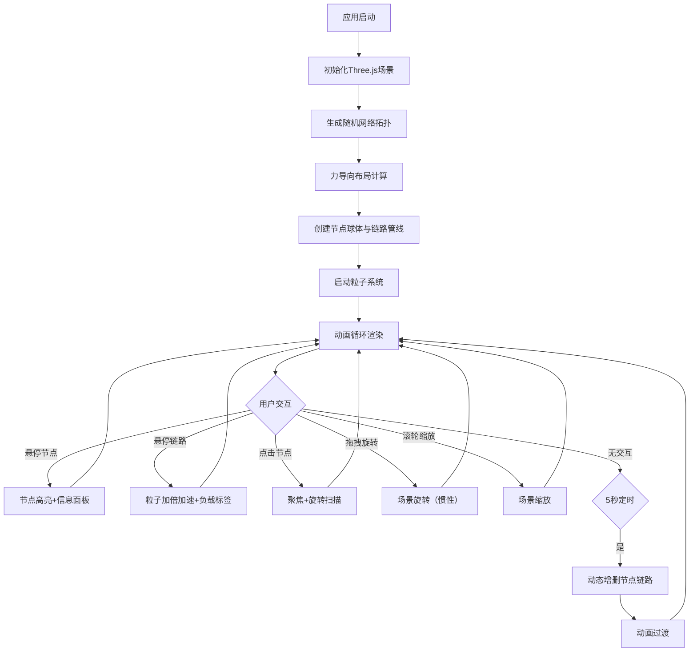

## 1. 产品概述

动态数据流3D网络拓扑可视化应用，用于实时展示网络节点之间的流量变化和链路状态。基于Three.js构建沉浸式太空主题3D场景，支持力导向布局、数据流粒子动画、节点交互和动态拓扑更新。

- 目标用户：网络运维工程师、系统管理员、网络架构师
- 核心价值：以直觉化3D可视化方式呈现复杂网络拓扑与实时流量，帮助用户快速识别网络瓶颈与异常链路

## 2. 核心功能

### 2.1 功能模块

1. **3D网络拓扑渲染**：随机生成15-20个节点（路由器/服务器/终端），半透明发光球体，力导向布局，弯曲管状连线
2. **数据流粒子动画**：沿链路流动的彩色粒子（TCP/UDP/ICMP），拖尾淡出效果，悬停交互
3. **节点交互与信息展示**：悬停高亮放大、信息面板、点击聚焦旋转扫描
4. **动态拓扑更新**：每5秒增删节点和链路，飞入/缩小动画，粒子重路由
5. **性能监控面板**：FPS/节点数/链路数/平均延迟/粒子数，玻璃毛玻璃风格，可拖拽折叠

### 2.2 页面详情

| 页面名称 | 模块名称 | 功能描述 |
|----------|----------|----------|
| 主场景 | 3D拓扑渲染 | 15-20个发光球体节点，弯曲管状连线，力导向布局，鼠标旋转缩放 |
| 主场景 | 粒子动画 | TCP蓝色/UDP橙色/ICMP红色粒子沿链路流动，拖尾淡出，悬停加速加倍 |
| 主场景 | 节点交互 | 悬停高亮1.2倍放大+信息面板，点击聚焦+自动旋转扫描+其他节点半透明化 |
| 主场景 | 动态更新 | 每5秒增删节点链路，飞入弹跳动画，缩小淡出，粒子平滑重路由 |
| 主场景 | 监控面板 | 右下角悬浮毛玻璃面板，FPS/节点数/链路数/延迟/粒子数，可拖拽可折叠，FPS<30红色警告 |

## 3. 核心流程

## 4. 用户界面设计

### 4.1 设计风格

- 主色调：深色太空主题，背景渐变 #0a0a2e → #1a1a3e
- 节点颜色：路由器蓝色 (#4488ff)、服务器绿色 (#44ff88)、终端紫色 (#aa44ff)
- 链路颜色：红渐变到蓝（负载率高→低）
- 粒子颜色：TCP蓝色、UDP橙色、ICMP红色
- 字体：monospace风格白色文字
- UI风格：毛玻璃效果（半透明+模糊），圆角矩形
- 动画：0.3秒弹性缩放过渡
- 后期处理：Bloom发光效果
- 场景装饰：静态星光粒子

### 4.2 页面设计概览

| 页面名称 | 模块名称 | UI元素 |
|----------|----------|--------|
| 主场景 | 背景 | 渐变色#0a0a2e→#1a1a3e，散布星光粒子 |
| 主场景 | 节点 | 半透明发光球体，颜色代表类型，大小代表处理能力 |
| 主场景 | 链路 | 半透明弯曲管状连线，颜色渐变表示负载 |
| 主场景 | 信息面板 | 节点上方弹出，毛玻璃圆角矩形，显示名称/IP/速率/连接数 |
| 主场景 | 负载标签 | 链路悬停显示，毛玻璃圆角矩形，显示负载百分比 |
| 主场景 | 监控面板 | 右下角悬浮，毛玻璃风格，可拖拽，可折叠（折叠为圆形图标） |

### 4.3 响应式

- Canvas始终全屏填充
- 响应式适配不同屏幕比例
- 窗口resize时自动更新相机和渲染器

### 4.4 3D场景指引

- 环境：深空星域氛围，深蓝紫色调
- 灯光：环境光+点光源，柔和光照
- 相机：透视相机，支持OrbitControls旋转缩放，点击聚焦时平滑过渡
- 构图：力导向布局节点分布，星光粒子背景
- 交互：鼠标悬停检测（Raycaster）、点击聚焦、拖拽旋转
- 动画：粒子流动、节点飞入弹跳、缩小淡出、高亮放大
- 后期处理：UnrealBloomPass发光效果
- 性能预算：50节点+100链路+2000粒子，FPS≥45
