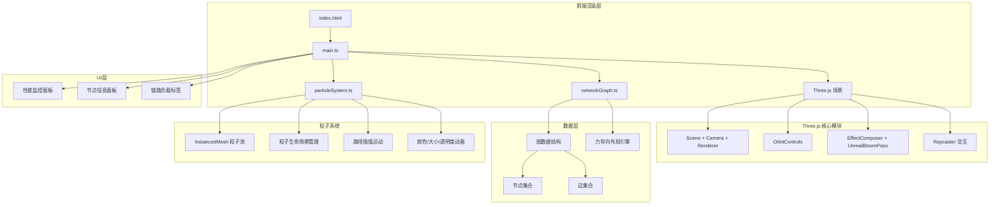

## 1. 架构设计



## 2. 技术说明

- 前端：TypeScript + Three.js + Vite（纯前端，无后端）
- 构建工具：Vite
- 3D引擎：Three.js
- 后期处理：EffectComposer + UnrealBloomPass
- 交互：OrbitControls + Raycaster
- 粒子系统：InstancedMesh几何体实例化
- 布局算法：力导向布局（自定义实现）
- 无后端，所有数据模拟生成

## 3. 路由定义

| 路由 | 用途 |
|------|------|
| / | 单页面应用，全屏3D网络拓扑可视化 |

## 4. 文件结构

```
├── package.json          # 依赖：three, typescript, vite, @types/three
├── vite.config.ts        # 基础Vite配置
├── tsconfig.json         # 严格模式，ES模块
├── index.html            # 入口页面，全屏canvas
└── src/
    ├── main.ts           # 初始化场景、相机、渲染器，灯光，动画循环
    ├── networkGraph.ts   # 图数据结构，节点/边生成与更新，力导向布局
    └── particleSystem.ts # 粒子动画，数据包路径流动，粒子生命周期
```

## 5. 数据模型

### 5.1 核心数据类型

```typescript
interface NetworkNode {
  id: string;
  name: string;
  ip: string;
  type: 'router' | 'server' | 'terminal';
  processingRate: number; // Mbps
  connections: number;
  position: THREE.Vector3;
  targetPosition: THREE.Vector3;
  mesh: THREE.Mesh;
  scale: number;
  opacity: number;
  state: 'idle' | 'hovered' | 'selected' | 'entering' | 'leaving';
}

interface NetworkEdge {
  id: string;
  source: string;
  target: string;
  load: number; // 0-1
  curve: THREE.CatmullRomCurve3;
  tubeMesh: THREE.Mesh;
  particles: ParticleData[];
  state: 'active' | 'highlighted' | 'leaving';
}

interface ParticleData {
  edgeId: string;
  progress: number; // 0-1 along curve
  speed: number;
  size: number;
  type: 'TCP' | 'UDP' | 'ICMP';
  life: number; // 0-1
  color: THREE.Color;
}
```

## 6. 性能优化策略

- **InstancedMesh**：粒子系统使用InstancedMesh，单次draw call渲染全部粒子
- **力导向布局节流**：每帧最多计算一次，避免阻塞主线程
- **对象池**：节点和粒子复用Three.js对象，减少GC压力
- **LOD策略**：远距离节点降低几何体精度
- **Bloom参数调优**：控制发光计算范围，避免过度后处理开销
