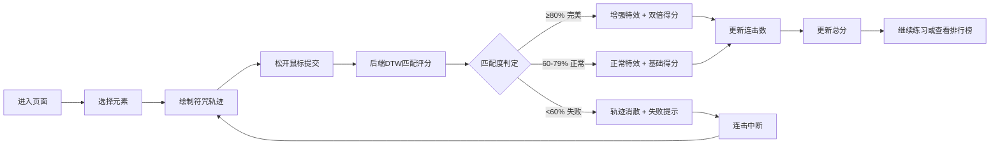

## 1. 产品概述

魔法符咒手势训练游戏是一款基于Web的3D互动训练应用，让魔法学院学员通过鼠标绘制符咒轨迹来安全地练习火、水、风、雷四种元素法术。系统实时识别手势并给予评分，触发炫酷的元素特效，提供沉浸式的魔法学习体验。

- **核心价值**：将传统枯燥危险的符咒练习转化为安全有趣的虚拟训练
- **目标用户**：魔法学院学员、手势交互爱好者、游戏玩家
- **市场定位**：融合教育与娱乐的沉浸式Web3D应用

## 2. 核心功能

### 2.1 用户角色

| 角色 | 注册方式 | 核心权限 |
|------|----------|----------|
| 练习学员 | 输入昵称即可 | 绘制符咒、查看评分、浏览排行榜 |

### 2.2 功能模块

1. **手势绘制模块**：鼠标轨迹采集、实时绘制显示、光影拖尾效果
2. **评分系统模块**：DTW轨迹匹配、元素类型识别、评分等级判定
3. **元素特效模块**：Three.js 3D粒子系统、四元素专属特效
4. **元素切换模块**：四元素图标选择、相克机制、每日克制加成
5. **连击系统模块**：连击计数、连击特效、连击分数加成
6. **排行榜模块**：最高分记录、前十名展示、新纪录特效

### 2.3 页面详情

| 页面名称 | 模块名称 | 功能描述 |
|----------|----------|----------|
| 主训练页面 | 画布区域 | 80%宽度主画布，支持鼠标绘制符咒，显示轨迹和3D特效 |
| 主训练页面 | 左侧面板 | 显示当前元素图标、连击数及连击动画 |
| 主训练页面 | 右侧面板 | 显示环形评分进度条、排行榜入口按钮 |
| 主训练页面 | 底部元素栏 | 四个元素图标切换，带动画效果和背景渐变 |
| 排行榜弹窗 | 排行榜列表 | 显示前十名昵称和分数，错峰淡入动画 |

## 3. 核心流程

用户进入页面后选择元素，在画布上按住鼠标绘制符咒轨迹，松开后系统自动将轨迹发送至后端进行DTW匹配评分，根据匹配度触发对应元素特效并更新分数和连击数。练习结束后可查看排行榜。

## 4. 用户界面设计

### 4.1 设计风格

**神秘魔法学院风格**
- **主色调**：深紫色(#1a0a2e)到黑色(#0a0510)径向渐变背景
- **元素色**：火(橙红#ff6b35)、水(冰蓝#4fc3f7)、风(翠绿#66bb6a)、雷(紫白#b388ff)
- **强调色**：金色#ffd700用于排行榜和完美评分
- **字体**：Cinzel Decorative（标题，魔法感衬线）+ Noto Sans SC（正文）
- **按钮风格**：半透明玻璃态，元素色发光边框，悬浮缩放效果
- **布局风格**：非对称布局，主画布居中，左右面板悬浮
- **视觉效果**：星空粒子背景、轨迹光影拖尾、光晕跟随鼠标

### 4.2 页面设计概述

| 页面名称 | 模块名称 | UI元素 |
|----------|----------|---------|
| 主训练页面 | 画布区域 | 80%宽度，深紫渐变背景，星空粒子闪烁，荧光线轨迹 |
| 主训练页面 | 左侧面板 | 元素大图标、连击数字脉冲动画、5连击后环绕特效 |
| 主训练页面 | 右侧面板 | 环形进度条（红→绿渐变）、排行榜入口按钮 |
| 主训练页面 | 底部元素栏 | 四个元素图标，缩放弹跳切换动画，背景色渐变过渡 |
| 主训练页面 | 评分提示 | 淡入上浮动画，画布中央显示 |
| 排行榜弹窗 | 排行榜列表 | 半透明玻璃面板，条目错峰淡入上浮，金色第一名称号 |

### 4.3 响应性

- **桌面端（>768px）**：横向布局，主画布80%宽度居中，左右面板悬浮两侧
- **移动端（≤768px）**：纵向堆叠布局，画布100%宽度，面板移至上下方
- **触摸优化**：支持触摸绘制，增大点击热区，调整字体大小

### 4.4 3D场景指导

- **环境/HDRI**：纯黑背景配合星空粒子，营造魔法空间感
- **光照设置**：环境光(0.3) + 四元素色点光源随特效动态变化
- **相机设置**：固定正交相机，正对画布平面
- **交互与动画**：
  - 火焰特效：粒子向上喷射，湍流扰动，橙黄渐变
  - 水波特效：环形波纹扩散，半透明蓝色，折射率变化
  - 旋风特效：螺旋粒子旋转上升，绿色渐变，尾迹拉长
  - 雷电特效：随机分支闪电，紫白色，频闪效果
- **后处理效果**：Bloom泛光效果增强元素发光感
- **性能约束**：同时不超过50个粒子系统，帧率稳定50FPS以上
