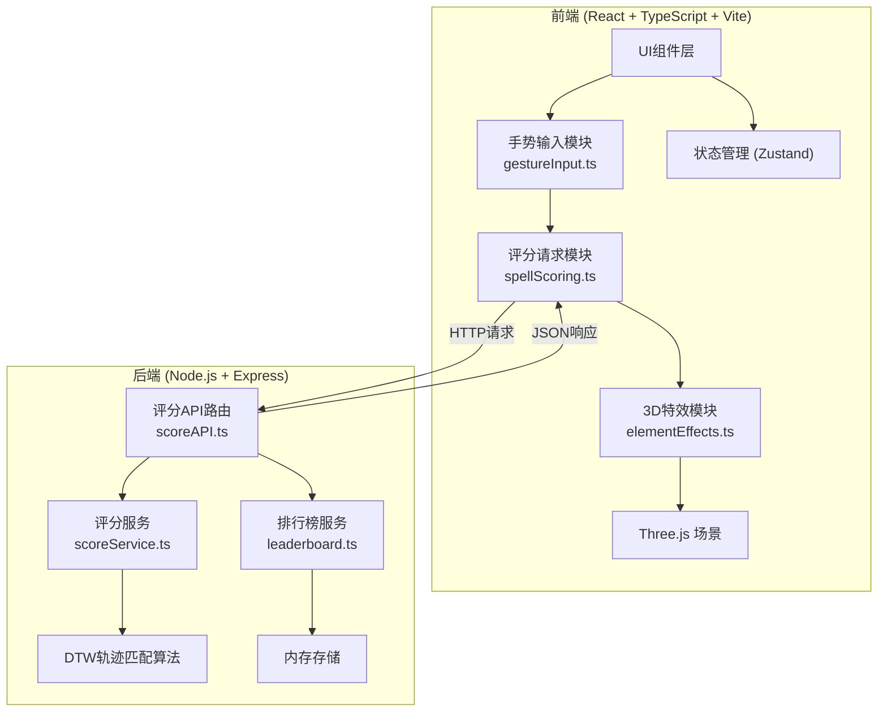
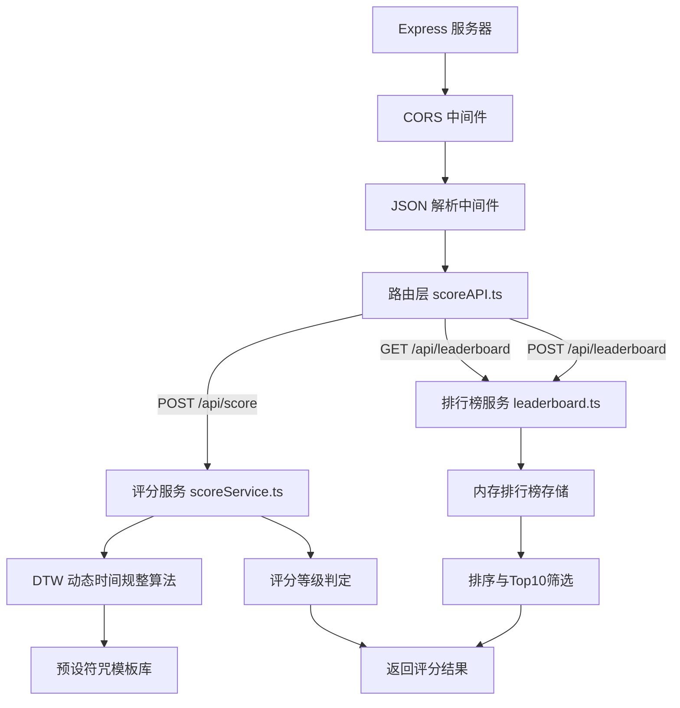
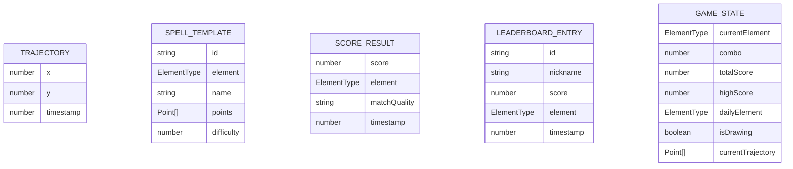

## 1. 架构设计



## 2. 技术描述

- **前端**：React@18 + TypeScript + Vite + Three.js + Zustand + TailwindCSS@3
- **后端**：Express@4 + TypeScript + DTW算法
- **构建工具**：Vite@5
- **状态管理**：Zustand
- **3D引擎**：Three.js @0.160.0 + @types/three
- **图标库**：lucide-react
- **HTTP客户端**：Fetch API
- **跨域处理**：cors@2.8.5
- **唯一标识**：uuid@9.0.0

## 3. 路由定义

| 路由 | 目的 |
|------|------|
| / | 主训练页面 |
| POST /api/score | 提交轨迹获取评分 |
| GET /api/leaderboard | 获取排行榜数据 |
| POST /api/leaderboard | 提交分数到排行榜 |

## 4. API 定义

### 4.1 评分请求

```typescript
// 请求
interface ScoreRequest {
  trajectory: Point[];
  element: ElementType;
}

interface Point {
  x: number;
  y: number;
  timestamp: number;
}

type ElementType = 'fire' | 'water' | 'wind' | 'thunder';

// 响应
interface ScoreResponse {
  score: number;           // 0-100
  element: ElementType;
  matchQuality: 'perfect' | 'normal' | 'fail';
  message: string;
}
```

### 4.2 排行榜请求

```typescript
// GET /api/leaderboard 响应
interface LeaderboardResponse {
  rankings: LeaderboardEntry[];
}

interface LeaderboardEntry {
  rank: number;
  nickname: string;
  score: number;
  isNewRecord?: boolean;
}

// POST /api/leaderboard 请求
interface LeaderboardSubmitRequest {
  nickname: string;
  score: number;
  element: ElementType;
}

// 响应
interface LeaderboardSubmitResponse {
  success: boolean;
  rank: number;
  isTopTen: boolean;
}
```

## 5. 服务器架构图



## 6. 数据模型

### 6.1 数据模型定义



### 6.2 符咒模板定义

```typescript
// 预设符咒模板（简化坐标）
const spellTemplates: Record<ElementType, SpellTemplate> = {
  fire: {
    id: 'fire-1',
    element: 'fire',
    name: '火焰符咒',
    difficulty: 3,
    points: [
      { x: 0.5, y: 0.2, timestamp: 0 },
      { x: 0.3, y: 0.5, timestamp: 100 },
      { x: 0.5, y: 0.8, timestamp: 200 },
      { x: 0.7, y: 0.5, timestamp: 300 },
      { x: 0.5, y: 0.2, timestamp: 400 },
    ]
  },
  water: {
    id: 'water-1',
    element: 'water',
    name: '水波符咒',
    difficulty: 2,
    points: [
      { x: 0.2, y: 0.5, timestamp: 0 },
      { x: 0.8, y: 0.5, timestamp: 300 },
    ]
  },
  wind: {
    id: 'wind-1',
    element: 'wind',
    name: '旋风符咒',
    difficulty: 4,
    points: [
      { x: 0.5, y: 0.5, timestamp: 0 },
      { x: 0.7, y: 0.3, timestamp: 100 },
      { x: 0.3, y: 0.3, timestamp: 200 },
      { x: 0.3, y: 0.7, timestamp: 300 },
      { x: 0.7, y: 0.7, timestamp: 400 },
      { x: 0.7, y: 0.4, timestamp: 500 },
    ]
  },
  thunder: {
    id: 'thunder-1',
    element: 'thunder',
    name: '雷电符咒',
    difficulty: 5,
    points: [
      { x: 0.5, y: 0.1, timestamp: 0 },
      { x: 0.4, y: 0.3, timestamp: 80 },
      { x: 0.6, y: 0.4, timestamp: 160 },
      { x: 0.35, y: 0.6, timestamp: 240 },
      { x: 0.55, y: 0.75, timestamp: 320 },
      { x: 0.5, y: 0.9, timestamp: 400 },
    ]
  }
};
```

### 6.3 DTW算法实现

```typescript
function dtwDistance(seq1: Point[], seq2: Point[]): number {
  const n = seq1.length;
  const m = seq2.length;
  const dp: number[][] = Array(n + 1).fill(0).map(() => Array(m + 1).fill(Infinity));
  dp[0][0] = 0;
  
  for (let i = 1; i <= n; i++) {
    for (let j = 1; j <= m; j++) {
      const cost = euclideanDistance(seq1[i - 1], seq2[j - 1]);
      dp[i][j] = cost + Math.min(dp[i - 1][j], dp[i][j - 1], dp[i - 1][j - 1]);
    }
  }
  
  return dp[n][m];
}
```
