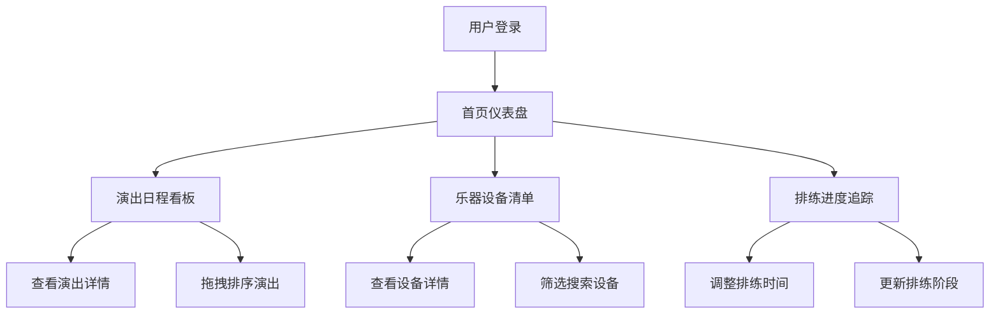

## 1. 产品概述

乐队管理助手（BandManager）是一款面向小型独立乐队和音乐人的综合管理工具，帮助乐队高效管理演出日程、乐器设备库存、排练进度，并实现乐队成员间的信息共享。

- **核心目标**：解决乐队组织混乱、工具分散、沟通效率低下的痛点
- **目标用户**：小型独立乐队成员、独立音乐人、乐队经纪人
- **市场价值**：提供一体化的乐队管理解决方案，提升乐队日常运营效率

## 2. 核心功能

### 2.1 用户角色

| 角色 | 注册方式 | 核心权限 |
|------|----------|----------|
| 乐队成员 | 默认内置 | 查看所有信息、确认演出状态、更新设备状态 |
| 乐队队长 | 默认内置 | 全部权限，包括新增/编辑/删除演出、设备、排练曲目 |

### 2.2 功能模块

1. **首页仪表盘**：统计卡片展示关键数据，快速了解乐队整体状况
2. **演出日程看板**：卡片网格展示演出，支持拖拽排序和详情展开
3. **乐器设备清单**：表格形式管理设备，支持筛选搜索和详情查看
4. **排练进度追踪**：甘特图形式展示排练进度，支持拖拽调整时间

### 2.3 页面详情

| 页面名称 | 模块名称 | 功能描述 |
|----------|----------|----------|
| 首页仪表盘 | 统计卡片 | 展示总演出数、设备总数、排练完成率、待处理事项，数字带计数动画 |
| 演出日程看板 | 演出卡片网格 | 卡片展示日期、场地、城市、成员确认状态，按日期升序排列，支持拖拽排序 |
| 演出日程看板 | 详情面板 | 点击卡片展开，日历时间轴展示当天日程（集合、调音、暖场、演出、结束），可编辑时段 |
| 乐器设备清单 | 设备表格 | 展示设备名称、类型、购买年份、状态，支持类型筛选和关键字搜索 |
| 乐器设备清单 | 详情卡片 | 左侧滑入，展示设备照片、购买凭证、维修记录、出借记录 |
| 排练进度追踪 | 甘特图 | 横轴为周刻度，纵轴为曲目，展示排练阶段，颜色渐变标识进度 |
| 排练进度追踪 | 拖拽调整 | 拖拽修改排练起止时间，自动同步演出日程的排练截止日期 |
| 全局导航 | 侧边栏 | 固定宽度260px，移动端转为底部标签栏，点击主内容区淡入切换 |

## 3. 核心流程

### 3.1 演出管理流程
乐队队长添加演出 → 系统生成演出卡片 → 成员查看并确认出席 → 队长查看确认状态 → 演出当日查看详细日程

### 3.2 设备管理流程
队长录入设备信息 → 设备显示在清单中 → 成员查看设备状态 → 设备出借/维修时更新状态 → 系统记录变更历史

### 3.3 排练管理流程
队长添加排练曲目 → 设置排练阶段和时间 → 甘特图展示进度 → 拖拽调整时间 → 自动关联演出日程

## 4. 用户界面设计

### 4.1 设计风格
- **主题**：暗色深蓝主题，营造专业且富有激情的摇滚氛围
- **主色调**：背景色 #1a1a2e，渐变点缀色 #e94560 到 #0f3460
- **卡片风格**：半透明背景，圆角边框，微妙阴影
- **按钮风格**：渐变背景，悬停放大效果
- **字体**：现代无衬线字体，标题粗体，正文常规
- **图标**：线性风格图标，与整体设计协调

### 4.2 页面设计概览

| 页面名称 | 模块名称 | UI元素 |
|----------|----------|--------|
| 首页仪表盘 | 统计卡片 | 4个卡片网格布局，数字计数动画，图标点缀 |
| 演出日程看板 | 卡片网格 | 响应式网格，卡片悬浮效果，成员状态圆点标识 |
| 演出日程看板 | 详情面板 | 右侧滑入，时间轴布局，可编辑时段 |
| 乐器设备清单 | 数据表格 | 斑马纹行，状态标签，筛选搜索栏 |
| 乐器设备清单 | 详情卡片 | 左侧滑入，图片缩略图，记录列表 |
| 排练进度追踪 | 甘特图 | 时间轴网格，彩色进度条，拖拽手柄 |
| 全局布局 | 侧边栏 | 固定宽度，图标+文字导航，当前页高亮 |

### 4.3 响应式设计
- **桌面端**：固定侧边栏（260px）+ 自适应主内容区
- **平板端**：侧边栏可折叠为图标模式
- **移动端（<768px）**：侧边栏转为底部导航标签栏
- **触摸优化**：增大点击区域，支持触摸滑动操作

### 4.4 动效设计
- **页面切换**：0.3秒透明度过渡，淡入效果
- **卡片加载**：依次淡入上浮，0.2秒延迟递增
- **拖拽效果**：半透明克隆，弹性动画
- **状态变更**：高亮闪烁动画
- **弹窗确认**：弹簧缩放动画
- **数字统计**：计数滚动动画
