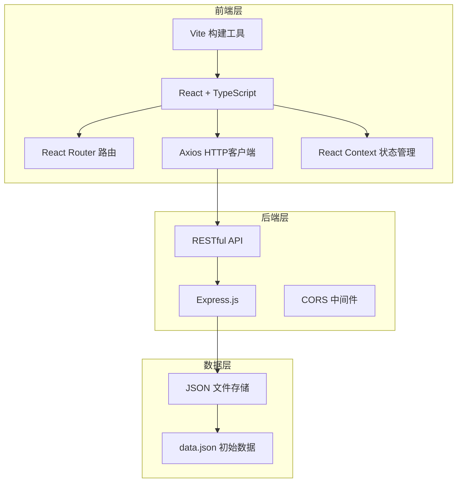
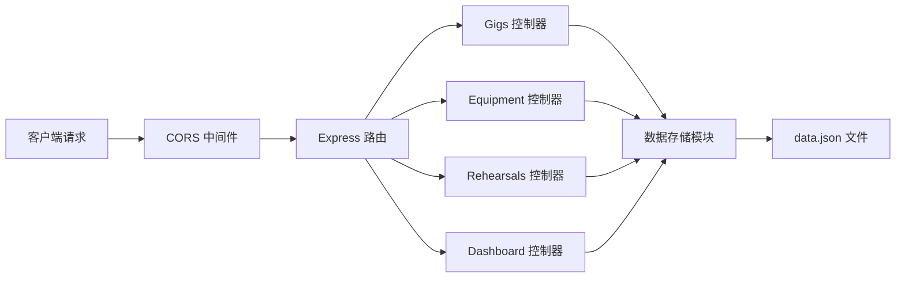
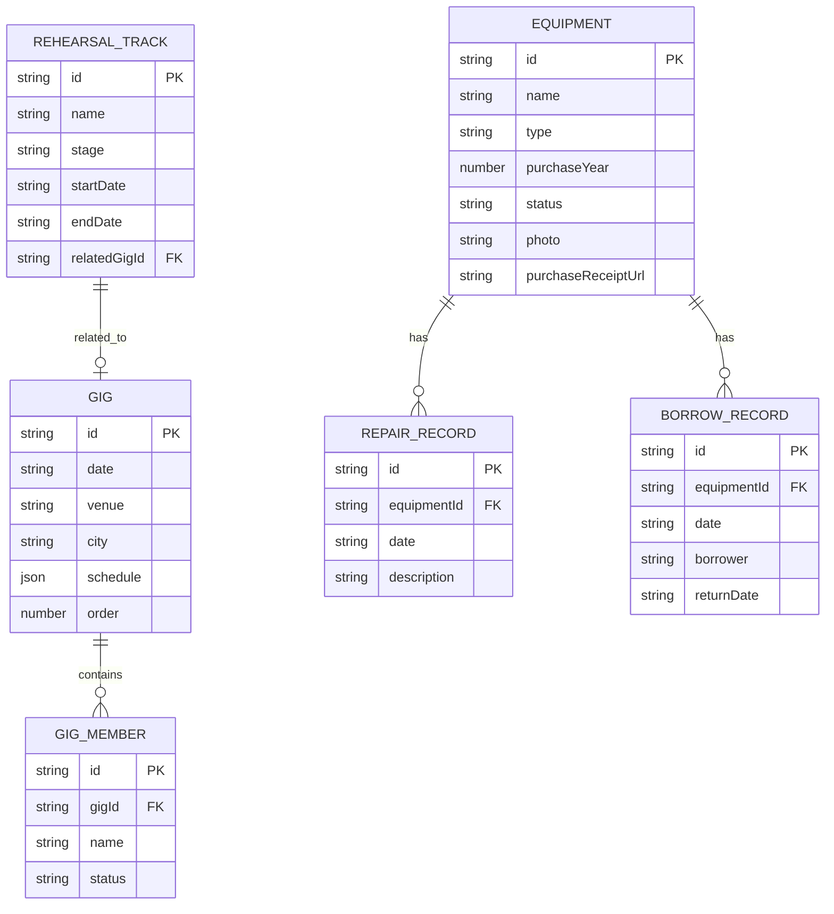

## 1. 架构设计



## 2. 技术栈描述

- **前端框架**：React 18 + TypeScript
- **构建工具**：Vite 5
- **路由管理**：React Router DOM 6
- **HTTP客户端**：Axios
- **状态管理**：React Context API
- **日期处理**：date-fns
- **拖拽库**：react-beautiful-dnd
- **后端框架**：Express 4
- **数据存储**：JSON 文件（file-based storage）
- **唯一ID**：uuid
- **跨域处理**：cors 中间件

## 3. 路由定义

| 路由路径 | 页面组件 | 功能描述 |
|----------|----------|----------|
| / | Dashboard | 首页仪表盘，统计数据展示 |
| /gigs | GigBoard | 演出日程看板 |
| /equipment | EquipmentList | 乐器设备清单 |
| /rehearsals | RehearsalGantt | 排练进度甘特图 |

## 4. API 定义

### 4.1 类型定义

```typescript
// 演出
interface Gig {
  id: string;
  date: string;
  venue: string;
  city: string;
  schedule: {
    meetingTime: string;
    soundcheck: string;
    warmup: string;
    performance: string;
    endTime: string;
  };
  members: {
    id: string;
    name: string;
    status: 'confirmed' | 'pending' | 'leave';
  }[];
  order: number;
}

// 设备
interface Equipment {
  id: string;
  name: string;
  type: 'guitar' | 'bass' | 'drums' | 'keyboard' | 'amplifier' | 'other';
  purchaseYear: number;
  status: 'normal' | 'repair' | 'borrowed';
  photo?: string;
  purchaseReceiptUrl?: string;
  repairRecords: { date: string; description: string }[];
  borrowRecords: { date: string; borrower: string; returnDate?: string }[];
}

// 排练曲目
interface RehearsalTrack {
  id: string;
  name: string;
  stage: 'not-started' | 'first-ensemble' | 'polishing' | 'mature';
  startDate: string;
  endDate: string;
  relatedGigId?: string;
}

// 仪表盘统计
interface DashboardStats {
  totalGigs: number;
  totalEquipment: number;
  rehearsalCompletionRate: number;
  pendingItems: number;
}
```

### 4.2 API 接口列表

| 方法 | 路径 | 功能描述 | 请求参数 | 返回数据 |
|------|------|----------|----------|----------|
| GET | /api/dashboard | 获取仪表盘统计 | - | DashboardStats |
| GET | /api/gigs | 获取演出列表 | - | Gig[] |
| POST | /api/gigs | 新增演出 | Gig | Gig |
| PUT | /api/gigs/:id | 更新演出 | Gig | Gig |
| DELETE | /api/gigs/:id | 删除演出 | - | { success: boolean } |
| PUT | /api/gigs/reorder | 重新排序演出 | { ids: string[] } | { success: boolean } |
| GET | /api/equipment | 获取设备列表 | type?, search? | Equipment[] |
| POST | /api/equipment | 新增设备 | Equipment | Equipment |
| PUT | /api/equipment/:id | 更新设备 | Equipment | Equipment |
| DELETE | /api/equipment/:id | 删除设备 | - | { success: boolean } |
| GET | /api/rehearsals | 获取排练列表 | - | RehearsalTrack[] |
| POST | /api/rehearsals | 新增排练 | RehearsalTrack | RehearsalTrack |
| PUT | /api/rehearsals/:id | 更新排练 | RehearsalTrack | RehearsalTrack |
| DELETE | /api/rehearsals/:id | 删除排练 | - | { success: boolean } |

## 5. 服务器架构图



## 6. 数据模型

### 6.1 数据模型定义



### 6.2 初始数据

包含4个演出、8台设备、5首排练曲目的示例数据，详见 `server/data.json`。

## 7. 性能优化策略

- **虚拟滚动**：设备列表超过100条时启用虚拟滚动
- **按需加载**：数据分页或懒加载
- **动画优化**：优先使用 CSS transform 和 opacity 动画，保证 50fps+
- **缓存策略**：API 结果缓存，避免重复请求
- **组件优化**：React.memo 包裹列表项，减少不必要重渲染
