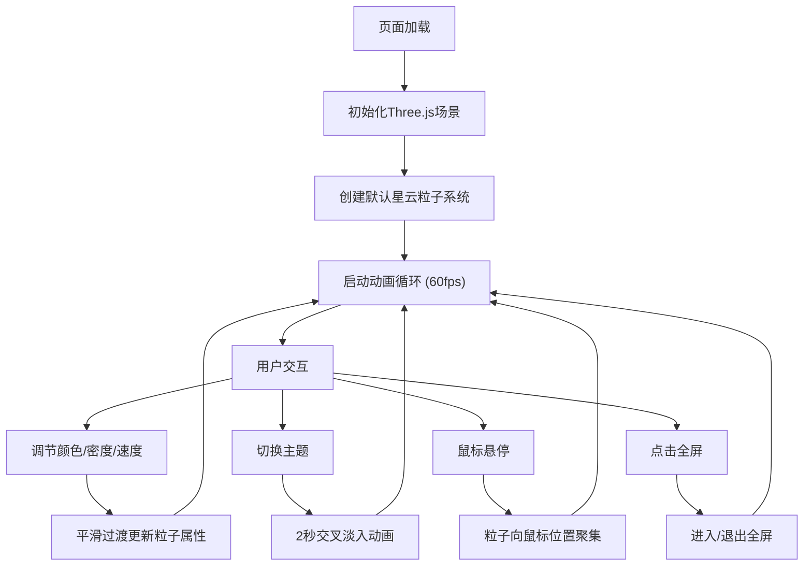

## 1. 产品概述
星云粒子系统动态壁纸是一款基于Web的3D可视化应用，用户可在浏览器中实时生成并定制绚丽的星云粒子效果，作为动态背景或沉浸式视觉体验使用。
- 核心价值：提供高自由度的粒子艺术创作工具，让普通用户也能创造出专业级的宇宙星云视觉效果
- 目标用户：设计师、开发者、数字艺术爱好者、需要动态壁纸/背景的内容创作者

## 2. 核心功能

### 2.1 功能模块
1. **粒子星云渲染系统**：基于Three.js的高性能粒子系统，支持8000+粒子实时渲染
2. **参数调节控制面板**：颜色、密度、旋转速度实时调节
3. **鼠标交互系统**：鼠标悬停吸引粒子效果
4. **主题预设系统**：星云、极光、火焰、深海四种主题一键切换
5. **全屏沉浸模式**：一键进入全屏无干扰体验

### 2.3 页面详情
| 页面名称 | 模块名称 | 功能描述 |
|-----------|-------------|---------------------|
| 主页面 | 粒子画布 | 全屏Three.js渲染，展示动态星云粒子效果 |
| 主页面 | 控制面板 | 左下侧毛玻璃面板，包含颜色色盘、密度滑块、速度滑块 |
| 主页面 | 主题切换区 | 四个主题按钮，点击触发2秒交叉淡入过渡动画 |
| 主页面 | 全屏按钮 | 右上角按钮，切换浏览器全屏模式 |
| 主页面 | 鼠标交互层 | 捕获鼠标位置，驱动粒子吸引效果 |

## 3. 核心流程
用户打开页面后，默认展示星云主题粒子效果。用户可通过左下侧控制面板调整颜色、密度、速度参数，所有参数调整实时生效且带平滑过渡动画。用户可点击主题按钮切换预设主题，粒子系统以2秒交叉淡入动画过渡。用户可点击右上角全屏按钮进入沉浸模式。鼠标悬停在画布上时粒子会被轻微吸引，移开后粒子恢复原有运动轨迹。

## 4. 用户界面设计

### 4.1 设计风格
- **主色调**：深空背景色 #0a0a1a（接近黑色的深蓝紫色）
- **文字颜色**：柔和白灰色 #e0e0e8，次级文字 #a0a0b0
- **按钮样式**：半透明圆角按钮，悬停时带柔和发光效果（box-shadow glow）
- **控制面板**：backdrop-filter 毛玻璃效果，半透明背景 rgba(20, 20, 40, 0.4)，12px 圆角，2px 边框 rgba(255,255,255,0.08)
- **字体**：Google Fonts - Orbitron（标题）+ Inter（正文），营造科幻宇宙感
- **滑块样式**：自定义轨道和拇指，拇指带发光效果

### 4.2 页面设计概述
| 页面名称 | 模块名称 | UI元素 |
|-----------|-------------|-------------|
| 主页面 | 粒子画布 | 全屏Canvas，z-index: 0，背景 #0a0a1a |
| 主页面 | 控制面板 | 固定左下，z-index: 10，毛玻璃效果，内边距 20px，宽度 300px |
| 主页面 | 主题切换区 | 控制面板下方，四个等宽按钮，间距 8px |
| 主页面 | 全屏按钮 | 固定右上，z-index: 10，圆形按钮 40x40px |
| 主页面 | 滑块控件 | 宽度 100%，轨道高度 4px，拇指直径 16px |
| 主页面 | 色盘控件 | 圆形颜色选择器，直径 60px |

### 4.3 响应式
- Desktop-first 设计，控制面板在小屏幕上自动调整宽度
- 移动端支持触摸滑动调节参数
- 全屏按钮在所有尺寸下保持可访问

### 4.4 3D场景指南
- **环境**：深空宇宙氛围，无外部光源，粒子自发光
- **相机**：PerspectiveCamera，fov 75，位置 z=200，轻微轨道控制（禁用平移）
- **粒子系统**：BufferGeometry + PointsMaterial，使用圆形渐变纹理
- **粒子运动**：每个粒子有独立的轨道半径、旋转角速度、上下浮动幅度和相位
- **后处理**：轻微辉光效果模拟星云发光感
- **性能优化**：使用BufferGeometry批量渲染，在GPU端完成粒子位置更新，目标60fps
