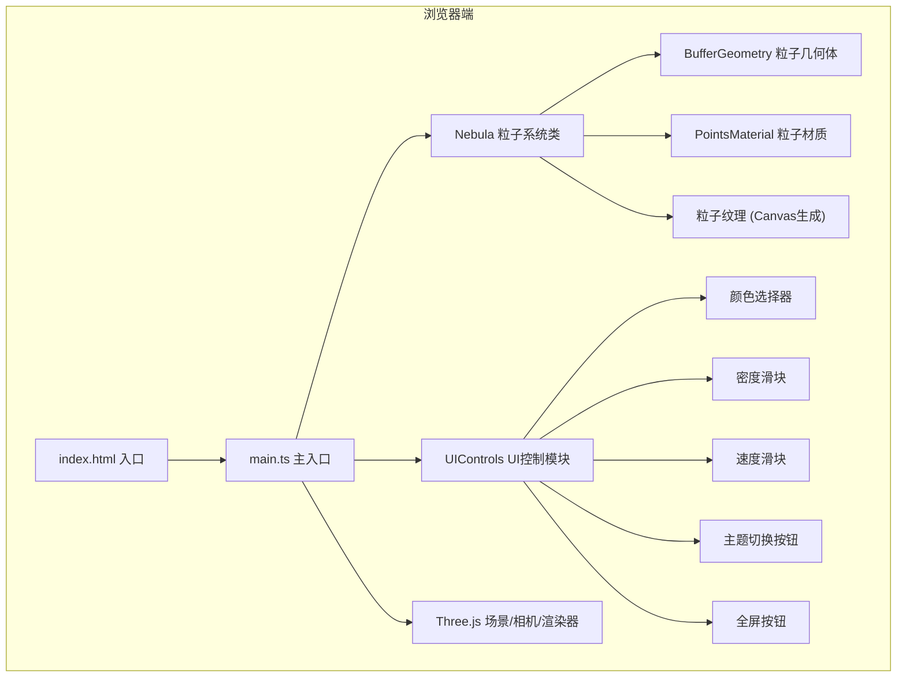

## 1. 架构设计



## 2. 技术描述
- **前端框架**：纯 TypeScript，无需React/Vue，直接操作DOM和Three.js
- **3D渲染**：Three.js r160+，使用BufferGeometry + Points实现高性能粒子系统
- **构建工具**：Vite 5.x，提供快速开发服务器和ES模块打包
- **语言**：TypeScript 5.x，严格模式(strict: true)
- **无后端**：纯前端项目，无需服务端支持

## 3. 文件结构定义

| 文件路径 | 用途 |
|-------|---------|
| `/package.json` | 项目依赖配置，包含 three, typescript, vite, @types/three |
| `/index.html` | HTML入口，全屏canvas，Google Fonts加载 |
| `/tsconfig.json` | TypeScript严格模式配置，ES模块 |
| `/vite.config.ts` | Vite基础配置 |
| `/src/main.ts` | 主入口：初始化Three.js场景、相机、渲染器、轨道控制器，整合各模块，启动动画循环 |
| `/src/nebula.ts` | Nebula核心类：管理粒子系统的创建、更新、参数调节 |
| `/src/controls.ts` | UIControls模块：创建UI元素，绑定事件，调用Nebula方法 |

## 4. 核心类与接口定义

### 4.1 Nebula 类接口

```typescript
interface NebulaParams {
  count: number;          // 粒子数量
  colorStart: string;     // 起始颜色
  colorEnd: string;       // 结束颜色
  rotationSpeed: number;  // 旋转速度系数
}

interface ThemePreset {
  name: string;
  colorStart: string;
  colorEnd: string;
  baseDensity: number;
  baseSpeed: number;
}

class Nebula {
  constructor(scene: THREE.Scene, params: NebulaParams);
  updateColor(colorStart: string, colorEnd: string, fadeDuration?: number): void;
  updateDensity(density: number): void;  // 0-1范围
  updateSpeed(speed: number): void;       // 0-1范围
  applyTheme(theme: ThemePreset, transitionDuration?: number): void;
  setMousePosition(x: number, y: number): void;  // NDC坐标 -1到1
  updateMouseInfluence(active: boolean): void;
  update(deltaTime: number): void;        // 每帧调用
  dispose(): void;
}
```

### 4.2 UIControls 类接口

```typescript
interface ControlCallbacks {
  onColorChange: (start: string, end: string) => void;
  onDensityChange: (value: number) => void;
  onSpeedChange: (value: number) => void;
  onThemeChange: (theme: ThemePreset) => void;
  onFullscreen: () => void;
}

class UIControls {
  constructor(container: HTMLElement, callbacks: ControlCallbacks);
  setInitialValues(params: { colorStart: string; colorEnd: string; density: number; speed: number }): void;
  dispose(): void;
}
```

## 5. 性能优化策略

### 5.1 粒子渲染优化
- 使用 `BufferGeometry` 而非 `Geometry`，所有粒子数据存储在连续内存中
- 使用单个 `Points` 对象批量渲染所有粒子，减少Draw Call
- 粒子纹理使用Canvas动态生成径向渐变，避免外部图片加载
- 材质启用 `transparent: true` 和 `alphaTest: 0.01` 优化透明排序

### 5.2 动画性能优化
- 粒子运动计算在JavaScript端完成，但只更新必要的属性（position数组）
- 颜色过渡使用 `THREE.Color` 的线性插值，每帧渐进更新，避免突变
- 使用 `requestAnimationFrame` 的deltaTime进行帧率无关的动画
- 鼠标影响区域使用距离衰减公式，减少计算量

### 5.3 内存优化
- 粒子数量通过可见性控制（density参数调节alpha而非增删粒子）
- 切换主题时复用现有BufferGeometry，只更新attribute数据
- 组件销毁时正确调用dispose释放GPU资源

## 6. 预设主题定义

```typescript
const THEMES: ThemePreset[] = [
  { name: '星云', colorStart: '#6366f1', colorEnd: '#ec4899', baseDensity: 0.7, baseSpeed: 0.4 },
  { name: '极光', colorStart: '#10b981', colorEnd: '#3b82f6', baseDensity: 0.6, baseSpeed: 0.3 },
  { name: '火焰', colorStart: '#f59e0b', colorEnd: '#ef4444', baseDensity: 0.8, baseSpeed: 0.6 },
  { name: '深海', colorStart: '#0891b2', colorEnd: '#1e40af', baseDensity: 0.5, baseSpeed: 0.2 },
];
```
