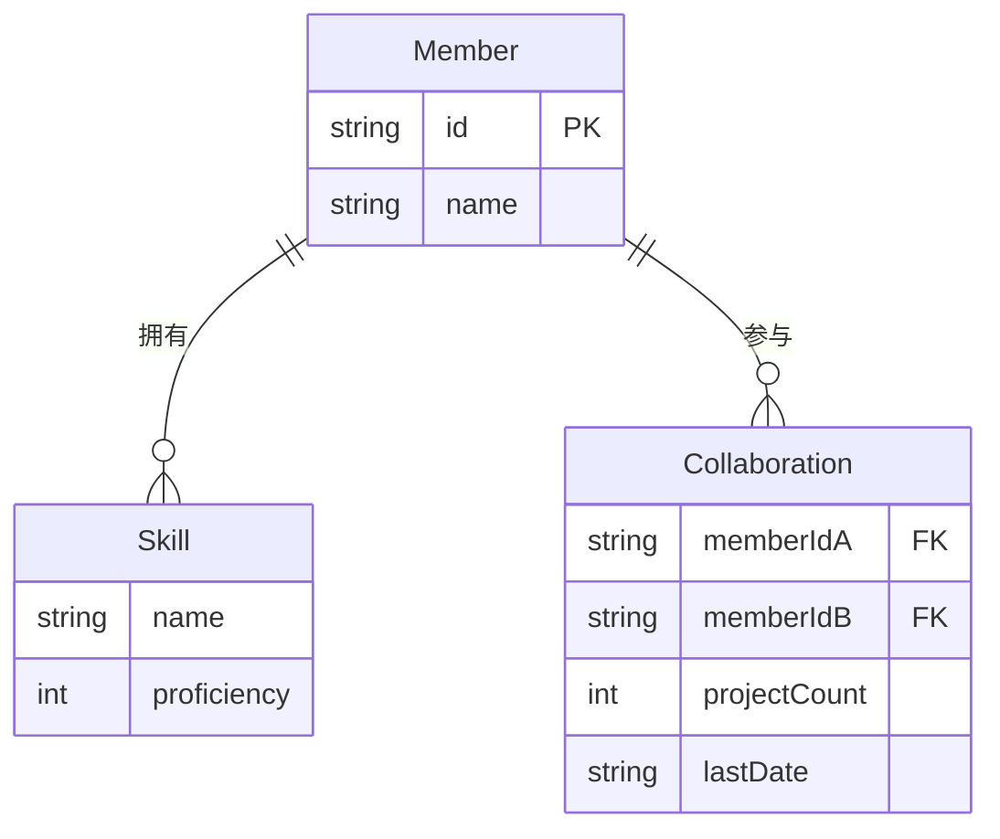

## 1. 架构设计

```mermaid
flowchart TB
    subgraph "前端 (React + Vite)"
        "App.tsx 主布局"
        "SkillTagInput 技能输入"
        "TeamRecommendationPanel 推荐面板"
        "CollaborationGraph 协作图谱"
        "recommendationEngine 推荐引擎"
    end
    subgraph "后端 (Express)"
        "API Routes"
        "成员 CRUD"
        "推荐计算"
    end
    subgraph "数据层 (内存数组)"
        "Members[]"
        "Collaborations[]"
    end
    "App.tsx 主布局" --> "API Routes"
    "API Routes" --> "成员 CRUD"
    "API Routes" --> "推荐计算"
    "成员 CRUD" --> "Members[]"
    "推荐计算" --> "Members[]"
    "推荐计算" --> "Collaborations[]"
```

## 2. 技术说明

- **前端**：React@18 + TypeScript + Vite + CSS Modules（毛玻璃效果）
- **初始化工具**：vite-init (react-express-ts 模板)
- **后端**：Express@4 (CommonJS, server/index.js)
- **数据库**：内存数组模拟（无持久化）
- **状态管理**：zustand
- **图标**：lucide-react
- **UUID**：uuid 库生成成员ID

## 3. 路由定义

| 路由 | 用途 |
|------|------|
| / | 主页面，包含项目表单、推荐面板、协作图谱 |

## 4. API 定义

### 4.1 TypeScript 类型定义

```typescript
interface Skill {
  name: string;
  proficiency: 1 | 2 | 3 | 4 | 5;
  priority?: 'required' | 'bonus';
}

interface Member {
  id: string;
  name: string;
  skills: Skill[];
}

interface Collaboration {
  memberIdA: string;
  memberIdB: string;
  projectCount: number;
  lastDate: string;
}

interface RecommendationRequest {
  projectName: string;
  requiredSkills: string[];
  bonusSkills: string[];
}

interface RecommendationResult {
  member: Member;
  score: number;
  skillOverlapScore: number;
  collaborationScore: number;
  matchedSkills: string[];
}
```

### 4.2 API 端点

| 方法 | 路径 | 请求体 | 响应 |
|------|------|--------|------|
| GET | /api/members | - | Member[] |
| POST | /api/members | Member | Member |
| PUT | /api/members/:id | Member | Member |
| DELETE | /api/members/:id | - | { success: boolean } |
| GET | /api/collaborations | - | Collaboration[] |
| POST | /api/collaborations | Collaboration | Collaboration |
| POST | /api/recommend | RecommendationRequest | RecommendationResult[] |

## 5. 服务器架构

```mermaid
flowchart LR
    "Controller 路由层" --> "Service 业务层"
    "Service 业务层" --> "Repository 数据层"
    "Repository 数据层" --> "内存数组"
```

## 6. 数据模型

### 6.1 数据模型定义



### 6.2 初始数据

预置8-10名成员，覆盖前端、后端、设计、数据分析等技能领域，每个成员3-6个技能，预置20-30条协作记录。

## 7. 文件结构

```
├── package.json
├── vite.config.ts
├── tsconfig.json
├── index.html
├── server/
│   └── index.js          # Express 后端入口
├── src/
│   ├── App.tsx            # 主布局
│   ├── main.tsx           # React 入口
│   ├── components/
│   │   ├── SkillTagInput.tsx
│   │   ├── TeamRecommendationPanel.tsx
│   │   └── CollaborationGraph.tsx
│   ├── utils/
│   │   └── recommendationEngine.ts
│   └── store/
│       └── useAppStore.ts  # zustand 状态管理
```
