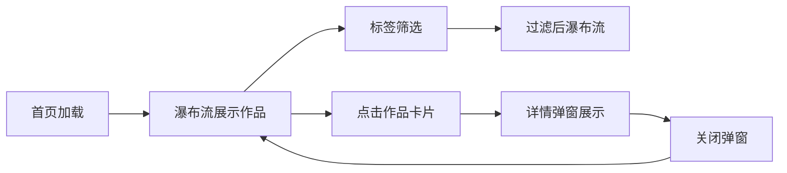

## 1. 产品概述
创意作品集展示工具，为摄影师、插画师等创意工作者提供轻量级在线作品展示平台。
- 主要目的：展示创意作品及其背后故事，支持瀑布流浏览、作品详情查看、标签筛选
- 目标用户：摄影师、插画师、设计师等创意工作者
- 产品价值：极简优雅的作品展示体验，支持暗色/亮色主题切换

## 2. 核心功能

### 2.2 功能模块
1. **首页**：瀑布流作品网格、标签过滤器、主题切换按钮
2. **作品详情**：大图展示、作品信息、创作日期、标签列表

### 2.3 页面详情
| 页面名称 | 模块名称 | 功能描述 |
|-----------|-------------|---------------------|
| 首页 | 瀑布流网格 | CSS columns 实现瀑布流布局，响应式列数，卡片淡入上浮动画，悬停上移加深阴影 |
| 首页 | 标签过滤器 | 多选标签筛选，切换时错峰淡入动画，空结果友好提示 |
| 首页 | 主题切换 | 暗色/亮色主题切换，localStorage 持久化，300ms 平滑过渡 |
| 作品详情弹窗 | 大图展示 | 高分辨率图片，点击放大查看 |
| 作品详情弹窗 | 作品信息 | 标题、详细描述、创作日期、标签列表 |
| 作品详情弹窗 | 交互动画 | 缩放弹入/弹出动画，半透明遮罩 |

## 3. 核心流程
用户进入首页 → 浏览瀑布流作品 → 使用标签筛选作品 → 点击作品卡片查看详情 → 关闭弹窗继续浏览

## 4. 用户界面设计

### 4.1 设计风格
- 主色调：中性灰搭配强调色（暗色主题琥珀色 #FFB347，亮色主题天蓝色 #4A90D9）
- 布局风格：极简留白，页面最大宽度 1200px 居中
- 卡片风格：圆角 8px，间距 16px，16:9 缩略图比例
- 动画风格：300ms ease-in-out 过渡，卡片淡入上浮，弹窗缩放

### 4.2 页面设计概述
| 页面名称 | 模块名称 | UI 元素 |
|-----------|-------------|-------------|
| 首页 | 顶部导航 | Logo、标签过滤器、主题切换按钮 |
| 首页 | 瀑布流网格 | 作品卡片（缩略图、标题、标签）、骨架屏占位、空状态 |
| 作品详情弹窗 | 弹窗内容 | 大图、标题、描述、日期、标签、关闭按钮 |

### 4.3 响应式
- 桌面端：4 列瀑布流
- 平板端：3 列瀑布流
- 手机端：2 列瀑布流
- 触摸优化：更大点击区域，流畅手势

