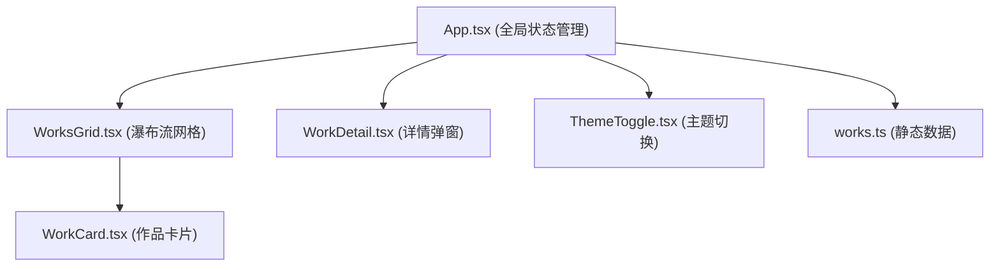

## 1. 架构设计
纯前端 React 应用，组件化架构，状态集中管理。



## 2. 技术描述
- 前端框架：React 18 + TypeScript 5
- 构建工具：Vite 5
- 样式方案：CSS Modules / 内联样式 + CSS 变量
- 状态管理：React useState + useContext（主题状态）
- 数据来源：静态 Mock 数据

## 3. 项目结构
```
src/
├── App.tsx              # 主应用组件，全局状态管理
├── components/
│   ├── WorksGrid.tsx    # 瀑布流网格组件
│   ├── WorkDetail.tsx   # 作品详情弹窗组件
│   └── ThemeToggle.tsx  # 主题切换组件
├── data/
│   └── works.ts         # 静态作品数据
└── index.css            # 全局样式
```

## 4. 数据模型

### Work 接口
```typescript
interface Work {
  id: string;
  title: string;
  image: string;
  description: string;
  date: string;
  tags: string[];
}
```

## 5. 性能优化
- 图片懒加载：Intersection Observer API
- CSS columns 瀑布流：高性能原生实现
- 骨架屏占位：提升感知加载速度
- CSS 变量主题切换：无重绘性能损耗
