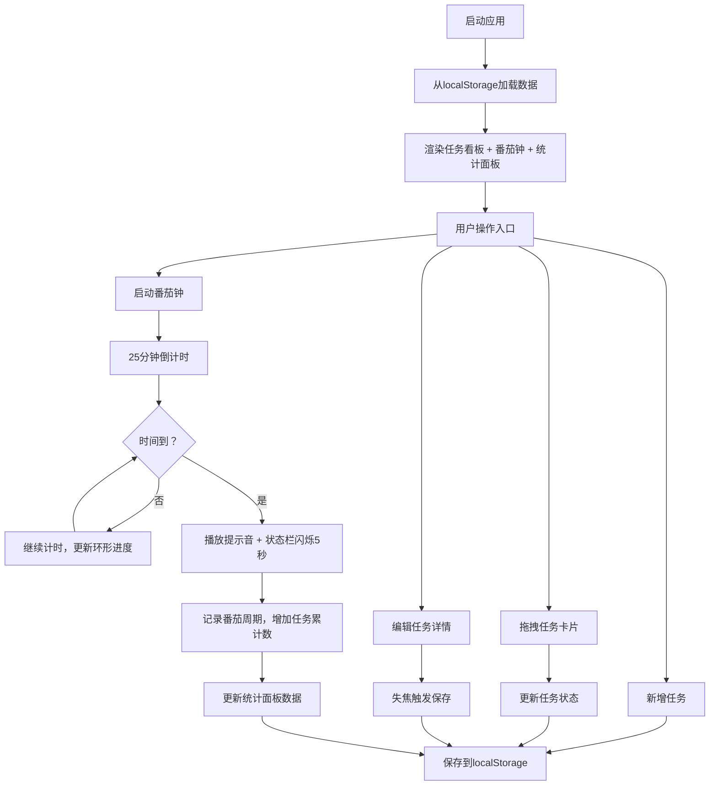

## 1. 产品概述
番茄工作法与任务看板结合的一站式个人效率工具，专为远程工作者和自由职业者设计，通过可视化任务管理与番茄钟计时提升专注力和工作效率。
- 核心功能：任务看板列管理、番茄钟计时、时间统计与视觉反馈
- 目标用户：远程工作者、自由职业者、需要提升个人效率的知识工作者
- 产品价值：将任务管理与时间管理无缝结合，通过数据驱动的方式帮助用户了解并优化工作习惯

## 2. 核心功能

### 2.1 用户角色
| 角色 | 注册方式 | 核心权限 |
|------|----------|----------|
| 普通用户 | 无需注册，本地存储 | 创建/编辑/删除任务、番茄钟计时、查看统计数据、切换主题 |

### 2.2 功能模块
1. **任务看板模块**：三列任务管理（待处理/进行中/已完成）、卡片拖拽、新增任务、内联编辑
2. **番茄钟计时模块**：环形进度显示、启动/暂停/重置、任务绑定、完成提醒音、状态闪烁
3. **时间统计模块**：今日番茄总数、总专注时长、各任务番茄环形图
4. **主题切换模块**：亮色/暗色主题切换、平滑过渡动画
5. **数据持久化模块**：localStorage异步存储、应用启动自动加载

### 2.3 页面详情
| 页面名称 | 模块名称 | 功能描述 |
|----------|----------|----------|
| 主应用 | 任务看板 | 三列看板展示、列计数徽章、拖拽移动卡片、新任务淡入上浮动画 |
| 主应用 | 番茄钟 | 25分钟倒计时、环形渐变进度条、启动/暂停/重置控制、绑定当前任务 |
| 主应用 | 统计面板 | 今日番茄数、专注时长(小时:分钟)、任务番茄环形图（渐变色环） |
| 主应用 | 任务编辑 | 点击标题展开内联编辑、修改标题/描述/预估番茄数、边框高亮、失焦自动保存 |
| 主应用 | 主题切换 | 右上角图标按钮、0.4秒平滑过渡、亮色/暗色两套配色方案 |

## 3. 核心流程

## 4. 用户界面设计

### 4.1 设计风格
- **主色调**：深蓝灰 (#2c3e50)，传达专业、专注的感觉
- **番茄进度色**：渐变绿 (#27ae60 → #2ecc71)，象征生长和完成
- **亮色主题**：背景#ffffff，卡片#ffffff，文字#333333
- **暗色主题**：背景#1a1a2e，卡片#16213e/#1e293b，文字#e0e0e0
- **按钮风格**：圆角按钮，悬停时缩放1.05倍并加深阴影
- **字体**：系统字体栈，保证跨平台一致性和可读性
- **布局风格**：左右两栏卡片式布局，左侧65%右侧35%，右侧统计面板固定
- **图标风格**：使用lucide-react图标库，线性简洁风格

### 4.2 页面设计概述
| 页面名称 | 模块名称 | UI元素 |
|----------|----------|----------|
| 主应用 | 全局容器 | 左右两栏（65%/35%），移动端上下堆叠，固定右侧统计面板 |
| 主应用 | 任务看板列 | 深蓝色头部、计数徽章背景色区分列、卡片容器弹性过渡 |
| 主应用 | 任务卡片 | 白底/深底卡片、拖拽时半透明克隆、编辑时蓝色边框高亮 |
| 主应用 | 番茄钟 | 大型SVG环形进度条、倒计时大字显示、三个控制按钮 |
| 主应用 | 统计面板 | 大号统计数字、环形图渐变色、标签清晰的图例 |
| 主应用 | 主题切换 | 右上角太阳/月亮图标按钮、圆形背景、悬停效果 |
| 主应用 | 动画效果 | 拖拽0.3秒弹性过渡、主题0.4秒平滑过渡、按钮悬停1.05倍缩放 |

### 4.3 响应式设计
- **桌面端（≥768px）**：左右两栏布局，左侧65%（番茄钟+看板），右侧35%（统计面板固定）
- **移动端（<768px）**：上下堆叠布局，上方番茄钟和看板可滚动，下方统计面板折叠为抽屉式可展开
- **触摸优化**：拖拽区域增大、按钮最小尺寸44px、避免使用:hover依赖

### 4.4 性能保障
- 番茄钟使用requestAnimationFrame驱动，精度误差<50ms
- 任务列表条件渲染优化，100个卡片首帧<200ms
- 本地存储操作异步化，避免阻塞UI渲染
