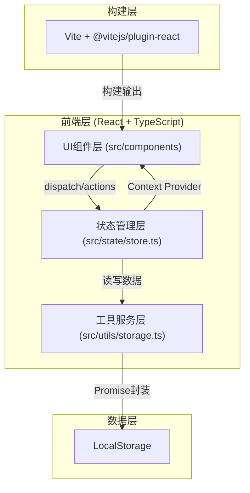
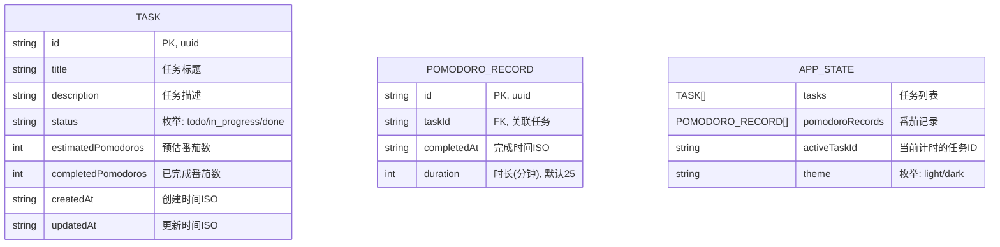

## 1. 架构设计


**数据流说明**：
- 单向数据流：UI组件 → dispatch action → useReducer更新状态 → Context重新下发 → UI重新渲染
- 状态变更后自动触发存储服务，异步写入localStorage
- 应用启动时从存储服务异步加载历史数据

## 2. 技术说明
- **前端框架**：React@18 + TypeScript@5
- **构建工具**：Vite@5 + @vitejs/plugin-react
- **状态管理**：React useReducer + Context API（按用户需求，不使用zustand）
- **数据存储**：浏览器localStorage，Promise封装模拟异步
- **样式方案**：原生CSS + CSS Variables（主题切换），CSS Modules可选
- **图标库**：lucide-react（按开发规范要求）
- **动画方案**：CSS transitions/animations + requestAnimationFrame
- **音频方案**：Web Audio API生成提示音

## 3. 配置文件说明
| 文件 | 关键配置 |
|------|----------|
| package.json | 依赖: react, react-dom, typescript, vite, @vitejs/plugin-react, lucide-react; 启动脚本: npm run dev |
| vite.config.ts | React插件、端口配置、输出目录 |
| tsconfig.json | strict: true, jsx: react-jsx, ESNext目标 |
| index.html | 入口页面，挂载点#root |

## 4. 数据模型

### 4.1 数据模型定义


### 4.2 TypeScript 类型定义
```typescript
type TaskStatus = 'todo' | 'in_progress' | 'done';

interface Task {
  id: string;
  title: string;
  description: string;
  status: TaskStatus;
  estimatedPomodoros: number;
  completedPomodoros: number;
  createdAt: string;
  updatedAt: string;
}

interface PomodoroRecord {
  id: string;
  taskId: string;
  completedAt: string;
  duration: number;
}

interface AppState {
  tasks: Task[];
  pomodoroRecords: PomodoroRecord[];
  activeTaskId: string | null;
  theme: 'light' | 'dark';
}

type Action =
  | { type: 'HYDRATE'; payload: Partial<AppState> }
  | { type: 'ADD_TASK'; payload: Task }
  | { type: 'UPDATE_TASK'; payload: Partial<Task> & { id: string } }
  | { type: 'DELETE_TASK'; payload: string }
  | { type: 'MOVE_TASK'; payload: { id: string; status: TaskStatus } }
  | { type: 'SET_ACTIVE_TASK'; payload: string | null }
  | { type: 'COMPLETE_POMODORO'; payload: PomodoroRecord }
  | { type: 'TOGGLE_THEME' };
```

## 5. 文件结构
```
auto43/
├── package.json
├── vite.config.ts
├── tsconfig.json
├── index.html
├── src/
│   ├── components/
│   │   ├── TaskBoard.tsx          # 任务看板主组件
│   │   ├── TaskCard.tsx           # 任务卡片组件（拆分，保证单文件<200行）
│   │   ├── TaskColumn.tsx         # 任务列组件（拆分）
│   │   ├── PomodoroTimer.tsx      # 番茄钟组件
│   │   ├── StatsPanel.tsx         # 统计面板组件（拆分）
│   │   ├── PomodoroChart.tsx      # 番茄环形图组件（拆分）
│   │   └── ThemeToggle.tsx        # 主题切换按钮（拆分）
│   ├── state/
│   │   └── store.ts               # 全局状态管理（Context + useReducer）
│   ├── utils/
│   │   └── storage.ts             # 本地存储服务（Promise封装）
│   ├── types/
│   │   └── index.ts               # 类型定义（集中管理）
│   ├── hooks/
│   │   ├── usePomodoro.ts         # 番茄钟逻辑hook
│   │   ├── useDragDrop.ts         # 拖拽逻辑hook
│   │   └── useTheme.ts            # 主题逻辑hook
│   ├── styles/
│   │   └── globals.css            # 全局样式与CSS变量
│   ├── App.tsx                    # 根组件
│   └── main.tsx                   # 入口文件
```

## 6. 核心实现约束
- **番茄钟精度**：使用requestAnimationFrame + 时间戳比较，误差<50ms，不依赖setInterval累计
- **拖拽动画**：HTML5 Drag and Drop API + 克隆元素 + cubic-bezier(0.34, 1.56, 0.64, 1)过渡
- **主题切换**：CSS Variables切换class，transition: all 0.4s ease
- **渲染性能**：任务卡片使用React.memo，列表条件渲染视口内卡片
- **音频提示**：Web Audio API生成纯音提示，无需外部音频文件
