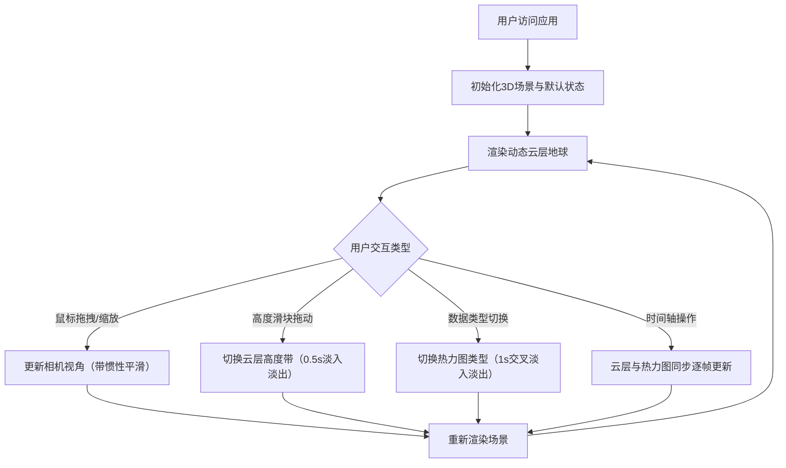

## 1. 产品概述

全球三维云层分布与流动状态可视化应用，为气象研究人员和爱好者提供沉浸式的大气观测体验。通过3D地球渲染技术解决传统二维卫星云图缺乏立体感和动态流动感的问题，实现云层高度切换、气象热力图叠加及72小时时间轴回放等核心功能。

- **核心价值**：将抽象的大气环流数据转化为可交互的三维视觉体验，支持多角度、多层次的气象数据分析
- **目标用户**：气象科研人员、气象爱好者、教育工作者、学生
- **应用场景**：科研数据可视化、气象教学演示、大气环流现象观察

## 2. 核心功能

### 2.1 用户角色

| 角色 | 注册方式 | 核心权限 |
|------|----------|----------|
| 访客用户 | 无需注册，直接访问 | 浏览3D地球、切换云层高度、查看气象热力图、播放时间轴 |

### 2.2 功能模块

1. **3D地球渲染模块**：球体渲染、动态云层纹理、鼠标交互（拖拽旋转/滚轮缩放/惯性平滑）、云层流动速度控制
2. **云层高度切换模块**：底部高度滑块（低云-中云-高云）、0.5秒淡入淡出过渡、同心环阴影高度指示
3. **气象数据热力图模块**：温度/湿度/风速数据切换、蓝红渐变热力图、点阵脉冲动画、1秒交叉淡入淡出叠加
4. **时间轴播放控制模块**：72小时逐小时时间滑块、播放/暂停按钮、云层与热力图同步更新

### 2.3 页面详情

| 页面名称 | 模块名称 | 功能描述 |
|----------|----------|----------|
| 主页面 | 3D地球场景 | 全屏Three.js渲染球体，动态云层纹理随时间旋转流动，支持鼠标拖拽旋转与滚轮缩放，带惯性平滑效果 |
| 主页面 | 左上角信息面板 | 半透明毛玻璃暗色面板，显示当前云层高度（低云/中云/高云）和气象数据类型（温度/湿度/风速） |
| 主页面 | 底部高度滑块区 | 云层高度切换滑块，从低云到高云共5档，切换时云层纹理0.5秒淡入淡出，地球表面显示同心环阴影 |
| 主页面 | 数据类型切换按钮组 | 温度/湿度/风速三选一切换按钮，切换时热力图1秒交叉淡入淡出，带点阵脉冲动画 |
| 主页面 | 右下角时间轴控制区 | 半透明渐变条，72小时逐小时滑块，左右两侧播放/暂停按钮，播放时云层平滑移动、热力图逐帧更新 |

## 3. 核心流程

用户打开应用 → 进入全屏3D地球场景（默认显示中云层+温度热力图，时间轴停留在第0小时）→ 用户可通过鼠标拖拽旋转地球 / 滚轮缩放视角 → 拖动底部高度滑块切换云层高度带 → 点击数据类型按钮切换温度/湿度/风速热力图 → 拖动时间轴滑块或点击播放按钮查看72小时内的云层与气象数据变化

## 4. 用户界面设计

### 4.1 设计风格

- **主色调**：深蓝 `#0b1a2a`（背景/面板底色），青蓝色 `#00d4ff`（强调色/高亮），白色 `#ffffff`（悬停/文字高亮）
- **视觉风格**：极简扁平科技风，毛玻璃半透明面板，无衬线字体，微弹性回弹动画
- **按钮样式**：扁平圆角矩形（4px圆角），默认青蓝色边框/文字，悬停白色高亮，点击时scale(0.96)回弹动画（100ms ease-out）
- **滑块样式**：自定义轨道（深蓝渐变）+ 青蓝色圆形滑块（悬停放大至1.1倍）
- **字体**：无衬线字体（优先 system-ui / -apple-system / Segoe UI），标题 14px 粗体，正文 12px 常规，标签 11px 细体

### 4.2 页面设计概述

| 页面名称 | 模块名称 | UI元素 |
|----------|----------|--------|
| 主页面 | 3D地球场景 | 居中球体，深蓝宇宙背景（带微弱星点），云层半透明白色流动纹理，地球表面蓝绿色基础纹理 |
| 主页面 | 左上角信息面板 | 200x100px，圆角12px，`rgba(11,26,42,0.75)`底色+backdrop-filter: blur(12px)，内边距16px，两行文字（云层高度标签+数据类型标签），青蓝色高亮指示点 |
| 主页面 | 底部高度滑块区 | 距底部140px居中，宽度400px，5档刻度标记（低云/较低云/中云/较高云/高云），当前档位置有青蓝色竖线标记 |
| 主页面 | 数据类型切换按钮组 | 距底部200px居中，三个100x36px按钮横向排列，间距8px，当前选中按钮背景填充青蓝色+白色文字 |
| 主页面 | 时间轴控制区 | 右下角32px以上边距，宽度520px高度64px，左右各40px圆形播放/暂停按钮（青蓝色描边），中间400px时间滑块带小时刻度 |

### 4.3 响应式设计

- **Desktop优先**：核心布局针对1920x1080及以上屏幕优化，时间轴最小宽度400px
- **自适应**：面板与控件使用vw/vh相对单位，在小屏（1366x768）下自动缩放80%，高度滑块与时间轴不低于300px
- **触摸优化**：滑块热区扩大至44px高度，按钮最小尺寸44x44px，支持触屏拖拽与捏合缩放

### 4.4 3D场景指导

- **环境与氛围**：深空黑背景（#050a14），地球大气层光晕（青蓝色径向渐变），微弱星点粒子背景（300-500个随机点）
- **灯光设置**：方向光模拟太阳（从右上方入射，强度1.2，色温6500K），环境光0.3填充暗部，半球光（天空青蓝/地面深蓝）增强大气感
- **相机设置**：PerspectiveCamera FOV=45，初始距离地球3倍半径，近裁剪0.1，远裁剪1000，限制最小距离1.5倍半径/最大距离8倍半径
- **相机运动**：鼠标左键拖拽触发轨道旋转（OrbitControls），带阻尼系数0.08的惯性平滑，禁止平移，限制极角10°-170°防止翻转
- **云层合成**：地球球体（基础纹理）+ 云层球体（半径1.02倍，半透明Additive混合，Canvas2D动态纹理每帧更新偏移模拟流动）
- **同心环阴影**：使用三个半透明圆环Mesh（半径随高度档递增），`rgba(0,212,255,0.15)`颜色，随高度切换以0.3s过渡动画缩放
- **性能预算**：云层纹理分辨率1024x512，热力图纹理512x256，目标帧率≥30FPS，单帧JS耗时<16ms
