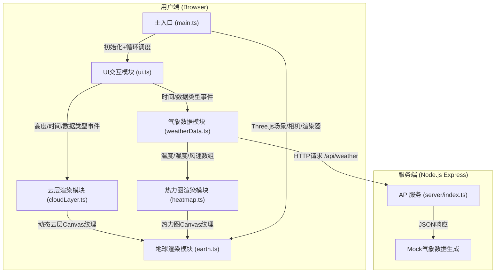
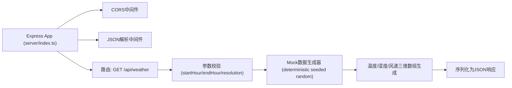

## 1. 架构设计



## 2. 技术描述

- **前端核心**：TypeScript 5.x + Three.js 0.160.x（原生Three，非React封装，保持高性能3D渲染控制）
- **构建工具**：Vite 5.x（热更新、ESM构建、TypeScript支持）
- **UI渲染**：原生DOM + CSS（毛玻璃backdrop-filter、CSS过渡动画），无UI框架依赖，保持轻量化
- **纹理生成**：Canvas2D API（云层与热力图均由代码生成，无外部图片资源）
- **后端服务**：Node.js + Express 4.x（CORS跨域支持），仅提供Mock数据，无数据库
- **依赖库**：three, @types/three, typescript, vite, express, cors, uuid

## 3. 路由定义

| 路由 | 服务 | 用途 |
|------|------|------|
| `/` | Vite Dev Server (5173) | 前端主页面入口 |
| `/api/weather` | Express Server (3001) | 获取72小时气象数据 |

## 4. API 定义

### GET /api/weather

获取指定小时范围内的模拟气象数据（温度/湿度/风速），按经纬度网格返回。

**请求参数**：

| 参数 | 类型 | 必填 | 说明 |
|------|------|------|------|
| startHour | number | 否 | 起始小时（0-71），默认0 |
| endHour | number | 否 | 结束小时（startHour-71），默认71 |
| resolution | string | 否 | 网格分辨率：low(18x9)/medium(36x18)/high(72x36)，默认medium |

**响应结构**（TypeScript类型）：

```typescript
interface WeatherAPIResponse {
  success: boolean;
  requestId: string;
  generatedAt: string;
  hours: number;
  resolution: { cols: number; rows: number };
  data: WeatherHourData[];
}

interface WeatherHourData {
  hour: number;
  temperature: number[][];   // 二维数组 [rows][cols]，值范围 -40 ~ 50 (°C)
  humidity: number[][];      // 二维数组 [rows][cols]，值范围 0 ~ 100 (%)
  windSpeed: number[][];     // 二维数组 [rows][cols]，值范围 0 ~ 150 (km/h)
}
```

## 5. 服务器架构



- **Mock数据算法**：使用固定seed（uuid基于时间戳）的伪随机数生成器，叠加正弦/余弦函数模拟大气波动规律，确保同一请求返回一致数据
- **分辨率策略**：low=18×9（移动端），medium=36×18（默认平衡性能），high=72×36（高精度）
- **性能**：全内存计算，单次请求<50ms，支持浏览器缓存ETag

## 6. 模块数据流向详解

### 6.1 主入口 (main.ts)

```
浏览器加载
  → 创建WebGLRenderer / PerspectiveCamera / Scene
  → 初始化OrbitControls（拖拽+缩放+惯性）
  → 创建AmbientLight + DirectionalLight + HemisphereLight
  → 初始化earth模块 → 创建地球Mesh + 基础纹理
  → 初始化cloudLayer模块 → 生成多层云层Canvas纹理缓存
  → 初始化weatherData模块 → 请求/api/weather获取72小时数据
  → 初始化heatmap模块 → 绑定Canvas + 脉冲动画状态
  → 初始化ui模块 → 绑定DOM控件事件 → 注册回调
  → 启动requestAnimationFrame循环
      · 更新controls阻尼
      · cloudLayer.update(time, hour) → 返回当前云层纹理
      · heatmap.update(time, hour, dataType) → 返回当前热力图纹理
      · earth.updateMaterials(cloudTex, heatmapTex)
      · renderer.render(scene, camera)
```

### 6.2 云层模块 (cloudLayer.ts)

```
初始化
  → 创建5张Canvas（对应5个高度档），分辨率1024×512
  → 每张Canvas使用多层Perlin噪声叠加生成基础云形
  → 存储为CloudLayerCache[] = { canvas, ctx, seed, basePattern: ImageData }

切换高度带 setHeightLevel(level: 0-4)
  → targetLevel = level
  → 通过opacity插值（每帧加/减0.02，持续≈0.5s）在两张纹理间交叉淡入淡出

更新纹理 update(elapsedSec: number, currentHour: number)
  → flowSpeed = baseSpeed(1 + currentHour/72 * speedFactor)  // 时间轴加速
  → offsetX = elapsedSec * flowSpeed * 8   // 水平流动偏移（模拟西风带）
  → offsetY = sin(elapsedSec * 0.3) * 4    // 垂直微小波动
  → ctx.save → ctx.clearRect → ctx.translate(offsetX % width, offsetY)
  → 绘制basePattern（重复平铺，wrap模式）
  → 叠加流动噪声层（低频Perlin噪声，随时间变形）
  → ctx.restore
  → 将canvas转为THREE.CanvasTexture（needsUpdate=true）
  → return { texture, opacity }
```

### 6.3 热力图模块 (heatmap.ts)

```
初始化
  → 创建512×256 Canvas + 预计算蓝→红渐变色阶（256级LUT）
  → pulsePhase = 0, dataType = 'temperature', transitionAlpha = 1

切换数据类型 setDataType(type: 'temperature'|'humidity'|'windSpeed')
  → nextDataType = type
  → 启动1秒交叉过渡：每帧 transitionAlpha -= 1/60
      · 当 transitionAlpha ≤ 0：dataType = nextDataType, transitionAlpha = 1

更新纹理 update(elapsedSec: number, currentHour: number, data: WeatherHourData)
  → pulsePhase += 0.02
  → pulseScale = 1 + 0.15 * sin(pulsePhase)   // 点阵脉冲缩放
  → 遍历data[dataType]二维数组的每个网格点 (row, col, value)
      · 归一化value → 0-255 → 查LUT得到颜色
      · lat = 90 - row * (180/rows), lon = col * (360/cols) - 180
      · 经纬度映射到Canvas像素坐标 (x, y)
      · 绘制半径=(3 + value*0.05) * pulseScale 的径向渐变圆点
      · alpha = 0.35 + 0.2 * sin(pulsePhase + row*0.3 + col*0.2)
  → 返回 { texture, opacity: currentTransitionAlpha }
```

### 6.4 UI模块 (ui.ts)

```
初始化
  → 选择DOM元素：#height-slider, #data-buttons, #time-slider, #play-btn, #info-panel
  → 注册回调接口 setCallbacks({ onHeightChange, onDataTypeChange, onTimeChange, onPlayToggle })

高度滑块事件
  → input事件 → level = Math.round(value / 25)  → onHeightChange(level)
  → 同步更新 #info-panel 中的云层高度文字

数据类型按钮
  → click事件 → 切换active类 → onDataTypeChange(btn.dataset.type)
  → 同步更新 #info-panel 中的数据类型文字

时间轴滑块
  → input事件 → hour = parseInt(value) → onTimeChange(hour)
  → change事件同input

播放/暂停按钮
  → click事件 → 切换播放状态图标 → onPlayToggle(isPlaying)
  → 播放时：每100ms hour递增（循环0-71）→ onTimeChange(hour)
  → 弹性动画：CSS scale(0.96) 100ms ease-out → scale(1)
```
