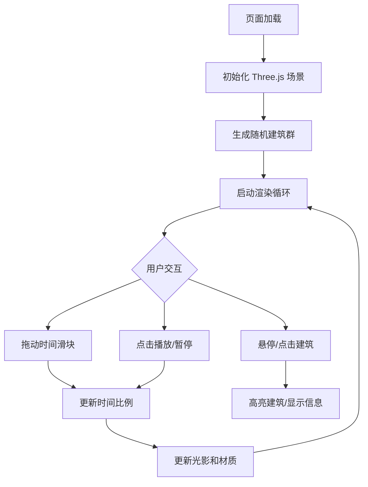

## 1. 产品概述
城市天际线轮廓动态演化可视化应用，展示一座虚拟城市从黎明到夜晚的建筑光影与高度变化。用户可通过时间滑块和播放按钮，观察一天中不同时段的城市光影效果，支持建筑选中查看信息。

- 核心价值：沉浸式的城市日夜交替视觉体验，交互式的时间控制与建筑探索
- 目标用户：对城市可视化、建筑光影效果感兴趣的用户，或作为城市规划演示工具

## 2. 核心功能

### 2.1 功能模块
1. **3D 城市场景**：随机生成的建筑群，分布在圆形区域内，具有高度和颜色变化
2. **时间循环系统**：从黎明到深夜的完整 24 小时光影循环，包含环境光、点光源、建筑材质的动态变化
3. **时间控制器**：底部滑块拖动控制时间，播放/暂停按钮自动循环
4. **建筑交互**：鼠标悬停高亮、点击显示建筑信息面板
5. **夜间灯光效果**：深夜时段建筑窗户随机亮起黄色光点

### 2.2 页面详情
| 页面名称 | 模块名称 | 功能描述 |
|---------|---------|---------|
| 主页面 | 3D 场景渲染 | 全屏 Three.js 画布，展示城市建筑群和动态光影效果 |
| 主页面 | 时间控制区 | 底部居中的半透明控制面板，包含时段文字、时间滑块、播放按钮 |
| 主页面 | 建筑信息面板 | 点击建筑后在顶部浮出的信息面板，显示高度和时间 |

## 3. 核心流程
用户打开页面后，默认展示黎明时刻的城市场景。用户可以：
- 拖动时间滑块，实时查看不同时段的光影变化
- 点击播放按钮，自动循环播放一天 24 小时的光影变化
- 鼠标悬停在建筑上，查看高亮效果
- 点击建筑，查看建筑详细信息

## 4. 用户界面设计

### 4.1 设计风格
- **主色调**：纯黑背景（#000000），白色 UI 元素，高对比度
- **点缀色**：浅蓝色滑块进度条，亮黄色建筑选中高亮，暖橙色建筑顶部
- **字体**：无衬线字体，16px 时段文字，清晰易读
- **整体风格**：极简科技感，沉浸式 3D 体验，UI 元素半透明浮于场景之上

### 4.2 页面设计概览
| 页面名称 | 模块名称 | UI 元素 |
|---------|---------|---------|
| 主页面 | 3D 场景 | 全屏画布，纯黑背景，建筑群居中，透视视角 |
| 主页面 | 时间控制面板 | 半透明白色圆角矩形背景（rgba(255,255,255,0.15)），边框 rgba(255,255,255,0.3)，圆角设计 |
| 主页面 | 时间滑块 | 灰色轨道，浅蓝色渐变进度，白色圆点滑块 |
| 主页面 | 播放按钮 | 白色图标，悬停微亮效果 |
| 主页面 | 时段文字 | 白色 16px，居中显示在滑块上方 |
| 主页面 | 建筑信息面板 | 半透明暗色背景，白色文字，位于建筑顶部 |

### 4.3 响应式设计
- 页面撑满整个浏览器窗口，自适应窗口大小变化
- 时间控制面板宽度随窗口自适应，最小宽度 300px，最大宽度 800px
- 建筑信息面板位置根据建筑位置动态调整

### 4.4 3D 场景指导
- **环境与氛围**：纯黑背景，根据时间变化环境光颜色，从冷灰蓝到暖黄白再到深蓝紫
- **灯光设置**：环境光 + 点光源模拟太阳，点光源角度随时间变化，产生动态光影效果
- **相机设置**：透视相机，固定视角，可观察整个城市区域
- **构图与焦点**：城市建筑群居中分布，视觉焦点在城市中心区域
- **交互与动画**：时间变化时所有光影、颜色、亮度过渡平滑，无跳跃感
- **性能要求**：60FPS 稳定帧率，建筑数量上限 120 栋
