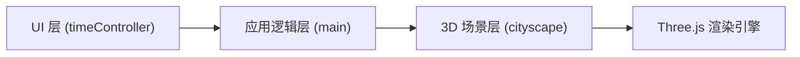

## 1. 架构设计
本项目为纯前端 3D 可视化应用，采用分层架构设计。



## 2. 技术描述
- **前端框架**：原生 TypeScript（无 React/Vue 框架）
- **3D 引擎**：Three.js
- **构建工具**：Vite
- **语言**：TypeScript（严格模式，ES 模块）
- **包管理**：npm

### 依赖说明
| 依赖 | 版本 | 用途 |
|------|------|------|
| three | latest | 3D 渲染引擎 |
| @types/three | latest | Three.js TypeScript 类型定义 |
| typescript | latest | TypeScript 编译器 |
| vite | latest | 构建工具与开发服务器 |

## 3. 文件结构

```
auto45/
├── .trae/
│   └── documents/
│       ├── PRD.md
│       └── 技术架构.md
├── index.html          # 入口 HTML
├── package.json        # 项目配置
├── vite.config.ts      # Vite 配置
├── tsconfig.json       # TypeScript 配置
└── src/
    ├── main.ts         # 主入口：场景初始化、动画循环、事件协调
    ├── cityscape.ts    # 城市模块：建筑生成、时间更新、交互
    └── timeController.ts  # 时间控制器：滑块 UI、播放控制
```

## 4. 模块职责

### 4.1 main.ts
- 初始化 Three.js 场景、透视相机、WebGL 渲染器
- 创建环境光和点光源
- 启动动画循环
- 协调各模块之间的通信
- 处理窗口大小变化
- 管理建筑选中与信息面板显示

### 4.2 cityscape.ts
- 生成随机建筑群（80-120 栋）
- 建筑位置布局（半径 10 的圆形区域，不重叠）
- 建筑材质颜色随高度变化（低建筑偏灰蓝，高建筑偏暖橙）
- 提供 `updateTime(timeRatio: number)` 方法
- 根据时间比例调整建筑材质的亮度、饱和度
- 管理夜间窗户灯光效果
- 处理建筑选中高亮（线框 + 自发光）

### 4.3 timeController.ts
- 创建时间轴滑块 UI（范围 0-24，步进 0.1）
- 渲染于页面底部居中，半透明背景
- 提供当前时间比例信号（可订阅/回调）
- 显示当前时段文字
- 播放/暂停按钮控制
- 播放速度：每帧 0.01 时间比例
- 循环播放（0 → 1 → 0 ...）

## 5. 核心数据模型

### 5.1 建筑数据
```typescript
interface Building {
  mesh: THREE.Mesh;
  edges: THREE.LineSegments;
  height: number;
  baseColor: THREE.Color;
  windows: THREE.Mesh[];
  windowFlickerSpeeds: number[];
}
```

### 5.2 时间状态
```typescript
type TimeOfDay = '黎明' | '上午' | '正午' | '下午' | '黄昏' | '夜晚' | '深夜';

interface TimeState {
  ratio: number;      // 0-1
  hour: number;       // 0-24
  period: TimeOfDay;
}
```

## 6. 光影变化曲线

### 6.1 时间阶段划分
| 时间比例 | 时段 | 环境光变化 | 光源角度 | 材质亮度 | 材质饱和度 |
|---------|------|-----------|---------|---------|-----------|
| 0.0 - 0.3 | 黎明 → 正午 | 冷灰蓝 → 暖黄白 | 40° → 90° | 0.4 → 1.0 | 0.2 |
| 0.3 - 0.7 | 正午 → 黄昏 | 暖黄白 → 橙红 | 90° → 40° | 1.0 | 0.2 → 0.8 |
| 0.7 - 1.0 | 黄昏 → 深夜 | 橙红 → 深蓝紫 | 40° → 负角度 | 1.0 → 0.2 | 0.8 → 0.2 |

### 6.2 颜色插值
使用 `THREE.Color.lerp()` 进行颜色平滑过渡
使用线性插值函数计算亮度、饱和度、角度的过渡值

## 7. 性能优化
- 每栋建筑为独立 Mesh，数量控制在 120 以内
- 选中高亮仅修改材质属性，不重新创建几何
- 窗户灯光使用简单平面几何体，数量适中
- 动画循环使用 `requestAnimationFrame`，目标 60FPS
- 避免在动画循环中创建新对象

## 8. 交互设计

### 8.1 建筑交互
- 使用 `THREE.Raycaster` 进行射线检测
- 鼠标移动：检测悬停，更新高亮状态
- 点击建筑：显示信息面板
- 点击空白处：隐藏信息面板

### 8.2 时间控制
- 滑块拖动：实时更新时间比例，场景立即响应
- 播放按钮：切换播放/暂停状态
- 播放时：每帧递增 0.01 时间比例，循环播放

### 8.3 响应式
- 监听 `resize` 事件，更新相机和渲染器尺寸
- 控制面板宽度自适应（min: 300px, max: 800px）
