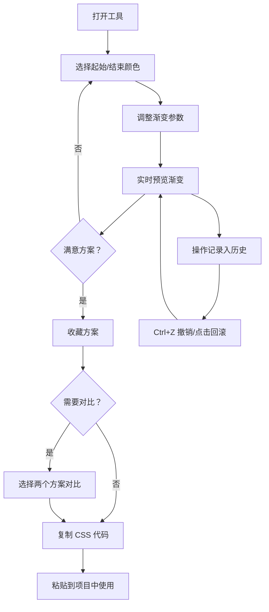

## 1. 产品概述

渐变色彩搭配方案生成与分享工具，面向设计师和前端开发者，解决选色配色效率低、灵感枯竭、缺乏直观预览和分享渠道的问题。用户可实时创建、预览、收藏、对比和导出个性化渐变方案，并通过一键复制获取生产级 CSS 代码。

- 核心用户：UI/UX 设计师、前端开发者、视觉创意工作者
- 核心价值：将配色从"凭感觉"升级为"可视化操控 + 即时反馈 + 一键输出"的高效工作流

## 2. 核心功能

### 2.1 用户角色

| 角色 | 使用方式 | 核心权限 |
|------|----------|----------|
| 访客 | 无需注册 | 创建渐变方案、收藏、对比、复制 CSS、历史回滚 |

### 2.2 功能模块

1. **主工作区**：双色盘选择 + 渐变参数配置 + 实时大尺寸预览
2. **收藏面板**：方案收藏、拖拽排序、双方案对比展示
3. **代码面板**：CSS 代码展示（含行号高亮）+ 一键复制
4. **历史面板**：操作时间轴 + 撤销/恢复 + 点击回滚

### 2.3 页面详情

| 页面名称 | 模块名称 | 功能描述 |
|----------|----------|----------|
| 主工作区 | 颜色选择器 | 两个色盘（起始/结束颜色），支持 HEX 输入，选择渐变样式（线性/径向/锥形）、方向角度/位置、渐变步数 |
| 主工作区 | 渐变预览区 | 宽高自适应大圆角矩形，实时渲染渐变，颜色切换带 0.3s 淡入淡出动画 |
| 收藏面板 | 收藏卡片列表 | 从右侧滑入面板，每张卡片含缩略渐变条 + 方案名称 + 创建时间，支持拖拽排序（半透明克隆 + 弹性回弹动画） |
| 收藏面板 | 对比模式 | 选中两个方案后点击对比，页面背景淡出，左右并排大卡片展示，中间分割线，上下同步滚动 |
| 代码面板 | CSS 代码展示 | 灰色等宽字体 + 行号高亮，包含 -webkit- 前缀和标准写法 |
| 代码面板 | 复制功能 | 点击复制按钮弹出圆形脉冲动画提示"已复制到剪贴板"，按钮变勾选状态，2s 后恢复 |
| 历史面板 | 操作时间轴 | 左侧面板以时间轴展示所有操作（新增/修改颜色/删除），每条记录含操作类型 + 缩略预览，支持点击回滚 |
| 历史面板 | 撤销/恢复 | Ctrl+Z 快捷键撤销，撤销时有平滑过渡动画 |

## 3. 核心流程

用户打开工具 → 在色盘中选择起始/结束颜色 → 调整渐变样式/方向/步数 → 实时预览渐变效果 → 满意后收藏方案 → 可选择两个方案进行对比 → 一键复制 CSS 代码 → 可通过历史面板回滚到之前状态

## 4. 用户界面设计

### 4.1 设计风格

- **主色调**：蓝紫色系（#6366f1 ~ #8b5cf6 渐变作为品牌色）
- **背景**：浅灰纹理渐变底色
- **卡片风格**：半透明白色磨砂玻璃质感（毛玻璃效果），边框细灰，投影柔和
- **按钮**：渐变填充，悬停时光晕扩散动画
- **字体**：标题使用 Outfit（几何感展示字体），正文使用 DM Sans（清晰 UI 字体），代码使用 JetBrains Mono
- **布局**：居中大预览 + 左侧历史面板 + 右侧收藏面板
- **交互反馈**：所有可交互元素 hover 时 0.2s 缩放 + 阴影加深

### 4.2 页面设计概览

| 页面名称 | 模块名称 | UI 元素 |
|----------|----------|---------|
| 主工作区 | 颜色选择器 | 两个圆形色盘 + HEX 输入框，下拉选择渐变样式，角度滑块，步数选择器 |
| 主工作区 | 渐变预览区 | 大圆角矩形（border-radius: 24px），占据页面主体，毛玻璃边框，0.3s CSS transition |
| 收藏面板 | 收藏卡片 | 缩略渐变条 + 名称 + 时间，拖拽时 opacity: 0.5 克隆 + spring 回弹 |
| 收藏面板 | 对比模式 | 全屏遮罩层，两张大卡片左右并排，中间 2px 分割线，同步滚动容器 |
| 代码面板 | 代码展示区 | 深灰背景，JetBrains Mono 字体，行号高亮，-webkit- 前缀 + 标准写法 |
| 代码面板 | 复制按钮 | 渐变填充按钮，点击后圆形脉冲动画 → 勾选图标 → 2s 恢复 |
| 历史面板 | 时间轴 | 左侧垂直时间线，每节点含操作图标 + 缩略渐变条 + 时间戳 |
| 历史面板 | 撤销按钮 | 底部固定撤销/恢复按钮 + Ctrl+Z 快捷键支持 |

### 4.3 响应式设计

- **桌面端（≥1024px）**：三栏布局，左侧历史面板（260px）+ 中间主工作区 + 右侧收藏面板（320px）
- **平板端（768-1023px）**：主工作区全宽，历史和收藏面板通过按钮切换显示
- **移动端（<768px）**：色盘上下排列，预览区缩小为正方形，面板改为底部抽屉式弹出

### 4.4 性能目标

- 渐变预览渲染帧率稳定 60fps（使用 CSS gradient 而非 Canvas）
- CSS 代码复制响应时间 < 50ms
- 面板滑入/滑出动画使用 GPU 加速（transform + will-change）
