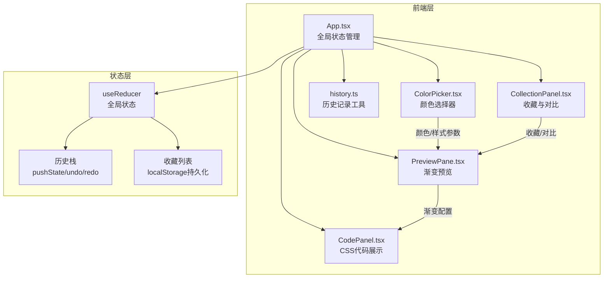

## 1. 架构设计



## 2. 技术说明

- **前端框架**：React 18 + TypeScript
- **构建工具**：Vite + @vitejs/plugin-react
- **样式方案**：Tailwind CSS 3 + CSS Modules（毛玻璃等自定义效果）
- **状态管理**：useReducer（核心状态）+ Context（跨组件共享）
- **依赖库**：uuid（方案唯一 ID 生成）
- **持久化**：localStorage（收藏方案和偏好设置）
- **无后端**：纯前端应用，所有数据存储在浏览器本地

## 3. 路由定义

| 路由 | 用途 |
|------|------|
| / | 主工作区（单页应用，无额外路由） |

## 4. 数据模型

### 4.1 核心类型定义

```typescript
interface GradientScheme {
  id: string;
  name: string;
  startColor: string;
  endColor: string;
  gradientType: 'linear' | 'radial' | 'conic';
  direction: number;
  steps: number;
  createdAt: number;
}

interface HistoryEntry {
  id: string;
  type: 'create' | 'update' | 'delete';
  scheme: GradientScheme;
  timestamp: number;
  snapshot: GradientScheme[];
}

interface AppState {
  currentScheme: GradientScheme;
  collections: GradientScheme[];
  history: HistoryEntry[];
  historyIndex: number;
  selectedForCompare: string[];
}
```

### 4.2 状态流转

```mermaid
stateDiagram-v2
    [*] --> "初始状态"
    "初始状态" --> "编辑渐变": 选择颜色/调整参数
    "编辑渐变" --> "编辑渐变": 继续调整
    "编辑渐变" --> "收藏方案": 点击收藏"
    "编辑渐变" --> "历史记录": 自动记录"
    "收藏方案" --> "对比模式": 选中两个方案"
    "对比模式" --> "收藏方案": 退出对比"
    "历史记录" --> "编辑渐变": 回滚到历史状态"
```

## 5. 文件组织

```
├── package.json
├── vite.config.ts
├── tsconfig.json
├── index.html
└── src/
    ├── App.tsx                    # 根组件，useReducer 管理全局状态
    ├── main.tsx                   # 入口文件
    ├── index.css                  # 全局样式 + Tailwind 指令
    ├── components/
    │   ├── ColorPicker.tsx        # 双色盘 + HEX输入 + 渐变参数
    │   ├── PreviewPane.tsx        # 渐变预览组件
    │   ├── CodePanel.tsx          # CSS代码展示 + 复制
    │   └── CollectionPanel.tsx    # 收藏面板 + 对比模式
    └── utils/
        └── history.ts             # 历史记录栈管理
```

## 6. 关键技术决策

### 6.1 渐变渲染方案
- 使用 CSS `background` 属性直接渲染渐变（而非 Canvas），确保 60fps 性能
- 预览区使用 `transition: background 0.3s ease` 实现平滑过渡动画

### 6.2 毛玻璃效果实现
- 卡片：`backdrop-filter: blur(20px) saturate(180%)` + 半透明白色背景
- 边框：`border: 1px solid rgba(255, 255, 255, 0.3)`
- 阴影：`box-shadow: 0 8px 32px rgba(0, 0, 0, 0.08)`

### 6.3 拖拽排序
- 使用 HTML5 Drag and Drop API + CSS transform 实现拖拽效果
- 拖拽时创建半透明克隆元素，松手时弹性回弹动画（CSS transition with cubic-bezier）

### 6.4 CSS 代码生成
- 同时输出 `-webkit-` 前缀和标准写法
- 根据渐变类型和步数生成对应的 CSS 渐变函数

### 6.5 历史记录
- 基于快照的不可变历史栈
- 每次 pushState 存储完整状态快照
- undo/redo 通过 historyIndex 指针切换
