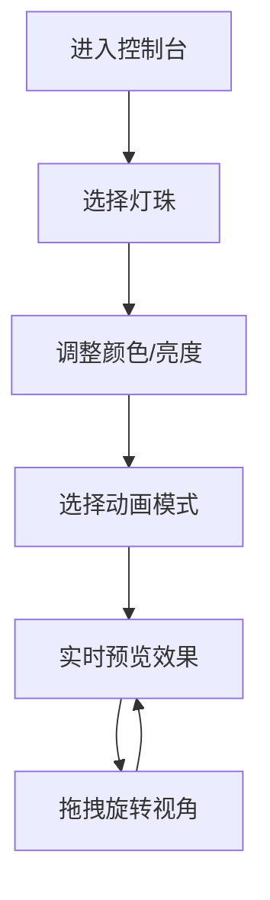

## 1. 产品概述

音乐人虚拟演出舞台灯光秀控制台是一款面向音乐人和舞台设计师的实时灯光效果设计与预览工具。用户可以通过直观的控制面板调节灯珠参数，设计并预览多种动画模式的灯光秀效果。

- 核心功能：3D舞台灯光渲染、灯珠颜色/亮度调节、多模式动画效果
- 目标用户：音乐人、DJ、舞台灯光设计师、演出策划人员
- 产品价值：降低灯光设计门槛，提供实时预览，提升创作效率

## 2. 核心功能

### 2.1 功能模块

1. **舞台展示模块**：3D环形灯珠阵列渲染、实时灯光效果展示、视角拖拽旋转
2. **控制面板模块**：灯珠选择、亮度调节、颜色调节、动画模式切换

### 2.2 页面详情

| 页面名称 | 模块名称 | 功能描述 |
|---------|---------|---------|
| 主控制台 | 舞台展示区 | 12颗灯珠环形排列，支持独立颜色/亮度设置，颜色变化带0.3秒淡入淡出 |
| 主控制台 | 控制面板区 | 灯珠选择（单选/全选）、亮度滑块（0-100）、色盘调色、动画模式下拉菜单 |
| 主控制台 | 动画系统 | 呼吸灯、交替闪烁、流水灯三种动画模式，切换无卡顿 |

## 3. 核心流程

用户进入控制台 → 选择灯珠（单个或全选） → 调整颜色和亮度 → 选择动画模式 → 实时预览灯光效果 → 拖拽旋转舞台视角

## 4. 用户界面设计

### 4.1 设计风格

- **主色调**：深色科技感主题（背景#1a1a2e，面板#16213e）
- **按钮风格**：圆角玻璃样式（毛玻璃效果），点击下压反馈动画
- **字体**：发光文字效果（text-shadow模拟），与深色背景形成反差
- **布局风格**：左大右小布局（舞台70%，控制面板30%），响应式适配
- **视觉效果**：灯珠圆形光斑、中心高亮度边缘渐暗、发光光晕效果

### 4.2 页面设计概述

| 页面名称 | 模块名称 | UI元素 |
|---------|---------|--------|
| 主控制台 | 舞台展示区 | 深灰色渐变背景、12颗环形灯珠、光晕效果、3D旋转视角 |
| 主控制台 | 控制面板区 | 发光标题文字、灯珠选择按钮、亮度滑块（实时数值）、色盘、动画下拉菜单 |

### 4.3 响应式

- 桌面端：左大右小布局（舞台70%，控制面板30%）
- 窄屏/移动端：控制面板移至舞台下方，上下布局
- 触摸优化：支持触屏拖拽旋转视角

### 4.4 3D场景指引

- **环境**：深灰色渐变背景，营造舞台氛围
- **灯光**：12颗虚拟灯珠，环形排列，每颗独立发光
- **相机**：透视视角，支持鼠标拖拽旋转，带惯性效果
- **交互**：鼠标拖拽旋转视角，滚轮缩放
- **特效**：灯珠光晕效果，颜色平滑过渡动画
