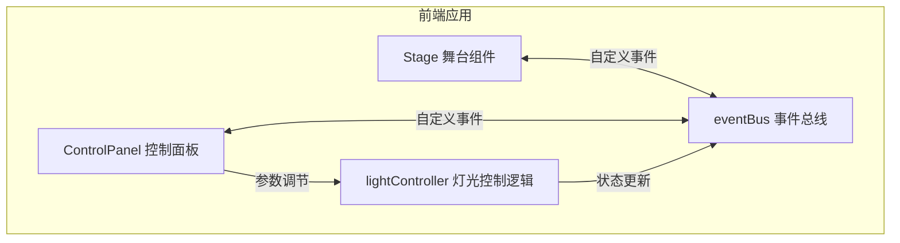

## 1. 架构设计



## 2. 技术描述

- **前端框架**：React 18 + TypeScript
- **构建工具**：Vite
- **3D渲染**：CSS 3D Transform + Canvas 2D（轻量级方案）
- **状态管理**：自定义事件总线（eventBus）
- **样式方案**：原生CSS + CSS变量

### 依赖清单

| 依赖包 | 用途 |
|--------|------|
| react | UI框架 |
| react-dom | DOM渲染 |
| typescript | 类型系统 |
| vite | 构建工具 |
| @vitejs/plugin-react | React插件 |

## 3. 文件结构

```
src/
├── Stage.tsx          # 3D灯光舞台组件
├── ControlPanel.tsx   # 控制面板组件
├── lightController.ts # 灯光控制逻辑
├── eventBus.ts        # 事件总线
├── styles.css         # 全局样式
└── main.tsx           # 入口文件
```

## 4. 模块说明

### 4.1 事件总线 (eventBus.ts)

- 实现发布-订阅模式
- 提供 `on`、`off`、`emit` 方法
- 支持自定义事件类型

### 4.2 灯光控制器 (lightController.ts)

- 管理12颗灯珠的状态数组
- 每颗灯珠包含：id、color、brightness、targetColor、targetBrightness
- 实现淡入淡出动画（0.3秒过渡）
- 实现三种动画模式：
  - 呼吸灯：亮度周期性正弦变化
  - 交替闪烁：相邻灯珠交替亮灭
  - 流水灯：灯珠依次亮起形成流动感

### 4.3 舞台组件 (Stage.tsx)

- 渲染12颗灯珠的环形布局
- 支持鼠标拖拽旋转视角（带惯性）
- 灯珠渲染为圆形光斑，中心亮边缘暗
- 光晕大小随亮度变化
- 监听灯光状态更新事件并重绘

### 4.4 控制面板组件 (ControlPanel.tsx)

- 灯珠选择器（单选/全选）
- 亮度滑块（0-100，实时显示数值）
- 颜色选择器（色盘）
- 动画模式下拉菜单
- 参数变化通过事件总线通知

## 5. 性能指标

| 指标 | 要求 |
|------|------|
| 灯光参数调整延迟 | ≤ 50ms |
| 动画模式切换响应 | ≤ 100ms |
| 拖拽视角帧率 | ≥ 30fps |
| 颜色过渡时间 | 0.3秒 |
