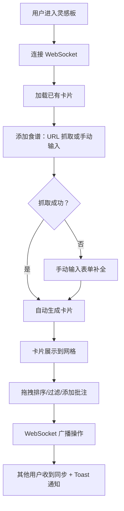

## 1. 产品概述

共享食谱灵感板是一款面向家庭用户的协作式食谱收集工具，允许家庭成员像 Pinterest 一样收集、整理网络上的食谱卡片，按菜系分类，并支持多人实时编辑同一个灵感板，方便家庭共同规划一周菜单。

- 核心价值：解决家庭菜单规划的协作痛点，让烹饪灵感可视化、可共享
- 目标用户：需要规划家庭饮食的家庭成员、美食爱好者

## 2. 核心功能

### 2.1 用户角色

| 角色 | 注册方式 | 核心权限 |
|------|----------|----------|
| 家庭成员 | 匿名昵称登录 | 浏览、添加、编辑、拖拽排序卡片，添加批注 |

### 2.2 功能模块

1. **灵感板主页**：卡片网格展示、菜系标签过滤、URL 抓取输入框
2. **食谱卡片**：封面图、标题、菜系标签、拖拽排序、点击展开批注
3. **批注系统**：批注列表（头像、时间、内容）、输入框、最新批注高亮
4. **实时协作**：WebSocket 同步所有操作、Toast 通知其他用户活动

### 2.3 页面详情

| 页面名称 | 模块名称 | 功能描述 |
|---------|---------|----------|
| 灵感板主页 | URL 抓取模块 | 输入 URL 自动抓取食谱标题和封面图，失败时提供手动输入表单 |
| 灵感板主页 | 卡片网格布局 | 桌面端多列网格，移动端单列瀑布流，支持按菜系标签过滤 |
| 食谱卡片 | 拖拽排序 | 弹性动画和小反弹效果，帧率不低于 50fps |
| 食谱卡片 | 批注面板 | 点击展开，淡入上浮动画，展示批注列表和输入框 |
| 实时通知 | Toast 模块 | 左下角滑入通知，显示其他用户操作（新增/拖拽/批注），淡出退场 |

## 3. 核心流程

### 3.1 用户主流程

用户进入灵感板 → 输入食谱 URL 或手动添加 → 卡片自动生成并展示 → 拖拽调整顺序或按菜系过滤 → 点击卡片添加烹饪心得批注 → 所有操作实时同步给其他在线用户 → 收到其他用户操作的 Toast 通知

### 3.2 流程图

## 4. 用户界面设计

### 4.1 设计风格

- **主色调**：温暖奶油色（#FFF8F0）作为背景，木纹色（#D4A574）作为导航和边框
- **强调色**：番茄红（#E67E22）用于按钮和高亮，牛油果绿（#27AE60）用于成功状态和标签
- **卡片风格**：圆角 16px，轻微阴影（box-shadow: 0 4px 20px rgba(0,0,0,0.08)），悬停时轻微上浮
- **字体**：标题使用 Playfair Display（优雅衬线），正文使用 Lato（清晰无衬线）
- **动画**：卡片拖拽弹性效果（cubic-bezier(0.68, -0.55, 0.265, 1.55)），批注淡入上浮，Toast 滑入滑出

### 4.2 页面设计概述

| 页面名称 | 模块名称 | UI 元素 |
|---------|---------|---------|
| 灵感板主页 | 顶部导航栏 | 木纹色背景，Logo，用户昵称输入，在线人数显示 |
| 灵感板主页 | URL 输入区 | 奶油色背景卡片，输入框+抓取按钮，番茄红主按钮 |
| 灵感板主页 | 标签过滤区 | 圆角标签按钮，牛油果绿选中态 |
| 灵感板主页 | 卡片网格 | CSS Grid 布局，桌面端 3-4 列，移动端单列 |
| 食谱卡片 | 卡片主体 | 封面图占上 60%，标题+标签占下 40%，圆角 16px |
| 食谱卡片 | 批注面板 | 点击卡片下方展开，淡入上浮动画，最新批注高亮 |
| 通知 | Toast | 左下角固定，滑入入场，淡出退场，显示用户名和操作 |

### 4.3 响应式设计

- **桌面端（≥1024px）**：3-4 列网格布局，卡片宽度 280px
- **平板端（768-1023px）**：2 列网格布局
- **移动端（<768px）**：单列瀑布流布局，卡片宽度 100%
- **触摸优化**：拖拽区域增大，点击目标 ≥44px

### 4.4 性能指标

- 拖拽操作帧率 ≥ 50fps
- 卡片加载延迟 < 200ms
- WebSocket 同步延迟 < 200ms
- 首屏加载时间 < 2s
