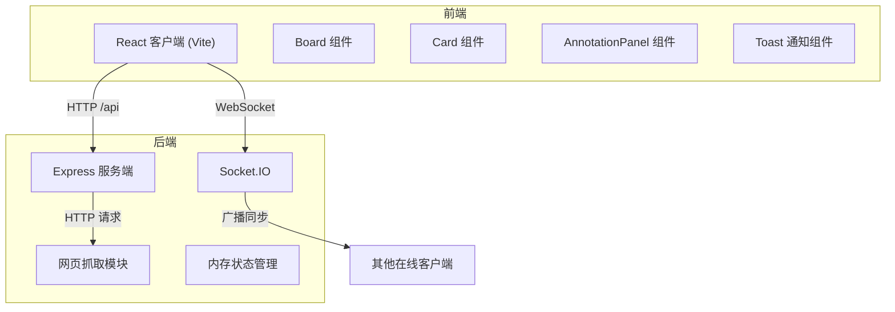
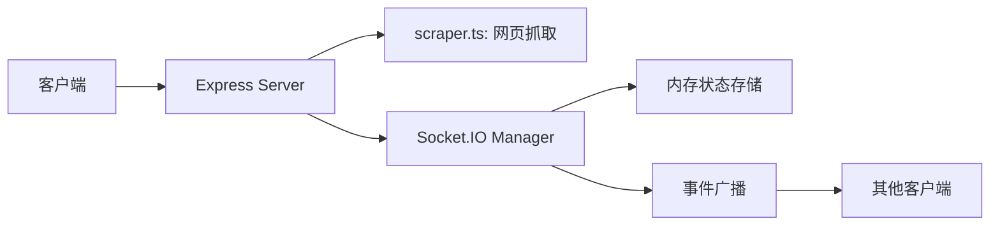

## 1. 架构设计



## 2. 技术描述

- **前端框架**：React 18 + TypeScript 5
- **构建工具**：Vite 5
- **状态管理**：React useState + useReducer（组件内）
- **拖拽库**：react-beautiful-dnd（高性能拖拽，支持弹性动画）
- **WebSocket**：socket.io-client 4.x
- **HTTP 请求**：axios 1.x
- **样式方案**：CSS Modules + CSS Variables（零运行时开销）
- **后端**：Express 4 + Socket.IO 4
- **数据存储**：内存存储（演示用途，生产可扩展为 Redis/PostgreSQL）
- **代理配置**：Vite Server Proxy 转发 /api 和 /socket.io 到后端

## 3. 项目结构

```
auto5/
├── package.json
├── vite.config.ts
├── tsconfig.json
├── index.html
├── src/
│   ├── main.tsx
│   ├── App.tsx
│   ├── components/
│   │   ├── Board.tsx
│   │   ├── Card.tsx
│   │   ├── AnnotationPanel.tsx
│   │   ├── Toast.tsx
│   │   └── TagFilter.tsx
│   ├── types/
│   │   └── index.ts
│   ├── utils/
│   │   └── socket.ts
│   └── styles/
│       └── variables.css
└── server/
    ├── index.ts
    └── scraper.ts
```

## 4. 路由定义

| 路由 | 用途 |
|------|------|
| / | 灵感板主页 |
| /api/scrape | POST，抓取网页食谱信息 |
| /socket.io | Socket.IO 连接端点 |

## 5. API 定义

### 5.1 类型定义

```typescript
// 食谱卡片
interface RecipeCard {
  id: string;
  title: string;
  coverImage: string;
  cuisine: string;
  url: string;
  order: number;
  createdAt: number;
  annotations: Annotation[];
}

// 批注
interface Annotation {
  id: string;
  content: string;
  author: string;
  avatar: string;
  createdAt: number;
}

// 用户
interface User {
  id: string;
  name: string;
  avatar: string;
}

// 同步事件类型
type SyncEventType = 'card:add' | 'card:reorder' | 'annotation:add';

// 同步事件
interface SyncEvent<T = any> {
  type: SyncEventType;
  payload: T;
  user: User;
  timestamp: number;
}
```

### 5.2 HTTP API

#### POST /api/scrape
请求体：
```typescript
{ url: string }
```
响应：
```typescript
{
  success: boolean;
  data?: { title: string; coverImage: string };
  error?: string;
}
```

### 5.3 Socket.IO 事件

#### 客户端 → 服务端
- `board:join` - 加入灵感板，携带 boardId
- `card:add` - 添加新卡片
- `card:reorder` - 卡片重新排序
- `annotation:add` - 添加批注

#### 服务端 → 客户端
- `board:state` - 初始状态同步
- `card:added` - 广播卡片添加
- `card:reordered` - 广播卡片排序
- `annotation:added` - 广播批注添加
- `user:joined` - 用户加入通知
- `user:left` - 用户离开通知

## 6. 服务器架构



## 7. 性能优化策略

1. **拖拽性能**：使用 react-beautiful-dnd 的虚拟滚动，仅渲染可视区域卡片
2. **动画性能**：使用 CSS transform 和 opacity 动画，避免重排重绘
3. **WebSocket 优化**：批量发送操作，debounce 高频事件（拖拽）
4. **图片优化**：使用 loading="lazy"，设置合适尺寸，添加 placeholder
5. **状态同步**：增量更新而非全量推送，减少传输数据量
6. **构建优化**：Vite 按需编译，生产环境代码分割，Tree Shaking

## 8. 启动脚本

```json
{
  "scripts": {
    "dev": "concurrently \"npm run server\" \"npm run client\"",
    "client": "vite",
    "server": "ts-node server/index.ts",
    "build": "tsc && vite build"
  }
}
```
