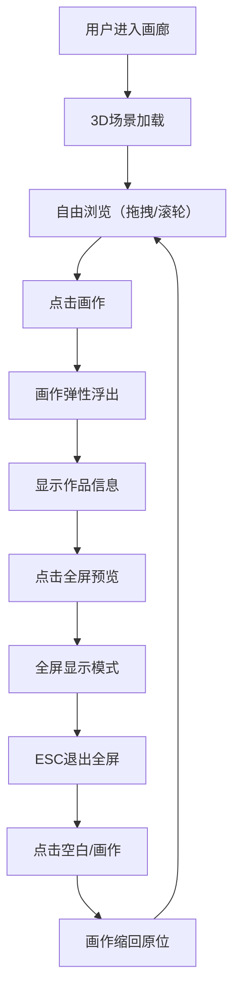

## 1. 产品概述

虚拟3D艺术画廊应用，为插画师、绘本创作者提供沉浸式数字艺术展示平台，用户可像逛真实展览一样自由漫步欣赏作品。

- 核心价值：打造沉浸式数字艺术展览体验，让艺术作品以3D画廊形式呈现
- 目标用户：艺术爱好者、插画师、绘本创作者、收藏家

## 2. 核心功能

### 2.1 用户角色

| 角色 | 注册方式 | 核心权限 |
|------|----------|----------|
| 访客用户 | 无需注册 | 自由浏览画廊、查看画作详情、全屏预览 |

### 2.2 功能模块

1. **3D画廊场景**：矩形展厅、地面、墙壁、天花板、6个画框
2. **交互控制系统**：鼠标拖拽旋转视角、滚轮缩放、平滑阻尼效果
3. **画作详情展示**：点击浮出画作、作品信息叠加、半透明遮罩
4. **全屏预览模式**：画作全屏显示、ESC退出、淡入淡出动画

### 2.3 页面详情

| 页面名称 | 模块名称 | 功能描述 |
|---------|----------|----------|
| 画廊主页 | 3D场景渲染 | Three.js渲染画廊空间，包含地面、墙壁、灯光 |
| 画廊主页 | 视角控制 | 鼠标拖拽水平环绕旋转、滚轮拉近拉远、0.2秒平滑阻尼 |
| 画廊主页 | 画框展示 | 6个木质画框均匀分布在四周墙壁 |
| 画廊主页 | 画作交互 | 点击画作浮出0.5米，0.3秒ease-out-back弹性动画 |
| 画廊主页 | 信息叠加 | 浮出画作显示作品名称、作者、创作年份 |
| 画廊主页 | 遮罩效果 | 背景变暗的半透明黑色遮罩渐入渐出 |
| 画廊主页 | 全屏预览 | 点击"全屏预览"按钮，画作填满屏幕，ESC退出 |

## 3. 核心流程

用户进入画廊 → 3D场景加载完成 → 鼠标拖拽环绕浏览 → 滚轮调整视角距离 → 点击感兴趣的画作 → 画作弹性浮出并显示详情 → 点击"全屏预览"进入全屏模式 → 按ESC退出全屏 → 点击空白区域或再次点击画作缩回原位

## 4. 用户界面设计

### 4.1 设计风格

- **主色调**：暖灰色墙壁（#E8E3DE）、浅木色地面（#D4A574）、深棕色画框（#5D4037）
- **辅助色**：半透明黑色遮罩（rgba(0,0,0,0.7)）、白色文字（#FFFFFF）
- **灯光**：色温3000K暖光，环境光+两盏方向性聚光灯
- **字体**：衬线字体（Georgia, serif），营造美术馆氛围
- **动画**：ease-out-back弹性效果、0.5秒淡入淡出

### 4.2 页面设计概述

| 页面名称 | 模块名称 | UI元素 |
|---------|----------|--------|
| 画廊主页 | 画廊名称 | 左上角半透明"数字画廊 — 卷2"，16px衬线字体 |
| 画廊主页 | 画作信息 | 浮出画作上居中显示作品名称、作者名、创作年份 |
| 画廊主页 | 全屏预览按钮 | 浮出画作右下角显示"全屏预览"按钮 |
| 画廊主页 | 全屏模式 | 全黑背景，画作居中填满屏幕 |
| 画廊主页 | 鼠标指针 | 悬停画作时变为手型光标 |

### 4.3 响应式

- 桌面端优先，适配不同屏幕尺寸
- 画作纹理根据窗口大小动态调整分辨率，最大2048x2048
- 窗口大小变化时自动调整渲染器和相机

### 4.4 3D场景指导

- **环境**：暖色调美术馆氛围，地面浅色木纹材质，墙壁暖灰色亚光质地
- **灯光**：柔和环境光（泛光）+ 两盏3000K聚光灯（左上、右上照射墙壁）
- **相机**：透视相机，环绕展厅中心点旋转，支持滚轮缩放
- **运动**：视角运动带0.2秒平滑阻尼，避免生硬跳跃
- **交互**：点击画作浮出（0.5米前移），0.3秒弹性动画
- **后期**：画作表面自然光照效果，画框轻微投影
- **资源**：画作纹理使用在线图片URL，性能目标60FPS
