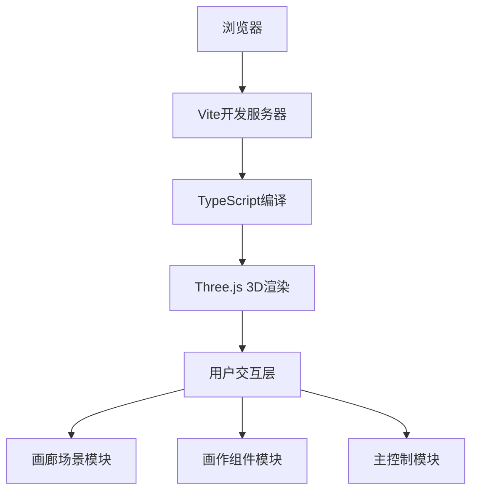

## 1. 架构设计



## 2. 技术描述

- **前端框架**：原生TypeScript + Three.js（无需React/Vue，按用户需求）
- **构建工具**：Vite 5.x
- **3D引擎**：Three.js 0.160.x
- **类型定义**：@types/three
- **语言**：TypeScript（严格模式）
- **模块系统**：ES Module

## 3. 目录结构

```
auto54/
├── package.json
├── vite.config.ts
├── tsconfig.json
├── index.html
└── src/
    ├── main.ts        # 主入口：场景、相机、渲染器、动画循环、交互控制
    ├── gallery.ts     # 画廊构建：地面、墙壁、天花板、画框位置管理
    └── artwork.ts     # 画作组件：画框、纹理加载、点击事件
```

## 4. 数据流向

### 4.1 模块间数据流

1. **main.ts → gallery.ts**：传递画作列表数据
2. **gallery.ts → artwork.ts**：为每个画作创建Artwork实例
3. **artwork.ts → main.ts**：点击画作时派发自定义事件传递画作数据
4. **main.ts**：统一管理场景状态，处理画作浮出/缩回逻辑

### 4.2 核心类型定义

```typescript
// 画作数据结构
interface ArtworkData {
  id: string;
  title: string;
  author: string;
  year: number;
  imageUrl: string;
}

// 画廊配置
interface GalleryConfig {
  width: number;
  height: number;
  depth: number;
  artworkCount: number;
}

// 交互状态
type InteractionState = 'idle' | 'hovering' | 'floating' | 'fullscreen';
```

## 5. 核心模块设计

### 5.1 main.ts 主控制模块

```typescript
// 核心职责：
// - 初始化Scene、PerspectiveCamera、WebGLRenderer
// - 创建AmbientLight和两盏SpotLight（3000K色温）
// - 启动requestAnimationFrame动画循环
// - 处理鼠标拖拽旋转（theta角控制）
// - 处理滚轮缩放（camera距离控制）
// - 应用0.2秒平滑阻尼
// - 监听画作点击事件
// - 管理遮罩层和UI元素
// - 处理全屏预览模式
```

### 5.2 gallery.ts 画廊模块

```typescript
// 核心职责：
// - 创建矩形展厅：地面、四面墙壁、天花板
// - 计算6个画框位置（均匀分布）
// - 创建Group作为画廊容器
// - 调用artwork.ts创建画作对象
// - 提供addArtworks方法接收画作列表
// - 返回画廊3D对象给main.ts
```

### 5.3 artwork.ts 画作模块

```typescript
// 核心职责：
// - 创建木质画框（BoxGeometry）
// - 创建画布平面（PlaneGeometry）
// - 使用TextureLoader加载图片纹理
// - 限制纹理最大分辨率2048x2048
// - 实现射线检测支持
// - 派发artwork-click自定义事件
// - 提供浮出/缩回动画方法
```

## 6. 动画与交互规范

| 动画类型 | 时长 | 缓动函数 | 说明 |
|---------|------|----------|------|
| 视角阻尼 | 0.2s | linear | 平滑跟随目标值 |
| 画作浮出 | 0.3s | ease-out-back | 向前0.5米 |
| 画作缩回 | 0.3s | ease-out | 返回原位 |
| 遮罩渐入 | 0.3s | ease-out | 透明度0→0.7 |
| 遮罩渐出 | 0.3s | ease-in | 透明度0.7→0 |
| 全屏淡入 | 0.5s | ease-out | 黑背景渐入 |
| 全屏淡出 | 0.5s | ease-in | 黑背景渐出 |

## 7. 性能优化

- **纹理优化**：设置纹理最大尺寸2048x2048，使用mipmap
- **材质复用**：地面、墙壁、画框材质复用
- **几何复用**：画框和画布几何体实例化
- **动画优化**：使用Clock.getDelta()计算帧间隔
- **事件节流**：鼠标移动事件节流处理
- **内存管理**：纹理dispose，几何体dispose
