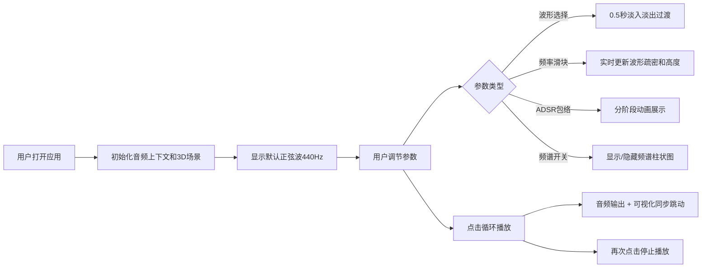

## 1. 产品概述

虚拟乐器波形调制可视化应用是一款面向音乐创作者和音效设计师的交互式工具，让用户能够实时设计并预览合成器音色的波形、包络和频谱，直观感受声音的视觉形态。

- 核心价值：将抽象的声音参数转化为直观的3D视觉表现，降低合成器学习门槛
- 目标用户：音乐爱好者、音效设计师、电子音乐制作人、学生

## 2. 核心功能

### 2.1 功能模块
1. **3D波形渲染模块**：以三维线条网格实时展示音频波形，支持四种基础波形
2. **频谱分析模块**：动态柱状图展示音频频谱分布，颜色随频率渐变
3. **控制面板模块**：波形选择、频率调节、ADSR包络控制、效果开关
4. **音频播放模块**：一键循环播放，实时输出合成音色到扬声器

### 2.2 页面详情
| 页面名称 | 模块名称 | 功能描述 |
|-----------|-------------|---------------------|
| 主界面 | 3D波形场景 | 全屏Three.js渲染，发光蓝色波形网格，旋转星空背景 |
| 主界面 | 频谱分析层 | 波形后方动态频谱柱状图，低频蓝色到高频红色渐变 |
| 主界面 | 控制面板 | 右侧悬浮磨砂玻璃面板，包含所有参数调节控件 |
| 主界面 | 播放控制 | 左下角一键循环播放按钮，同步驱动音频和可视化 |

## 3. 核心流程

## 4. 用户界面设计

### 4.1 设计风格
- **主色调**：深色背景 `#1a1a2e`，发光波形 `#00d4ff`，渐变强调色 `#e94560` 到 `#0f3460`
- **按钮风格**：圆角按钮，渐变填充，点击缩放反馈（scale: 0.95）
- **字体**：显示字体使用 Orbitron（科技感），正文字体使用 JetBrains Mono（等宽清晰）
- **布局风格**：非对称布局，3D场景居中，控制面板悬浮右侧，播放按钮固定左下角
- **视觉效果**：磨砂玻璃面板（backdrop-filter: blur(10px)），滑块拖影光晕，发光线条

### 4.2 页面设计概述
| 页面名称 | 模块名称 | UI元素 |
|-----------|-------------|-------------|
| 主界面 | 3D波形场景 | 居中发光蓝色网格线条，微微俯视相机，背景旋转星空粒子，最大宽度1200px |
| 主界面 | 频谱分析层 | 512根渐变柱子，顶端圆形光晕，呼吸脉冲动画，位于波形后方 |
| 主界面 | 控制面板 | 半透明深色背景，磨砂玻璃效果，波形选择按钮组，频率滑块，ADSR四象限控制，频谱开关 |
| 主界面 | 播放控制 | 圆形播放/暂停按钮，脉冲光环动画，固定左下角 |

### 4.3 响应式
- 桌面端（>1200px）：控制面板悬浮右侧，3D场景居中显示
- 移动端（≤1200px）：控制面板折叠为底部抽屉，上滑展开，下滑收起
- 触摸优化：滑块增大触摸区域（48px高度），按钮最小44x44px

### 4.4 3D场景指导
- **环境**：深色宇宙空间感，无HDRI，使用自发光材质营造科技感
- **光照**：两点光源（冷蓝色主光 + 品红色补光），环境光强度0.3
- **相机**：PerspectiveCamera，位置(0, 8, 15)，lookAt(0, 0, 0)，fov 60°
- **构图**：波形网格占据视觉中心，频谱柱在Z轴后方，星空粒子环绕四周
- **交互**：鼠标移动时相机轻微偏移（视差效果），无轨道控制
- **后处理**：Bloom泛光效果（强度1.2，阈值0.3），提升发光质感
- **性能**：波形顶点≤5000，粒子数量根据FPS动态调整（最低200，最高1000）

## 5. 交互细节

### 5.1 波形切换
- 四种波形：正弦波、方波、锯齿波、三角波
- 过渡动画：0.5秒淡入淡出，顶点高度线性插值，避免突变
- 视觉反馈：选中按钮高亮，边框发光

### 5.2 频率控制
- 范围：20Hz - 2000Hz
- 阻尼效果：0.1秒惯性缓冲，滑块拖动平滑
- 视觉变化：频率越高网格越密，振幅缩小10%-30%

### 5.3 ADSR包络
- 起音（Attack）：0-2秒，波形从底部升起
- 衰减（Decay）：0-2秒，波形顶部缓缓下落
- 延音（Sustain）：0-100%，保持稳定高度
- 释音（Release）：0-2秒，波形逐渐消失
- 辅助显示：每个阶段半透明渐变网格

### 5.4 频谱分析
- 刷新率：≥30FPS
- 柱子数量：512根
- 颜色渐变：低频蓝色 → 中频青色 → 高频红色
- 动画效果：呼吸般脉冲（scale 0.95-1.05），顶端光晕闪烁
