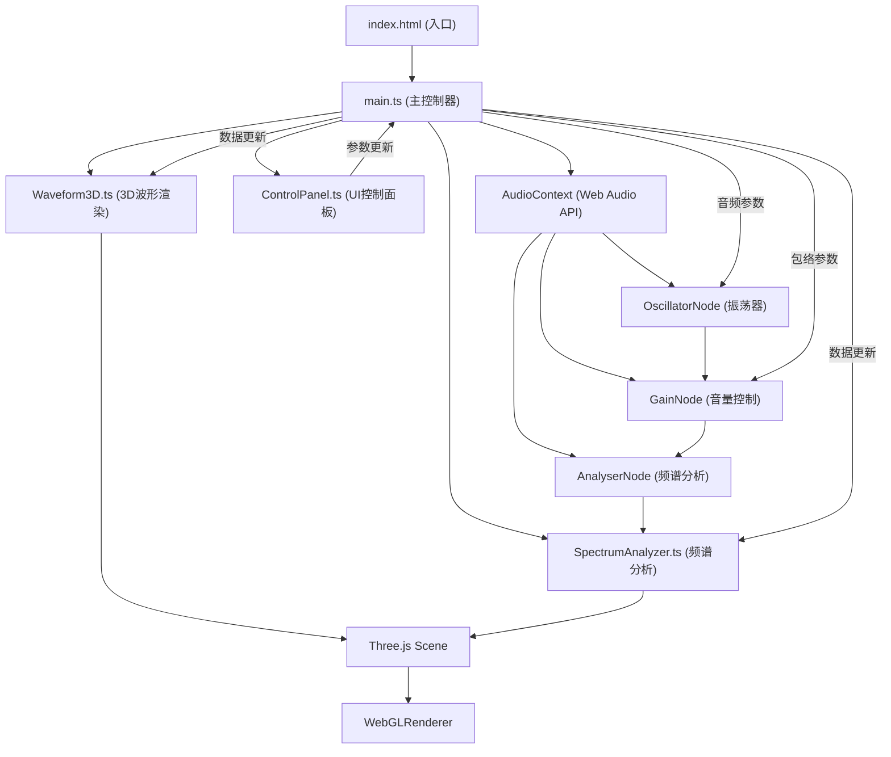

## 1. 架构设计



## 2. 技术描述

- **前端**：TypeScript 5.x + Three.js 0.160.x + Vite 5.x
- **构建工具**：Vite 5.x，支持热更新，生产构建优化
- **3D引擎**：Three.js，使用LineSegments + BufferGeometry渲染波形
- **音频引擎**：原生Web Audio API，无需额外音频库
- **样式方案**：原生CSS + CSS变量，无需Tailwind

## 3. 核心数据结构

### 3.1 波形参数接口
```typescript
interface WaveformParams {
  type: OscillatorType;
  frequency: number;
  attack: number;
  decay: number;
  sustain: number;
  release: number;
}
```

### 3.2 音频状态
```typescript
interface AudioState {
  isPlaying: boolean;
  currentTime: number;
  envelopePhase: 'idle' | 'attack' | 'decay' | 'sustain' | 'release';
}
```

## 4. 文件结构

```
auto55/
├── package.json
├── vite.config.ts
├── tsconfig.json
├── index.html
└── src/
    ├── main.ts              # 主入口，场景初始化，音频连接
    ├── Waveform3D.ts        # 3D波形渲染器
    ├── SpectrumAnalyzer.ts  # 频谱分析可视化
    ├── ControlPanel.ts      # UI控制面板
    └── types.ts             # 类型定义
```

## 5. 性能优化策略

### 5.1 渲染优化
- 波形使用 `BufferGeometry` + `LineSegments`，避免频繁重建几何体
- 顶点数据使用 `Float32Array`，通过 `needsUpdate` 标记更新
- 频谱柱子使用 `InstancedMesh`，减少draw call

### 5.2 帧率控制
- 目标帧率：60FPS，最低保证45FPS
- FPS监控：使用 `performance.now()` 计算帧间隔
- 动态降级：FPS < 30时，粒子数量从1000降至200，频谱柱从512降至128

### 5.3 内存管理
- 几何体、材质、纹理在组件销毁时调用 `dispose()`
- 避免在动画循环中创建新对象，复用对象池
- 音频节点在停止播放时正确断开连接

## 6. 关键实现说明

### 6.1 波形过渡动画
- 使用线性插值（lerp）平滑过渡顶点位置
- 过渡时间：0.5秒，使用 `requestAnimationFrame` 驱动
- 过渡期间同时渲染旧波形（淡出）和新波形（淡入）

### 6.2 ADSR包络实现
- 使用 `GainNode.gain.setValueAtTime()` 和 `linearRampToValueAtTime()`
- 包络阶段追踪：状态机管理 attack → decay → sustain → release
- 可视化辅助：每个阶段绘制半透明参考网格

### 6.3 频谱数据处理
- `AnalyserNode.fftSize = 1024`，获得512个频率数据点
- 使用 `getByteFrequencyData()` 获取时域数据
- 能量归一化：将0-255映射到0-1的高度值

### 6.4 响应式布局
- CSS `@media (max-width: 1200px)` 触发移动端模式
- 控制面板使用 CSS `transform` 实现抽屉动画
- Three.js 渲染器监听 `resize` 事件，更新相机宽高比
