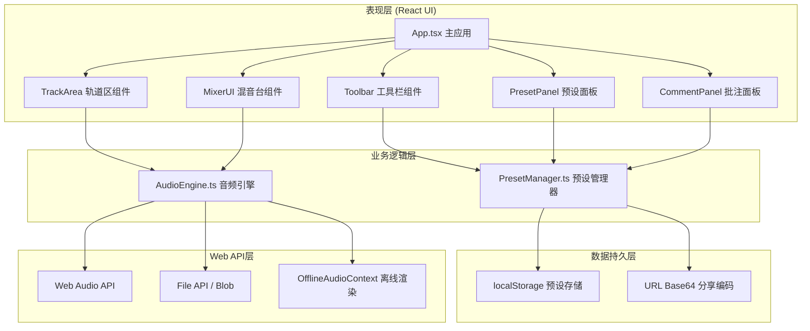
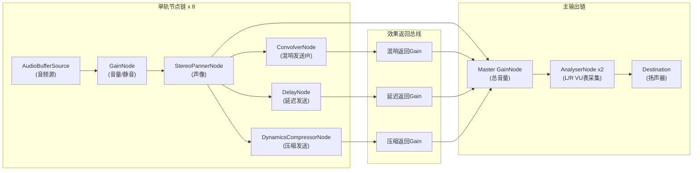

## 1. 架构设计



## 2. 技术选型说明

| 层级 | 技术方案 | 版本说明 |
|------|----------|----------|
| 前端框架 | React 18 + TypeScript 5 | 严格模式ES模块 |
| 构建工具 | Vite 5 + @vitejs/plugin-react | 热更新HMR |
| 状态管理 | React useState/useReducer + 自定义Hooks | 轻量级，无需额外store |
| UI样式 | 全局CSS + CSS变量 + 原生动画 | 无Tailwind依赖，精细控制磨砂玻璃质感 |
| 音频处理 | Web Audio API + OfflineAudioContext | 原生支持，无需第三方音频库 |
| 数据存储 | localStorage (预设) + URL Base64 (分享) | 无需后端 |
| 文件导出 | file-saver + Blob/WAV编码 | 客户端离线混合导出 |
| 图标方案 | 内联SVG图标 + lucide-react | 轻量可定制 |

## 3. 文件目录结构

```
auto66/
├── .trae/documents/          # 需求与架构文档
├── index.html                # Vite入口HTML，深色背景防闪烁
├── package.json              # 依赖与脚本
├── vite.config.ts            # Vite React插件配置
├── tsconfig.json             # TS严格模式配置
└── src/
    ├── main.tsx              # React入口
    ├── App.tsx               # 主应用组件，组装三层布局
    ├── AudioEngine.ts        # 核心音频引擎（加载/播放/参数/导出）
    ├── PresetManager.ts      # 预设CRUD、分享编码、批注管理
    ├── MixerUI.tsx           # 混音台UI（滑块/旋钮/VU表）
    ├── styles.css            # 全局样式、主题变量、动画关键帧
    └── components/           # 拆分的子组件
        ├── Toolbar.tsx       # 顶部工具栏
        ├── TrackArea.tsx     # 音轨编排区
        ├── Track.tsx         # 单条轨道
        ├── Waveform.tsx      # 波形渲染与拖拽
        ├── PresetPanel.tsx   # 预设侧边面板
        ├── CommentPanel.tsx  # 批注面板
        ├── Knob.tsx          # 通用磨砂玻璃旋钮
        ├── Slider.tsx        # 通用滑块控件
        └── VUMeter.tsx       # VU电平表组件
```

## 4. 核心数据结构定义

```typescript
// src/types.ts（定义于文件顶部，不单独建文件）

interface Track {
  id: string;
  name: string;
  audioBufferId: string;
  startTime: number;      // 波形起始位置(秒)
  duration: number;       // 音频时长(秒)
  muted: boolean;
  soloed: boolean;
  volume: number;         // 0-100
  pan: number;            // -1~0~1 (左/中/右)
  reverb: number;         // 0-100 发送量
  delay: number;
  compression: number;
}

interface Preset {
  id: string;
  name: string;
  createdAt: number;
  bpm: number;
  loopEnabled: boolean;
  tracks: Track[];
  waveformSnapshot: string; // 缩略波形Base64(可选)
  comments: Comment[];
}

interface Comment {
  id: string;
  time: number;       // 时间轴位置(秒)
  trackId?: string;   // 关联轨道
  text: string;
  author: 'creator' | 'viewer';
  createdAt: number;
}

interface AudioEngineState {
  isPlaying: boolean;
  currentTime: number;
  bpm: number;
  loopEnabled: boolean;
  masterVolume: number;
  vuLevels: [number, number]; // [L, R] dB值
}
```

## 5. AudioEngine 节点链架构



## 6. 关键算法与实现要点

### 6.1 波形可视化渲染
- 使用 `AudioBuffer.getChannelData(0)` 获取PCM数据
- 对采样数据按像素宽度降采样（每像素取max/avg峰值）
- Canvas 2D 绘制浅蓝色线性渐变（#60a5fa → #93c5fd）
- 每轨道独立Canvas，避免重绘所有轨道

### 6.2 VU电平表计算
- `AnalyserNode.getByteTimeDomainData()` 获取时域数据
- 计算RMS值：`rms = sqrt(avg(sample²))`
- 转换为dB：`db = 20 * log10(rms)`
- requestAnimationFrame 60fps更新，峰值保持使用setTimeout 200ms回落

### 6.3 离线混合导出WAV
1. 计算最长轨道结束时间作为渲染时长
2. 创建 `OfflineAudioContext(sampleRate, channels, length)`
3. 在离线上下文中重建完整节点链并按startTime调度播放
4. `startRendering()` 返回Promise，通过progress事件更新进度条
5. 编码AudioBuffer为WAV格式Blob（16bit PCM，RIFF头）

### 6.4 分享链接编码
- 将Preset对象序列化为JSON → UTF-8字节 → Base64字符串
- URL拼接hash：`#share={base64}` 避免URL长度超限风险
- 读取时解析hash判断只读模式，右上角显示锁徽标

### 6.5 拖拽网格吸附
- 每拍秒数：`60 / bpm`，16分音符网格：`(60 / bpm) / 4`
- 拖拽结束时：`snappedTime = Math.round(time / grid) * grid`
- 使用 requestAnimationFrame 平滑更新波形位置避免闪烁
