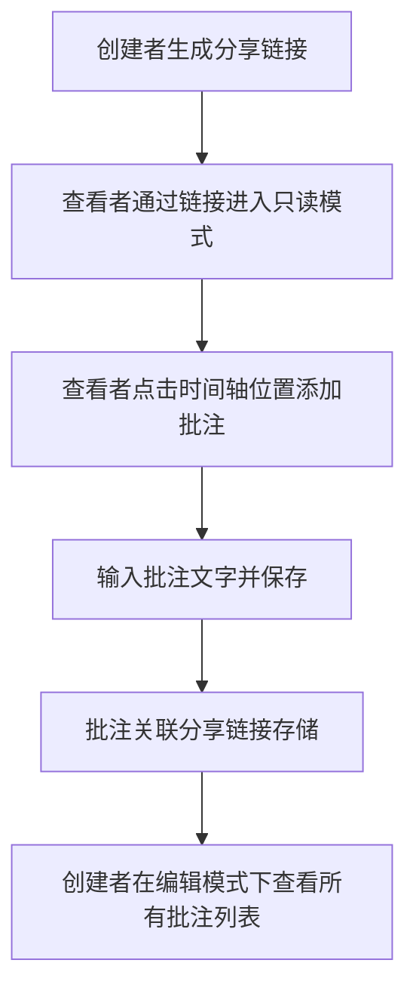

## 1. 产品概述

AudioMix Studio 是一款面向乐队和音乐制作人的在线多轨音频混音协作工具，通过浏览器即可实现专业级的音频编排、混音和共享，彻底消除传统 DAW 软件操作复杂、多人协作困难、混音效果无法直观分享的痛点。

- 核心目标：在浏览器中提供低门槛、高交互的多轨音频混音体验，支持预设保存、离线导出和协作批注
- 目标用户：独立音乐人、乐队成员、音乐制作人、音频工程师、播客创作者

## 2. 核心功能

### 2.1 用户角色

| 角色 | 使用方式 | 核心权限 |
|------|----------|----------|
| 编辑者 | 直接访问应用 | 上传音轨、调整参数、保存预设、导出混音、生成分享链接 |
| 查看者 | 通过分享链接访问 | 只读模式浏览、播放预览、添加批注、查看其他批注 |

### 2.2 功能模块

1. **音轨编排区**：最多8条轨道的网格布局，支持音频上传、波形渲染、拖拽定位、静音/独奏控制
2. **全局播放控制**：播放/暂停、BPM调速（60-160）、循环播放开关
3. **混音控制台**：每通道音量滑块、声像旋钮、混响/延迟/压缩效果发送旋钮、主输出VU电平表
4. **预设管理**：预设保存（命名）、瀑布流卡片列表展示、一键加载应用、缩略波形快照
5. **导出与分享**：离线混合导出WAV文件（带进度条）、Base64编码生成只读分享链接
6. **协作批注**：只读模式下时间轴批注添加、编辑模式下批注列表查看与管理

### 2.3 页面详情

| 页面名称 | 模块名称 | 功能描述 |
|----------|----------|----------|
| 主编辑页 | 顶部工具栏 | 导入音频、保存预设、导出WAV、生成分享链接按钮组 |
| 主编辑页 | 音轨编排区 | 8条轨道网格、波形可视化渲染、拖拽定位、静音/独奏圆形按钮 |
| 主编辑页 | 全局控制栏 | 播放/暂停按钮、BPM滑块、循环开关、当前时间显示 |
| 主编辑页 | 混音控制台 | 8通道垂直控制条（音量、声像、3个效果发送）、主输出通道与VU表 |
| 主编辑页 | 预设侧边面板 | 右侧滑入面板、卡片瀑布流、缩略波形、加载按钮 |
| 主编辑页 | 批注面板 | 底部上滑、批注列表（内容、时间、位置） |
| 只读分享页 | 只读徽标 | 右上角锁图标+灰色边框标识 |
| 只读分享页 | 批注大头针 | 时间轴上圆形标记、点击展开文本输入框 |

## 3. 核心流程

### 3.1 混音创作主流程

### 3.2 协作批注流程

## 4. 用户界面设计

### 4.1 设计风格
- **主背景色**：#1a1a2e（深空紫黑），卡片/轨道背景：#16213e（深海蓝紫）
- **文字主色**：#e0e0e0（柔和灰白），按钮渐变：#0f3460 → #533483（蓝紫渐变）
- **整体基调**：深色专业音频工作站风格，金属质感混音台，磨砂玻璃控件
- **按钮样式**：圆角矩形渐变按钮，按下时0.15秒缩放至0.95倍
- **字体方案**：使用 Space Grotesk 搭配 JetBrains Mono 等宽字体，兼顾现代感与数字可读性
- **动效语言**：所有过渡0.2秒，旋钮响应0.15秒平滑，面板弹性缓动0.35秒

### 4.2 页面设计概述

| 模块名称 | UI设计要素 |
|----------|-------------|
| 顶部工具栏 | 圆角渐变按钮（#0f3460→#533483），悬停亮度+10%，布局横向均匀分布 |
| 音轨编排区 | 网格轨道，波形浅蓝色渐变渲染，静音灰暗色，独奏其他轨20%不透明度，左侧圆形M/S按钮 |
| 全局控制栏 | 大型播放按钮（醒目紫蓝），BPM滑块带刻度，循环开关圆形绿/灰切换动画 |
| 混音控制台 | 金属质感线性渐变（#2a2a3e→#1a1a2e），磨砂玻璃旋钮+白色细边框+内发光，垂直VU表绿→黄→红渐变 |
| 预设面板 | 右侧滑入，半透明遮罩，卡片瀑布流，缩略波形快照可展开 |
| 批注面板 | 底部上滑，卡片式批注列表带时间戳和坐标，圆形大头针标记 |

### 4.3 响应式设计
- **桌面端（≥768px）**：三层纵向布局（工具栏/轨道区/混音台），混音台固定高度220px水平滚动
- **移动端（<768px）**：轨道区单列缩窄，混音台垂直堆叠（每通道80px），旋钮直径30px迷你尺寸
- **触摸优化**：按钮最小触控区44px，支持触摸滑动调节滑块/旋钮

### 4.4 动效与交互细节
1. **波形拖拽**：鼠标按下波形即可沿时间轴水平拖拽，释放后吸附到最近的16分音符网格
2. **静音/独奏按钮**：圆形按钮，Mute按钮激活时轨道整体灰暗，Solo激活时其他轨道opacity:0.2
3. **循环开关**：圆形按钮从绿色（#4ade80）平滑过渡到灰色（#6b7280），带0.2秒scale:1.1缩放脉冲
4. **旋钮高亮**：效果发送量超过50%时，旋钮外圈出现半透明光晕脉冲动画（opacity 0.3→0.6循环）
5. **VU电平表**：60fps垂直条形图，绿色< -12dB，黄色-12~-6dB，红色> -6dB，峰值保持200ms
6. **预设加载**：所有轨道波形先淡出（0.2s opacity→0）→重置位置→淡入（0.2s opacity→1）
7. **保存按钮**：点击后内部出现沙漏旋转图标0.3秒，完成后恢复
8. **面板动画**：预设面板从右侧translateX(100%)弹性滑入（cubic-bezier(0.34,1.56,0.64,1)，0.35s）
