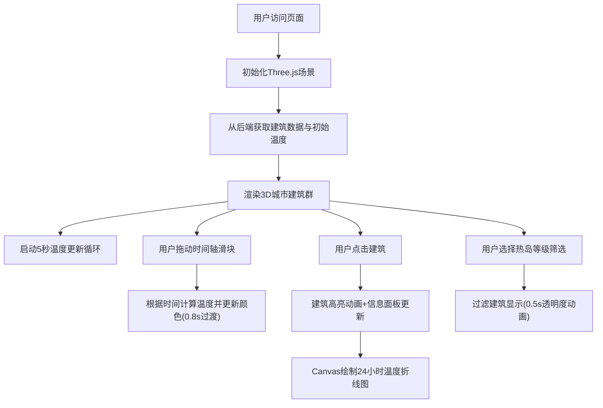

## 1. 产品概述
城市热岛效应实时交互式可视化应用，为城市规划师和公众提供直观的城市热岛分布感知与热区变化追踪工具。
- 主要用途：通过3D可视化展示城市建筑表面温度分布，辅助城市规划决策与公众环境认知
- 目标用户：城市规划师、环境研究人员、公众用户
- 产品价值：将抽象的温度数据转化为直观的3D视觉体验，提升热岛效应的可理解性和可交互性

## 2. 核心功能

### 2.1 用户角色
| 角色 | 注册方式 | 核心权限 |
|------|----------|----------|
| 普通用户 | 无需注册 | 浏览3D场景、交互查看建筑温度、使用时间轴和筛选功能 |

### 2.2 功能模块
1. **核心数据可视化模块**：3D城市街区场景渲染、建筑温度颜色映射、实时数据更新与平滑过渡
2. **时间轴控制与热区动画模块**：时间轴滑块控制、日变化温度曲线、颜色平滑插值动画
3. **热岛高亮与聚光灯分析模块**：建筑点击高亮、信息面板展示、24小时温度折线图
4. **热区过滤与交互反馈模块**：热岛等级筛选、建筑透明度过渡、下拉菜单动画

### 2.3 页面详情
| 页面名称 | 模块名称 | 功能描述 |
|----------|----------|----------|
| 主页面 | 3D场景渲染 | Three.js渲染城市建筑、道路、绿化带，建筑按温度着色 |
| 主页面 | 时间轴控制 | 底部滑块(8:00-20:00)控制时间，温度实时更新，颜色0.8s线性插值过渡 |
| 主页面 | 建筑交互 | 点击建筑高亮（上升0.1单位+蓝色呼吸光晕），右侧面板显示详情 |
| 主页面 | 信息面板 | 展示建筑地址、当前温度、热岛等级，Canvas绘制24小时温度折线图 |
| 主页面 | 筛选功能 | 顶部下拉筛选框按热岛等级过滤，其他建筑半透明灰色显示 |
| 主页面 | 场景交互 | 鼠标拖拽旋转、滚轮缩放、帧率≥30FPS |

## 3. 核心流程
用户打开应用后，前端初始化3D场景并从后端获取初始温度数据，渲染城市建筑群。用户可通过拖动时间轴查看不同时段的温度变化，点击建筑查看详情和历史温度曲线，或通过筛选框聚焦特定热岛等级的建筑。后端每5秒模拟生成新一轮温度数据，前端平滑更新建筑颜色。

## 4. 用户界面设计

### 4.1 设计风格
- 主色调：深蓝灰(#1a1a2e)背景、柔和冷光(#e0e0ff)文字、蓝绿色(#00b4d8)交互元素、亮蓝(#00d4ff)选中状态
- 温度色带：深蓝(＜20°C) → 浅蓝(20-25°C) → 黄(25-30°C) → 橙(30-35°C) → 深红(＞35°C)，科学色带无断裂
- 按钮/滑块：圆角设计，蓝绿色基调，选中态亮蓝
- 字体：纯白色(#ffffff)无衬线字体
- 布局：主场景70%宽度，左侧30%信息面板+顶部筛选栏

### 4.2 页面设计概述
| 页面名称 | 模块名称 | UI元素 |
|----------|----------|--------|
| 主页面 | 3D场景 | 全屏Three.js canvas、鼠标拖拽旋转、滚轮缩放、建筑温度着色 |
| 主页面 | 顶部筛选栏 | 下拉选择框(低/中/高)、0.3s向下展开动画、悬停浅灰背景 |
| 主页面 | 左侧信息面板 | 建筑地址、温度数值、热岛等级标签、Canvas折线图(2px线宽、渐变色) |
| 主页面 | 底部时间轴 | 水平滑块、时间刻度(8:00-20:00)、蓝绿色进度条 |
| 主页面 | 高亮效果 | 建筑上升0.1单位、蓝色光晕环(2秒呼吸周期、透明度0.3-0.8循环) |

### 4.3 响应式
- 桌面端优先设计，固定比例布局(70%/30%)
- 最小分辨率支持1280×720

### 4.4 3D场景指导
- **环境**：深蓝灰背景，柔和环境光+方向光模拟日照
- **光照设置**：AmbientLight(0x404060, 0.5) + DirectionalLight(0xffffff, 0.8)，配合HemisphereLight模拟天空光
- **相机设置**：PerspectiveCamera(60°, aspect, 0.1, 1000)，初始位置(30, 25, 30)，OrbitControls控制
- **构图**：城市街区居中，网格地面，绿化带用绿色平面表示，道路用深灰色平面
- **交互**：OrbitControls实现拖拽旋转和滚轮缩放，Raycaster实现建筑点击检测
- **后期处理**：建筑光晕使用Sprite+透明贴图实现呼吸效果
- **性能**：建筑数量≤200栋，单帧渲染≤16ms，使用MeshBasicMaterial/MeshStandardMaterial减少计算
