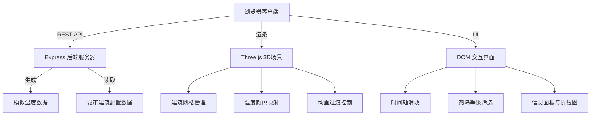
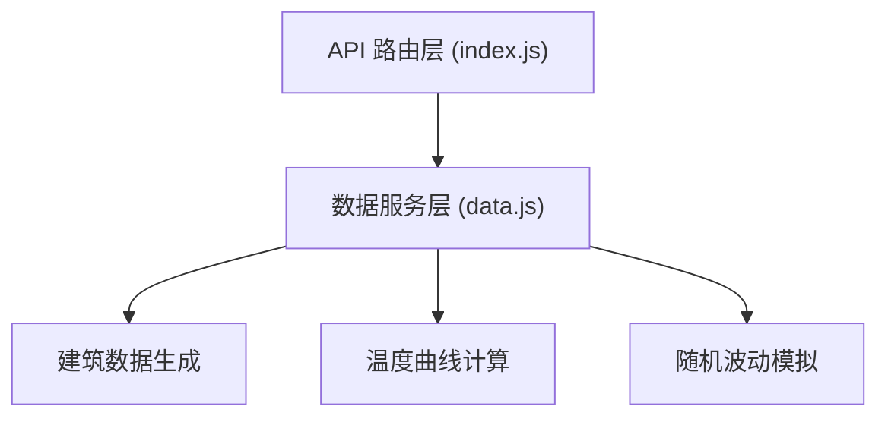
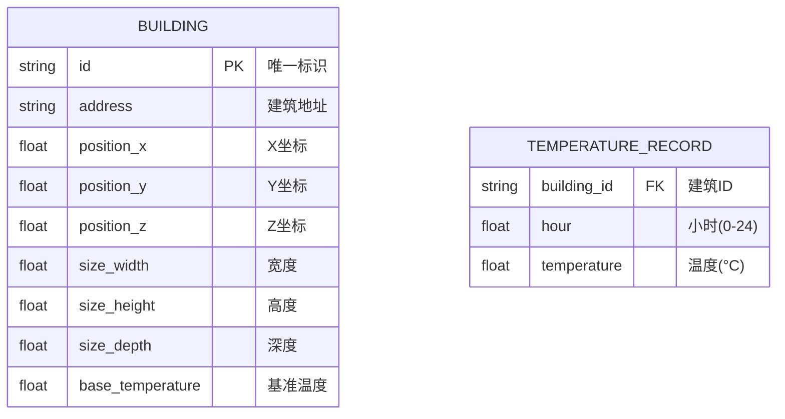

## 1. 架构设计


## 2. 技术描述
- 前端：TypeScript + Three.js + Vite
  - three：3D场景渲染
  - axios：HTTP请求
- 后端：Node.js + Express
  - express：REST API服务
  - cors：跨域支持
  - uuid：建筑唯一标识生成
- 构建工具：Vite + TypeScript 严格模式
- 无数据库，使用内存模拟数据

## 3. 路由定义
| 路由 | 用途 |
|------|------|
| GET /api/temperature?time={t} | 获取指定时刻所有建筑的温度数据 |
| GET /api/history?id={id} | 获取指定建筑24小时温度历史数据 |

## 4. API 定义

### 类型定义
```typescript
interface Building {
  id: string;
  address: string;
  position: { x: number; y: number; z: number };
  size: { width: number; height: number; depth: number };
  baseTemperature: number;
}

interface BuildingTemperature {
  id: string;
  temperature: number;
}

interface BuildingHistory {
  id: string;
  hours: number[];
  temperatures: number[];
}

type HeatIslandLevel = 'low' | 'medium' | 'high';
```

### GET /api/temperature?time={t}
- 请求参数：time - 小时数(0-24，支持小数)
- 响应格式：
```json
{
  "time": 14.5,
  "buildings": [
    { "id": "uuid-1", "temperature": 32.5 },
    { "id": "uuid-2", "temperature": 27.3 }
  ]
}
```

### GET /api/history?id={id}
- 请求参数：id - 建筑唯一标识
- 响应格式：
```json
{
  "id": "uuid-1",
  "hours": [0, 1, 2, ..., 23],
  "temperatures": [18.2, 17.8, 17.5, ..., 22.1]
}
```

## 5. 服务器架构图


## 6. 数据模型

### 6.1 数据模型定义


### 6.2 温度计算逻辑
- 日变化曲线采用正弦波模拟：T(t) = baseTemp + amplitude × sin(π × (t - 6) / 12)
- 其中 t ∈ [6, 18] 为白天升温时段，6点最低，14点最高
- amplitude = 8~12°C，根据建筑基准温度随机
- 叠加随机波动 ±1.5°C
- 热岛等级划分：低(＜25°C)、中(25-32°C)、高(＞32°C)
