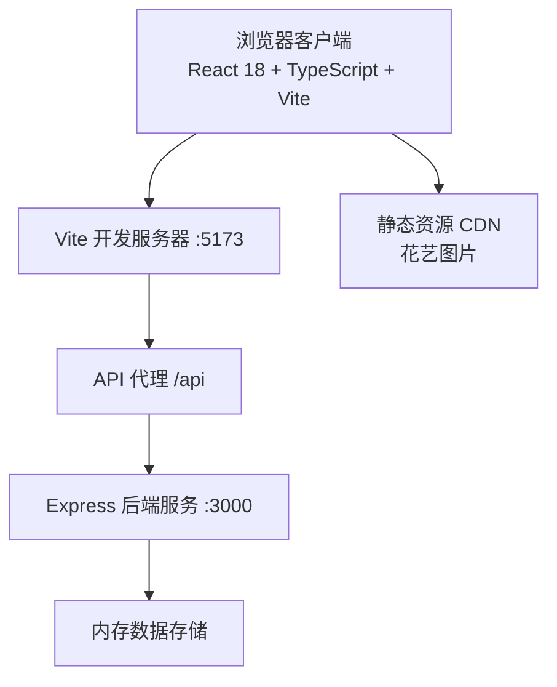
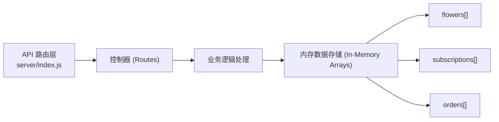
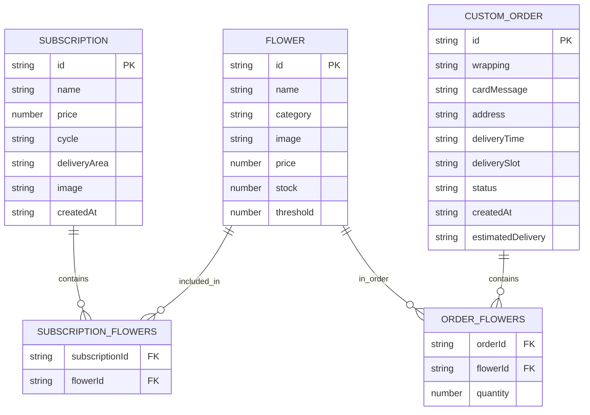

## 1. 架构设计



## 2. 技术描述

- **前端框架**：React@18 + TypeScript + Vite
- **路由管理**：react-router-dom@6
- **HTTP客户端**：axios
- **后端框架**：Express@4 + CORS + UUID
- **数据存储**：内存数组（开发阶段）
- **样式方案**：CSS Modules + CSS 变量（暖色系主题）
- **动画方案**：纯CSS动画（transform/transition/keyframes）
- **图标方案**：lucide-react
- **状态管理**：React useState/useReducer（组件内状态）+ zustand（全局共享状态）
- **初始化工具**：vite-init，采用 react-express-ts 模板

## 3. 路由定义

| 路由路径 | 页面组件 | 用途说明 |
|---------|---------|---------|
| `/` | Home | 首页：品牌展示、功能入口 |
| `/subscriptions` | Subscription | 订阅管理：套餐列表、创建套餐 |
| `/custom-order` | CustomOrder | 定制下单：花材选择、组装、提交 |
| `/delivery` | DeliveryTracking | 配送跟踪：配送看板、订单状态管理 |
| `/inventory` | Inventory | 库存管理：花材库存、低库存预警、补货 |

## 4. API 定义

### 4.1 TypeScript 类型定义

```typescript
// 花材
interface Flower {
  id: string;
  name: string;
  category: string;
  image: string;
  price: number;
  stock: number;
  threshold: number;
}

// 订阅套餐
interface Subscription {
  id: string;
  name: string;
  price: number;
  cycle: 'weekly' | 'biweekly' | 'monthly';
  flowers: string[];
  deliveryArea: string;
  image: string;
  createdAt: string;
}

// 定制订单
interface CustomOrder {
  id: string;
  flowers: { flowerId: string; quantity: number }[];
  wrapping: 'kraft' | 'plain' | 'floral';
  cardMessage: string;
  address: string;
  deliveryTime: string;
  deliverySlot: 'morning' | 'afternoon';
  status: 'pending' | 'delivering' | 'delivered';
  createdAt: string;
  estimatedDelivery: string;
}
```

### 4.2 接口列表

| 方法 | 路径 | 请求体 | 响应 | 说明 |
|------|------|--------|------|------|
| GET | `/api/flowers` | - | `Flower[]` | 获取所有花材列表 |
| GET | `/api/flowers/:id` | - | `Flower` | 获取单个花材详情 |
| PATCH | `/api/flowers/:id` | `{ stock?: number; threshold?: number }` | `Flower` | 更新花材库存/阈值 |
| POST | `/api/flowers/:id/restock` | `{ amount: number }` | `Flower` | 花材补货 |
| GET | `/api/subscriptions` | - | `Subscription[]` | 获取订阅套餐列表 |
| POST | `/api/subscriptions` | `Omit<Subscription, 'id' | 'createdAt'>` | `Subscription` | 创建订阅套餐 |
| GET | `/api/orders` | - | `CustomOrder[]` | 获取所有订单 |
| GET | `/api/orders/today` | - | `CustomOrder[]` | 获取当日订单 |
| POST | `/api/orders` | `Omit<CustomOrder, 'id' | 'status' | 'createdAt' | 'estimatedDelivery'>` | `{ orderId: string; estimatedDelivery: string }` | 创建定制订单 |
| PATCH | `/api/orders/:id/status` | `{ status: 'delivering' | 'delivered' }` | `CustomOrder` | 更新订单配送状态 |

## 5. 服务器架构图



## 6. 数据模型

### 6.1 ER 图



### 6.2 初始种子数据

```javascript
// 初始花材数据
const initialFlowers = [
  { id: 'f1', name: '红玫瑰', category: '玫瑰', image: '...', price: 8, stock: 100, threshold: 20 },
  { id: 'f2', name: '粉玫瑰', category: '玫瑰', image: '...', price: 7, stock: 5, threshold: 20 },
  { id: 'f3', name: '白百合', category: '百合', image: '...', price: 12, stock: 30, threshold: 10 },
  { id: 'f4', name: '向日葵', category: '向日葵', image: '...', price: 6, stock: 8, threshold: 15 },
  // ... 更多花材
];
```
