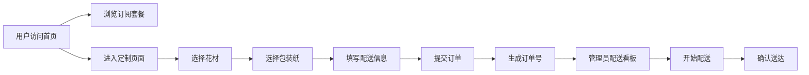

## 1. 产品概述

花语派FlowerPie是一个面向花店的在线鲜花订阅与定制配送服务平台，解决传统花店手工接单效率低、配送过程鲜花易损、客户难以根据场合选择搭配的痛点。

- 目标用户：花店管理员（管理订阅套餐、订单配送、花材库存）和终端消费者（浏览订阅、定制花束、下单配送）
- 产品价值：数字化花店运营流程，提供个性化花束定制体验，提升配送效率与客户满意度

## 2. 核心功能

### 2.1 用户角色

| 角色 | 注册方式 | 核心权限 |
|------|---------|---------|
| 访客 | 无需注册 | 浏览订阅套餐、定制花束页面 |
| 注册用户 | 邮箱注册 | 下单定制花束、查看订单状态 |
| 管理员 | 预设账号 | 管理订阅套餐、配送看板、花材库存 |

### 2.2 功能模块

1. **首页**：导航栏、品牌介绍、订阅套餐预览入口、定制花束入口
2. **订阅管理页面**：套餐列表（翻转卡片）、创建新套餐表单
3. **定制下单页面**：花材选择区、花束组装区、包装纸选择、配送信息表单、确认模态框
4. **配送跟踪页面**：当日配送看板、订单状态管理、实时统计徽标
5. **库存管理页面**：花材库存列表、低库存预警、阈值调整、一键补货

### 2.3 页面详情

| 页面名称 | 模块名称 | 功能描述 |
|---------|---------|----------|
| 首页 | 导航栏 | 品牌Logo、页面导航链接、响应式菜单 |
| 首页 | 英雄区 | 品牌标语、主视觉图、CTA按钮跳转定制页面 |
| 首页 | 特色介绍 | 三大卖点卡片（订阅便利、定制自由、配送保障） |
| 订阅管理 | 套餐网格 | 翻转卡片展示，上翻入场动画，悬停显示详情 |
| 订阅管理 | 创建表单 | 套餐名称、价格、周期、花材多选、配送区域 |
| 定制下单 | 花材选择器 | 按品种分类、圆形缩略图、点击放大动画、移动至组装区 |
| 定制下单 | 花束组装区 | 卡片堆叠展示、数量显示、删除动画 |
| 定制下单 | 包装/配送 | 三种包装纸切换、贺卡文字、地址、送达时间选择 |
| 配送跟踪 | 配送看板 | 订单卡片列表、状态标签、脉冲动画指示配送中 |
| 配送跟踪 | 统计徽标 | 配送中/已送达数量、变化时平移缩放动画 |
| 库存管理 | 库存列表 | 花材名称、数量、阈值、状态、低库存红色高亮 |
| 库存管理 | 预警操作 | 感叹号呼吸闪烁、阈值调整弹窗、一键补货 |

## 3. 核心流程

### 3.1 用户定制下单流程
用户进入定制页面 → 浏览并选择花材（点击添加到组装区）→ 选择包装纸 → 填写贺卡与配送信息 → 提交订单 → 系统返回订单号与预计配送时间 → 弹出确认模态框

### 3.2 管理员配送流程
管理员登录配送看板 → 查看当日待配送订单列表 → 点击"开始配送"切换状态 → 卡片显示绿色脉冲动画 → 配送完成后点击"确认送达" → 卡片淡出移除、统计数字更新

### 3.3 核心流程图

## 4. 用户界面设计

### 4.1 设计风格

- **主色调**：米白色背景 `#FBF7F2`，浅棕辅助色 `#A68B6B`，灰绿辅助色 `#7A8B7A`，玫瑰粉点缀色 `#E8B4B8`
- **按钮样式**：8px圆角、柔和平滑的微阴影、悬停时加深阴影并上移4px
- **字体**：无衬线字体体系，正文14-16px，标题20-28px
- **布局风格**：卡片式布局，1200px定宽居中，8px圆角，`box-shadow: 0 2px 8px rgba(0,0,0,0.1)`
- **图标风格**：线性简洁图标，配合柔和色彩

### 4.2 页面设计概览

| 页面名称 | 模块名称 | UI元素 |
|---------|---------|--------|
| 首页 | 英雄区 | 大标题、温暖渐变色背景、花艺配图、圆角CTA按钮 |
| 订阅管理 | 套餐卡片 | 3D翻转效果、正面图片+标题+价格、背面周期+花材列表、弹性动画0.35s |
| 定制下单 | 花材选择区 | 分类Tab、圆形缩略图网格、点击放大0.1s过渡、平滑飞行动画 |
| 定制下单 | 组装区 | 堆叠卡片、数量徽章、删除旋转淡出动画0.3s |
| 配送跟踪 | 订单卡片 | 状态标签、脉冲圆点（绿色box-shadow动画）、操作按钮组 |
| 库存管理 | 预警行 | 浅红背景 `#FDE8E8`、橙色感叹号、1.5s呼吸闪烁opacity动画 |

### 4.3 响应式设计

- 桌面优先设计，断点768px
- 小屏幕：卡片网格变为2列，间距12px，字体缩小至14px，按钮高度保持不变
- 导航栏在移动端折叠为汉堡菜单
- 表单输入框全宽展示

### 4.4 动画与交互规范

所有交互反馈在0.3-0.5秒内完成，目标帧率60fps：
- 卡片翻转：0.35s cubic-bezier弹性缓动
- 按钮悬停：0.2s transition（阴影加深+上移4px）
- 数字变化：0.2s向右平移+缩放
- 删除动画：缩小+旋转淡出0.3s
- 模态框弹出：从中心缩放弹出0.3s缓动
- 加载动画：旋转圆环0.5s一圈
