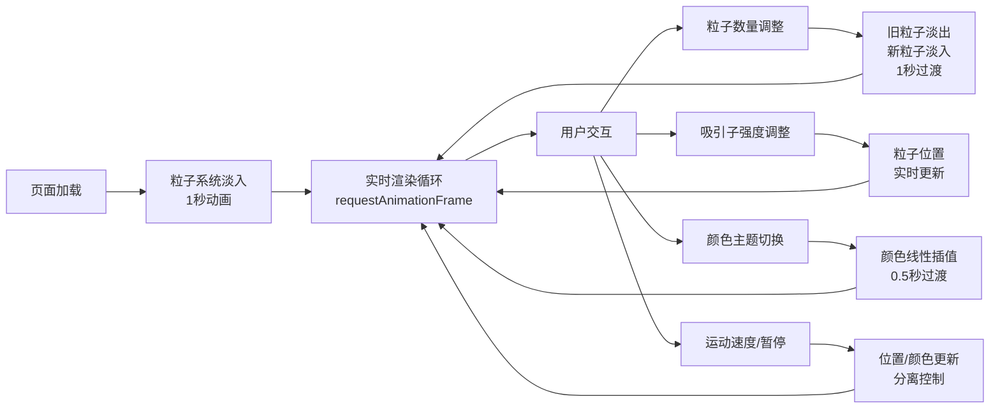

## 1. 产品概述
虚拟粒子星系交互式生成应用，用户通过实时调整参数控制动态粒子星系视觉效果。
- 面向创意工作者、视觉设计师和技术爱好者，提供沉浸式3D粒子艺术创作体验
- 产品价值：将复杂的物理模拟与美学设计结合，让用户无需编程即可创造独特的星系视觉效果

## 2. 核心功能

### 2.1 功能模块
1. **3D粒子星系主场景**：螺旋结构粒子系统、实时渲染、动态动画
2. **参数控制面板**：粒子数量、吸引子强度、颜色主题、运动速度控制
3. **平滑过渡系统**：粒子增减淡入淡出、颜色插值过渡、暂停/恢复控制

### 2.2 页面详情
| 页面名称 | 模块名称 | 功能描述 |
|-----------|-------------|---------------------|
| 主页面 | 3D粒子星系渲染 | 全屏Three.js渲染，默认3000粒子螺旋星系，Y轴旋转，颜色中心白到边缘蓝渐变 |
| 主页面 | 左侧控制面板 | 280px宽毛玻璃半透明面板，包含所有参数控制 |
| 主页面 | 粒子数量滑块 | 500-8000范围，步长500，1秒平滑淡入淡出过渡 |
| 主页面 | 吸引子强度控制 | 两个吸引子（2,1,0）和（-2,-1,0），强度范围-5到5，实时流体效果 |
| 主页面 | 颜色主题选择器 | 星云紫蓝、烈焰橙红、极光绿青三个预设，0.5秒颜色插值过渡 |
| 主页面 | 运动控制 | 速度滑块0.1-3.0，暂停/恢复按钮（暂停时位置冻结，颜色呼吸继续） |

## 3. 核心流程
用户打开页面 → 粒子星系淡入（1秒）→ 实时渲染星系动画 → 用户调整参数 → 系统平滑更新视觉效果 → 用户选择颜色主题 → 颜色渐变过渡 → 用户暂停/恢复 → 状态切换

## 4. 用户界面设计
### 4.1 设计风格
- 主色调：深空黑色背景（#000000），紫色（#8B5CF6）到蓝色（#3B82F6）渐变
- 辅助色：白色粒子、半透明深灰面板（rgba(20,20,30,0.7)）
- 按钮样式：圆角矩形8px，紫色渐变背景，悬停亮度+15%，点击缩放0.95（0.1秒）
- 滑块样式：紫蓝渐变轨道，白色圆点带微弱光晕
- 字体：现代无衬线字体，清晰可读
- 布局：左侧固定280px控制面板，右侧全屏3D场景
- 毛玻璃效果：backdrop-filter: blur(10px)

### 4.2 页面设计概述
| 页面名称 | 模块名称 | UI元素 |
|-----------|-------------|-------------|
| 主页面 | 3D场景 | 全屏黑色背景，粒子星系居中，1秒淡入动画 |
| 主页面 | 控制面板 | 左侧280px，半透明深灰毛玻璃，滚动区域，分组控件 |
| 主页面 | 粒子数量组 | 标签+滑块+数值显示，紫蓝渐变轨道 |
| 主页面 | 吸引子组 | 两个滑块分别控制两个吸引子强度 |
| 主页面 | 颜色主题组 | 三个主题按钮预览色块+名称 |
| 主页面 | 运动控制组 | 速度滑块+暂停/恢复按钮 |

### 4.3 响应性
- 桌面端优先设计，全屏体验
- 控制面板固定宽度，3D场景自适应

### 4.4 3D场景指引
- 环境：纯黑背景，无HDRI，宇宙深空氛围
- 光照：粒子自发光，无需额外光源
- 相机：PerspectiveCamera，fov 75，距离中心约8单位，轻微轨道感
- 粒子：Points + BufferGeometry + PointsMaterial，additive blending，size attenuation开启
- 动画：requestAnimationFrame驱动，60fps目标，8000粒子时≥55fps
- 性能：Float32Array直接操作BufferAttribute，批量更新，减少向量对象创建
