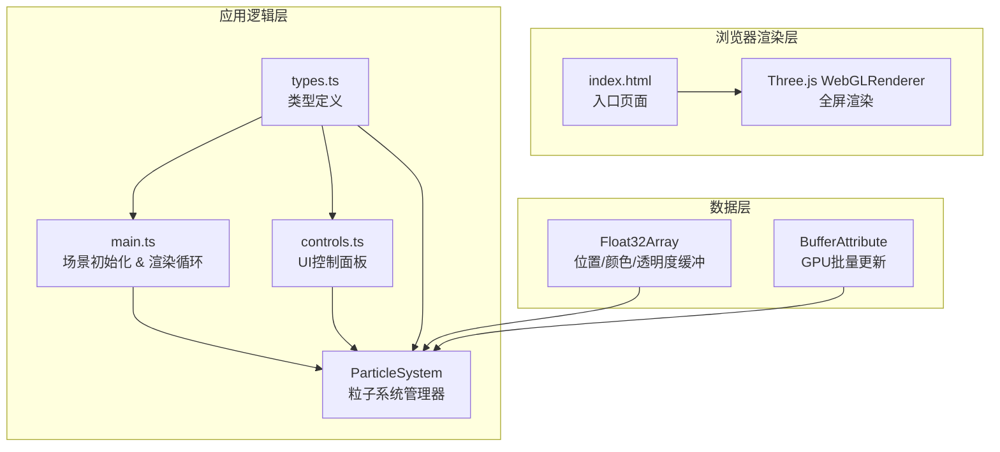

## 1. 架构设计



## 2. 技术描述
- 前端框架：TypeScript 5 + Three.js 0.160 + Vite 5
- 构建工具：Vite
- 渲染引擎：Three.js（原生WebGL封装）
- 无后端服务，纯前端运行

## 3. 项目文件结构
| 文件路径 | 用途 |
|----------|------|
| /package.json | 项目依赖与脚本配置 |
| /vite.config.ts | Vite构建配置 |
| /tsconfig.json | TypeScript严格模式配置 |
| /index.html | 入口HTML，全屏黑色背景+UI容器 |
| /src/types.ts | 粒子参数、星系状态、颜色主题类型定义 |
| /src/main.ts | 场景初始化、相机、渲染器、主渲染循环、粒子星系创建与更新 |
| /src/controls.ts | UI控件构建与绑定，与main.ts控制接口交互 |

## 4. 核心模块设计

### 4.1 粒子系统架构（main.ts）
- **双缓冲粒子池**：维护currentParticles和targetParticles两个BufferGeometry，支持平滑过渡
- **过渡管理器**：transitionState追踪淡入淡出进度（0-1），每帧更新透明度
- **颜色插值器**：currentColors与targetColors，每帧按插值进度计算中间色
- **位置/颜色分离更新**：paused标志只影响位置计算，颜色呼吸动画独立执行
- **性能优化**：
  - 预分配Float32Array（最大8000×3×4字节）
  - BufferAttribute.needsUpdate单帧标记
  - PointsMaterial.sizeAttenuation = true
  - 避免每帧创建Vector3临时对象

### 4.2 UI控件（controls.ts）
- **性能测量**：滑块onChange记录startTime = performance.now()，粒子更新完成后计算delta，输出到console
- **帧率监控**：吸引子调整时通过requestAnimationFrame时间戳计算FPS，低于55fps输出警告
- **控件类型**：
  - range滑块：粒子数量、吸引子1/2强度、运动速度
  - 主题按钮：3个预设配色，点击触发颜色过渡
  - 切换按钮：暂停/恢复运动

### 4.3 类型定义（types.ts）
```typescript
interface GalaxyParams {
  particleCount: number
  attractor1Strength: number
  attractor2Strength: number
  rotationSpeed: number
  moveSpeed: number
  paused: boolean
  colorTheme: ColorTheme
}

interface ColorTheme {
  name: string
  centerColor: [number, number, number]
  edgeColor: [number, number, number]
}

interface TransitionState {
  active: boolean
  startTime: number
  duration: number
  type: 'particleCount' | 'color' | 'fadeIn'
}
```

## 5. 关键算法

### 5.1 螺旋星系生成
```
for each particle i:
  arm = random(0, 4)  // 4条螺旋臂
  radius = random(0, 5) ^ 1.5  // 内密外疏
  angle = arm * (π/2) + radius * 2.5 + random(-0.3, 0.3)
  height = random(-0.5, 0.5) * (1 - radius/5)
  x = cos(angle) * radius
  y = height
  z = sin(angle) * radius
```

### 5.2 吸引子物理更新
```
for each particle:
  dx1 = attractor1.x - pos.x
  dy1 = attractor1.y - pos.y
  dz1 = attractor1.z - pos.z
  dist1 = sqrt(dx1² + dy1² + dz1²) + 0.1
  force1 = attractor1Strength / (dist1 * dist1)
  
  // 吸引子2同理
  vel.x += (dx1/dist1 * force1 + dx2/dist2 * force2) * dt * speed
  vel.y += ...
  pos += vel * dt
  vel *= 0.98  // 阻尼
```

### 5.3 平滑过渡算法
**粒子数量过渡（1000ms）**：
- 帧开始：t = (now - startTime) / duration，clamp(0,1)
- 旧粒子透明度 *= (1 - t)
- 新粒子透明度 *= t
- t == 1时：释放旧缓冲，当前缓冲 = 新缓冲

**颜色过渡（500ms）**：
- 每通道线性插值：r = r0 + (r1 - r0) * t
- 应用到粒子颜色 = centerColor + (edgeColor - centerColor) * normalizedDistance
