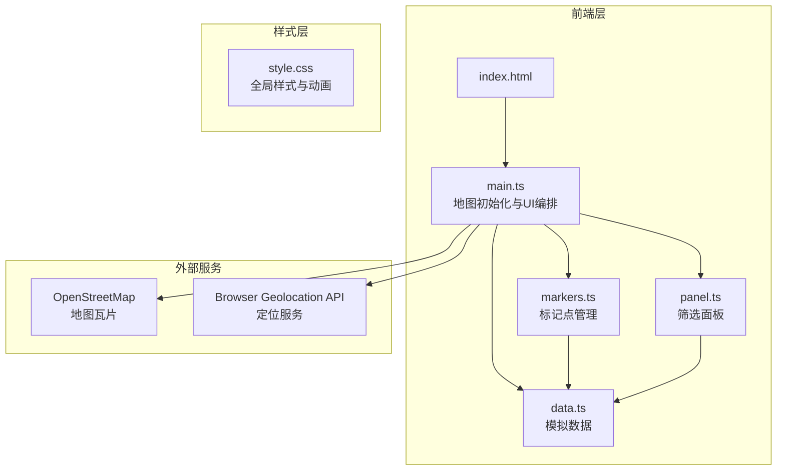
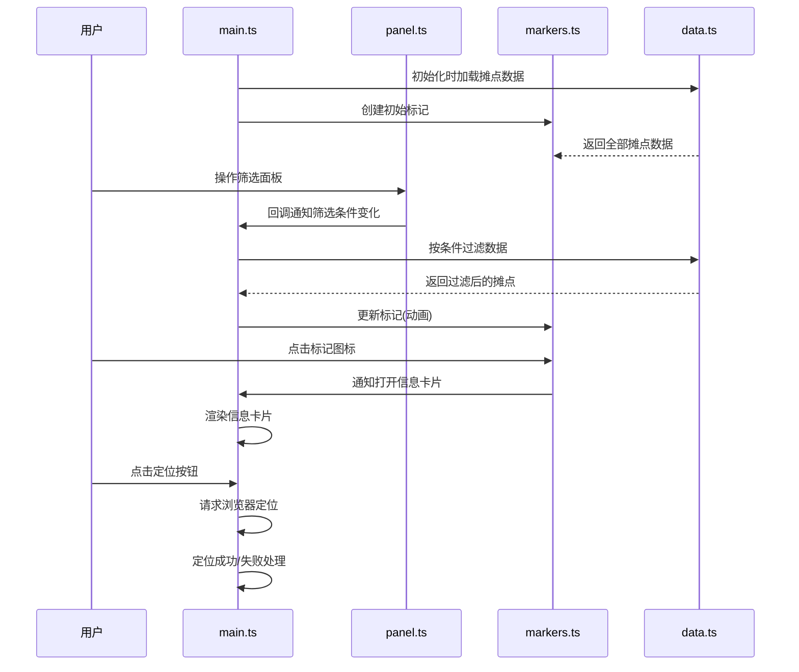

## 1. 架构设计



## 2. 技术选型

- **前端**：TypeScript + Leaflet + Vite
- **地图库**：Leaflet（OpenStreetMap瓦片）
- **构建工具**：Vite
- **样式**：纯CSS（style.css）
- **数据**：本地模拟数据（data.ts）
- **无后端**：纯前端项目

## 3. 文件结构

| 文件 | 职责 |
|------|------|
| `package.json` | 依赖管理：leaflet, typescript, vite, @types/leaflet；启动脚本：npm run dev |
| `index.html` | 入口页面，全屏地图容器，UI覆盖层 |
| `tsconfig.json` | TypeScript严格模式，ES模块 |
| `vite.config.ts` | Vite基础配置 |
| `src/main.ts` | 初始化Leaflet地图，设置OSM瓦片，管理地图事件和UI元素创建 |
| `src/markers.ts` | 管理标记点创建/更新/动画/点击事件，接收筛选条件 |
| `src/panel.ts` | 管理左侧抽屉式筛选面板渲染/交互/筛选条件输出 |
| `src/data.ts` | 模拟生成小吃摊数据，包含坐标/类别/评分/排队时长等字段，提供过滤方法 |
| `style.css` | 全局样式：地图/面板/卡片/按钮样式和动画效果 |

## 4. 数据模型

### 4.1 小吃摊数据结构

```typescript
interface FoodStall {
  id: number;
  name: string;
  lat: number;
  lng: number;
  category: FoodCategory;
  rating: number;         // 1.0 - 5.0，支持半星
  queueMinutes: number;   // 排队时长（分钟）
  priceMin: number;       // 最低价格
  priceMax: number;       // 最高价格
  thumbnail: string;      // 食物缩略图URL
  description: string;    // 简短描述
}

type FoodCategory = '烤串' | '奶茶' | '煎饼' | '糖葫芦' | '臭豆腐' | '炸鸡' | '凉皮' | '烤红薯';
```

### 4.2 筛选条件数据结构

```typescript
interface FilterCriteria {
  categories: FoodCategory[];
  priceRange: [number, number];  // [min, max]
  queueRange: QueueRange;
}

type QueueRange = 'all' | 'short' | 'medium' | 'long';
// short: <10分钟, medium: 10-20分钟, long: >20分钟
```

## 5. 模块交互流程



## 6. 性能优化策略

- 使用CSS transform/opacity做动画，触发GPU加速
- 标记更新使用requestAnimationFrame批量处理
- Leaflet标记使用DivIcon替代图片Icon，减少DOM层级
- 筛选变化时防抖处理（300ms）
- 地图移动事件使用节流
