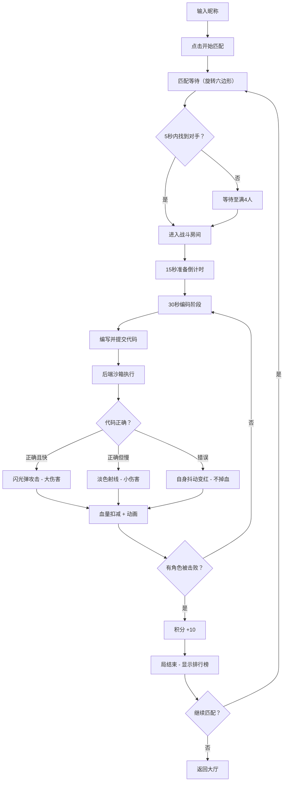

## 1. 产品概述

在线代码对战竞技场——面向开发者的实时多人编码对抗游戏。玩家以代码片段为武器，在限时内编写并提交代码，系统自动运行评分，根据正确性和速度打出伤害，击败对手的代码角色获得积分，争夺排行榜排位。
- 目标用户：技术大会参会者、开发者社区成员
- 核心价值：将编程能力转化为竞技乐趣，为技术活动提供互动性强的娱乐体验

## 2. 核心功能

### 2.1 用户角色

| 角色 | 进入方式 | 核心权限 |
|------|----------|----------|
| 玩家 | 输入昵称即可加入 | 匹配对战、编写代码、查看排名 |

### 2.2 功能模块

1. **大厅页面**: 昵称输入、开始匹配按钮、旋转六边形加载动画
2. **战斗页面**: 左侧代码编辑器、右侧战斗区域、血量条、倒计时、积分显示
3. **结算页面**: 房间积分排行榜（金/银/铜高亮）、继续匹配按钮

### 2.3 页面详情

| 页面名称 | 模块名称 | 功能描述 |
|----------|----------|----------|
| 大厅页面 | 昵称输入区 | 输入昵称后点击"开始匹配"，系统在5秒内匹配对手（最多4人） |
| 大厅页面 | 匹配动画 | 旋转六边形加载动画（0.8秒周期），匹配成功后跳转战斗界面 |
| 战斗页面 | 代码编辑器 | 支持JavaScript语法高亮，提交按钮（提交后变灰"运行中..."） |
| 战斗页面 | 战斗舞台 | 像素编程猫角色，网格线装饰对战台，血量条，代码状态文字 |
| 战斗页面 | 倒计时显示 | 60px大号数字居中，缩放脉冲动画，15秒准备倒计时+30秒编码倒计时 |
| 战斗页面 | 战斗动画 | 闪光弹攻击/淡色射线/自身抖动变红，屏幕边缘闪烁，血条平滑过渡 |
| 结算页面 | 排行榜 | 前3名金/银/铜微光背景高亮，显示积分 |
| 结算页面 | 继续匹配 | 返回大厅重新匹配 |

## 3. 核心流程

1. 玩家输入昵称 → 点击"开始匹配" → 系统匹配对手（5秒内或满4人）
2. 匹配成功 → 15秒准备倒计时 → 自动开始回合
3. 30秒编码限时 → 编写代码 → 点击提交 → 代码发送后端沙箱
4. 沙箱执行（3秒超时）→ 结果评分 → 广播至所有玩家
5. 战斗动画播放 → 血量扣减 → 击败判定 → 积分更新
6. 局结束 → 显示排行榜 → 可选继续匹配



## 4. 界面设计

### 4.1 设计风格

- **主色调**: 深灰#1a1a2e（背景），青色#00d4ff（强调色），橙色#ff6b35（次要强调色）
- **按钮风格**: 圆角按钮，青色主按钮，橙色次要按钮，提交后变灰
- **字体**: 等宽字体用于代码编辑器，无衬线字体用于UI文字，倒计时60px大号
- **布局风格**: 桌面端左右分栏（40%编辑器/60%战斗），移动端上下分栏
- **图标风格**: 像素风格编程猫角色图标

### 4.2 页面设计概览

| 页面名称 | 模块名称 | UI元素 |
|----------|----------|--------|
| 大厅页面 | 匹配区 | 深灰背景，居中昵称输入框，青色"开始匹配"按钮，旋转六边形动画 |
| 战斗页面 | 代码编辑器 | 左侧40%宽，浅灰边框，暗色编辑区，语法高亮，底部提交按钮 |
| 战斗页面 | 战斗区域 | 右侧60%宽，网格线平台，像素猫角色，血量条（平滑过渡），状态文字 |
| 战斗页面 | 倒计时 | 60px数字居中，缩放脉冲动画 |
| 战斗页面 | 攻击特效 | 闪光弹/射线/抖动变红，屏幕边缘0.15秒闪烁 |
| 结算页面 | 排行榜 | 金/银/铜微光背景，积分数字跳动 |

### 4.3 响应式设计

- 桌面优先设计，宽度<768px时：
  - 编辑器区域折叠到底部，高度占40%
  - 战斗区域移至顶部，高度占60%
  - 角色图标缩小至80%

### 4.4 数据流向

```
玩家键入代码 → 前端编辑器 → WebSocket发送 → 后端沙箱执行 → 结果评分 → WebSocket广播 → 前端战斗动画更新
```
