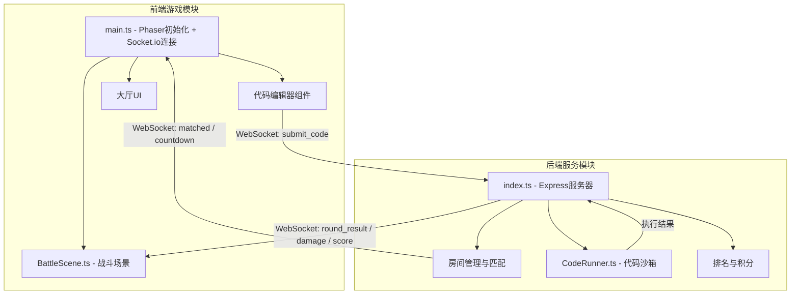
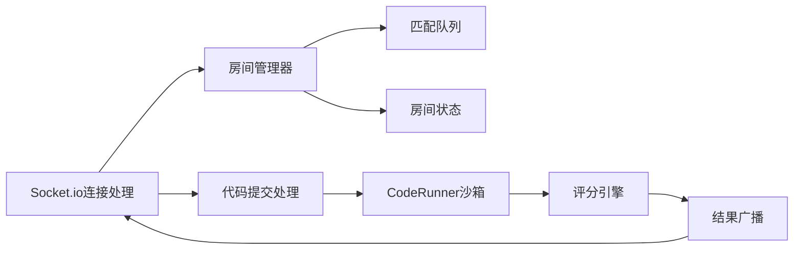

## 1. 架构设计



## 2. 技术说明

- **前端**: Phaser@3.80.2 + TypeScript + Vite（游戏渲染引擎，负责战斗场景、角色动画、特效）
- **构建工具**: Vite（前端开发服务器，端口5173，代理/api和/ws到后端）
- **后端**: Express + Socket.io + TypeScript（房间匹配、代码执行沙箱、排名更新，端口3001）
- **通信**: Socket.io（实时双向通信，事件驱动）
- **数据库**: 无（内存存储房间和积分数据，适合短期竞技场景）

## 3. 路由定义

| 路由 | 用途 |
|------|------|
| / | 主页面，加载Phaser游戏和编辑器UI |
| /api/health | 健康检查接口 |

## 4. WebSocket事件定义

### 4.1 客户端 → 服务器

| 事件名 | 数据类型 | 描述 |
|--------|----------|------|
| join_queue | `{ nickname: string }` | 加入匹配队列 |
| submit_code | `{ roomId: string, code: string }` | 提交代码到沙箱执行 |
| leave_room | `{ roomId: string }` | 离开房间 |
| play_again | `{}` | 重新匹配 |

### 4.2 服务器 → 客户端

| 事件名 | 数据类型 | 描述 |
|--------|----------|------|
| matched | `{ roomId: string, players: Player[] }` | 匹配成功 |
| countdown | `{ seconds: number }` | 倒计时更新 |
| round_start | `{ challenge: string, testCases: TestCase[] }` | 回合开始，下发题目 |
| code_result | `{ playerId: string, passed: boolean, execTime: number }` | 代码执行结果 |
| damage | `{ fromId: string, toId: string, amount: number, type: string }` | 伤害事件 |
| player_defeated | `{ playerId: string, killerId: string }` | 玩家被击败 |
| score_update | `{ playerId: string, score: number }` | 积分更新 |
| round_end | `{ rankings: Ranking[] }` | 回合结束，排行榜 |
| error | `{ message: string }` | 错误通知 |

## 5. 服务器架构



## 6. 数据模型

### 6.1 核心类型定义

```typescript
interface Player {
  id: string;
  nickname: string;
  hp: number;
  maxHp: number;
  score: number;
  status: 'waiting' | 'coding' | 'running' | 'done';
}

interface Room {
  id: string;
  players: Player[];
  status: 'matching' | 'countdown' | 'coding' | 'judging' | 'finished';
  challenge: Challenge;
  countdownSeconds: number;
  codingSecondsLeft: number;
}

interface Challenge {
  description: string;
  template: string;
  testCases: TestCase[];
}

interface TestCase {
  input: any[];
  expected: any;
}

interface Ranking {
  playerId: string;
  nickname: string;
  score: number;
  rank: number;
}

interface CodeResult {
  passed: boolean;
  passedCount: number;
  totalCount: number;
  execTime: number;
  error?: string;
}
```

### 6.2 游戏参数

| 参数 | 值 | 描述 |
|------|-----|------|
| 匹配超时 | 5秒 | 未满4人也开始匹配 |
| 最大房间人数 | 4人 | 匹配满4人立即开始 |
| 准备倒计时 | 15秒 | 匹配成功后倒计时 |
| 编码限时 | 30秒 | 编写代码的时间限制 |
| 沙箱超时 | 3秒 | 代码执行最大时长 |
| 初始血量 | 100 | 每个角色初始HP |
| 击败积分 | 10分 | 每次击败对手获得的积分 |
| 快速正确伤害 | 25 | 正确且速度快的伤害 |
| 慢速正确伤害 | 10 | 正确但慢的伤害 |
| 错误自身伤害 | 0 | 错误不掉对手血 |
