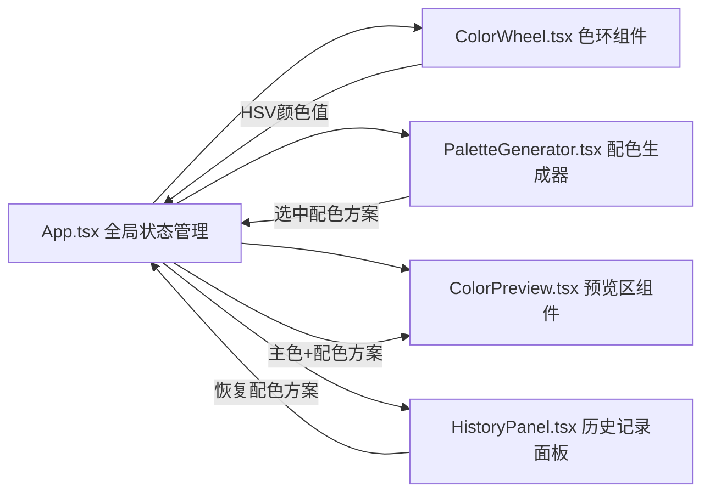

## 1. 架构设计



## 2. 技术描述

- **前端框架**：React 18 + TypeScript
- **构建工具**：Vite
- **状态管理**：React useState/useReducer（轻量级，无需额外状态库）
- **样式方案**：CSS Modules + CSS Variables
- **颜色计算**：内置颜色转换工具函数（HSV/RGB/HSL互转、配色算法）
- **图标**：lucide-react

## 3. 项目结构

```
d:\Pro\tasks\auto77
├── package.json
├── vite.config.ts
├── tsconfig.json
├── index.html
└── src/
    ├── App.tsx                 # 主组件，全局状态管理
    ├── main.tsx               # 应用入口
    ├── index.css              # 全局样式、CSS变量、主题
    ├── ColorWheel.tsx         # 可交互色环组件
    ├── PaletteGenerator.tsx   # 配色方案生成器
    ├── ColorPreview.tsx       # UI预览区
    ├── HistoryPanel.tsx       # 历史记录面板
    └── utils/
        ├── colorUtils.ts      # 颜色转换与配色算法
        └── types.ts           # TypeScript类型定义
```

## 4. 颜色算法说明

### 4.1 颜色空间转换
- HSV → RGB：标准HSV转RGB算法
- RGB → HEX：十六进制格式化
- RGB → HSL：用于亮度调整计算

### 4.2 配色方案算法
- **互补色**：主色色相 + 180°
- **类比色**：主色色相 ± 30°，生成5个邻近色
- **三分色**：主色色相 ± 120°，生成三色组并扩展为5色
- **单色**：保持色相不变，调整饱和度和亮度生成5级渐变

### 4.3 颜色调整函数
- `adjustBrightness(hex, percent)`：调整颜色亮度
- `adjustSaturation(hex, percent)`：调整颜色饱和度
- `getContrastColor(hex)`：获取对比色（用于文字）

## 5. 数据模型

### 5.1 类型定义

```typescript
// HSV颜色值
interface HSV {
  h: number; // 0-360
  s: number; // 0-100
  v: number; // 0-100
}

// 配色方案类型
type PaletteType = 'complementary' | 'analogous' | 'triadic' | 'monochromatic';

// 单个配色方案
interface Palette {
  type: PaletteType;
  name: string;
  colors: string[]; // 5个HEX颜色值
}

// 历史记录条目
interface HistoryItem {
  id: string;
  primaryColor: string; // HEX
  palette: Palette;
  timestamp: number;
}

// 全局应用状态
interface AppState {
  primaryHSV: HSV;
  palettes: Palette[];
  selectedPaletteIndex: number;
  history: HistoryItem[];
}
```

## 6. 性能优化策略

- **色环渲染**：使用Canvas绘制，只在尺寸变化时重绘，选色标记用DOM绝对定位
- **颜色计算**：纯函数计算，避免重复计算，useMemo缓存结果
- **动画优化**：所有动画使用transform和opacity（GPU加速）
- **事件节流**：拖拽事件使用requestAnimationFrame节流，确保≤16ms响应
- **组件优化**：React.memo包裹子组件，避免不必要的重渲染
