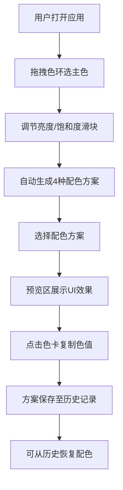

## 1. 产品概述

动态色彩搭配与调色板生成器是一款面向设计师和前端开发者的专业色彩工具，通过交互式色环和滑块微调颜色，自动生成基于所选主色的完整配色方案。

- 核心功能：色环交互选色、配色方案自动生成（互补、类比、三分、单色）、UI预览、历史记录
- 目标用户：UI设计师、前端开发者、视觉创意人员
- 产品价值：提高配色效率，提供专业色彩搭配建议，辅助快速决策

## 2. 核心功能

### 2.1 功能模块

1. **色环交互组件**：HSV色彩模型色环、拖拽点选主色、亮度/饱和度滑块调节
2. **配色方案生成器**：四种配色方案自动计算、五色卡片展示、一键复制色值
3. **配色预览区**：模拟UI元素展示、响应式布局、交互动效预览
4. **历史记录面板**：最近10条配色记录、悬停展开、一键恢复

### 2.2 功能详情

| 模块名称 | 子模块 | 功能描述 |
|---------|--------|---------|
| 色环组件 | 色环画布 | 使用Canvas/SVG渲染HSV色环，支持点击和拖拽选色 |
| 色环组件 | 颜色标记 | 发光圆点标记当前选中色，0.2秒平滑过渡 |
| 色环组件 | 亮度滑块 | 渐变轨道，圆形手柄带阴影，实时更新颜色 |
| 色环组件 | 饱和度滑块 | 渐变轨道，圆形手柄带阴影，实时更新颜色 |
| 配色生成器 | 互补色方案 | 计算主色的互补色系，生成5个渐变色块 |
| 配色生成器 | 类比色方案 | 计算主色相邻色系，生成5个渐变色块 |
| 配色生成器 | 三分色方案 | 计算主色三等分色系，生成5个渐变色块 |
| 配色生成器 | 单色方案 | 计算主色明暗渐变，生成5个同色系色块 |
| 配色生成器 | 色卡交互 | 悬停上浮4px、阴影加深，点击复制色值+1.5秒提示 |
| 预览区 | 导航栏模拟 | 应用配色方案的导航栏组件 |
| 预览区 | 卡片组模拟 | 应用配色方案的内容卡片组 |
| 预览区 | 按钮模拟 | 悬停加深15%、点击缩小10%的交互动效 |
| 预览区 | 响应式布局 | 桌面横向、移动纵向堆叠 |
| 历史记录 | 记录存储 | 最多保存最近10条配色方案 |
| 历史记录 | 悬停展开 | 鼠标悬停展开5个色块缩略图 |
| 历史记录 | 恢复动画 | 0.5秒淡入切换恢复配色方案 |
| 历史记录 | 滑入动画 | 新记录从右侧弹性滑入（0.3秒） |

## 3. 核心流程

用户打开应用 → 拖拽色环选择主色 → 调整亮度/饱和度 → 自动生成四种配色方案 → 选择任一配色方案 → 预览区实时展示UI效果 → 点击色卡复制色值 → 方案自动保存至历史记录 → 可从历史记录恢复方案

## 4. 用户界面设计

### 4.1 设计风格

- **主题色调**：深色主题，背景#1a1a2e，卡片#16213e，文字#e0e0e0
- **色环**：高饱和HSV彩虹渐变
- **卡片风格**：柔和圆角 border-radius: 12px
- **交互动效**：所有交互元素0.2-0.3秒平滑过渡
- **历史面板**：毛玻璃效果 backdrop-filter: blur(10px)

### 4.2 页面布局

| 区域 | 组件 | UI元素 |
|-----|------|--------|
| 左侧 | 色环组件 | 圆形色环、发光标记点、亮度滑块、饱和度滑块 |
| 中间 | 配色生成器 | 4个方案卡片组、每组5个渐变色卡、复制提示 |
| 右侧 | 预览区 | 导航栏、内容卡片、操作按钮、响应式布局 |
| 右侧边缘 | 历史记录 | 毛玻璃面板、主色圆点、方案名、悬停展开色块 |

### 4.3 响应式布局

- **桌面端 (>=1024px)**：三列布局（色环 | 调色板 | 预览区）
- **平板端 (768-1023px)**：两列布局（色环+调色板 | 预览区）
- **手机端 (<768px)**：单列纵向堆叠
- **断点过渡**：0.3秒平滑过渡动画

### 4.4 动画规范

| 交互 | 动画效果 | 时长 |
|-----|---------|------|
| 色环标记跟随 | transform平滑移动 | 0.2s |
| 色卡悬停 | translateY(-4px) + 阴影加深 | 0.3s ease |
| 按钮悬停 | 亮度-15% | 0.2s |
| 按钮点击 | scale(0.9) → 恢复 | 0.1s |
| 复制提示 | opacity淡入淡出 | 1.5s |
| 历史记录新增 | translateX从右弹性滑入 | 0.3s |
| 配色恢复 | opacity淡入替换 | 0.5s |
| 响应式切换 | width/spacing过渡 | 0.3s |
