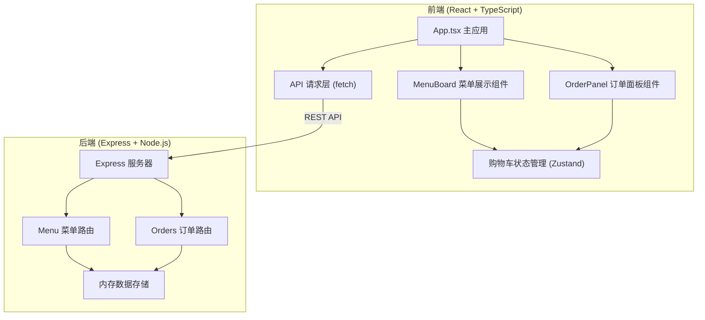
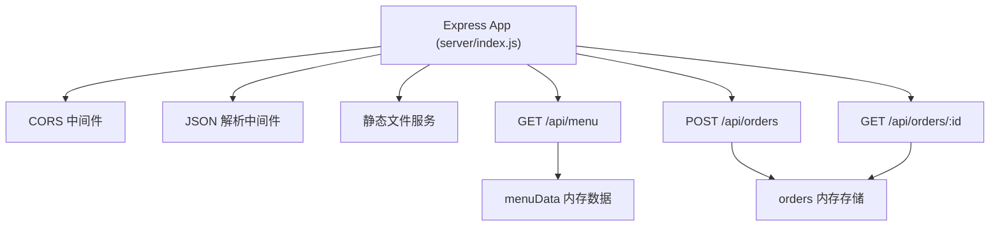
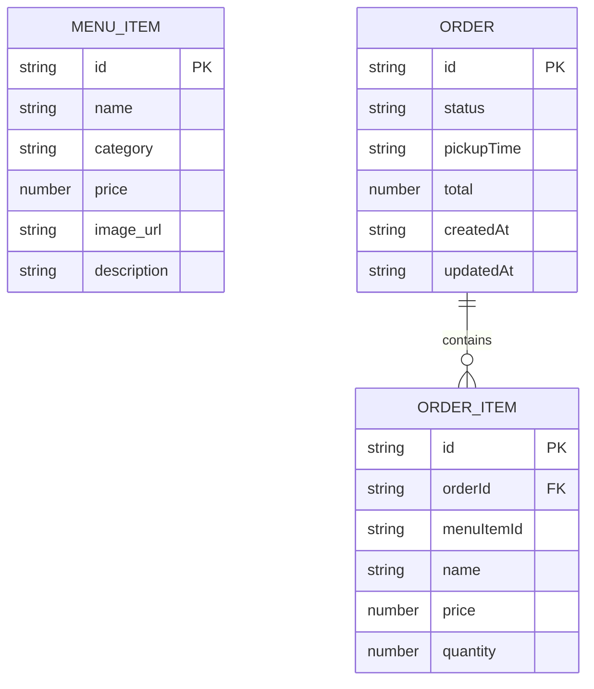

## 1. 架构设计



## 2. 技术选型说明

- **前端框架**：React 18 + TypeScript
- **构建工具**：Vite
- **样式方案**：CSS Modules + CSS 变量
- **状态管理**：Zustand（轻量级，适合购物车状态）
- **后端框架**：Express 4
- **数据存储**：内存存储（开发演示用）
- **通信方式**：RESTful API
- **图标库**：lucide-react

## 3. 路由定义

| 路由路径 | 页面/组件 | 说明 |
|----------|-----------|------|
| / | App.tsx | 主应用，菜单浏览 + 购物车 + 订单追踪 |

## 4. API 定义

### 4.1 获取菜单列表

```typescript
// GET /api/menu
interface MenuItem {
  id: string;
  name: string;
  category: 'iced' | 'hot' | 'light';
  price: number;
  image_url: string;
  description?: string;
}

// Response: MenuItem[]
```

### 4.2 创建订单

```typescript
// POST /api/orders
interface OrderItem {
  menuItemId: string;
  name: string;
  price: number;
  quantity: number;
}

interface CreateOrderRequest {
  items: OrderItem[];
  pickupTime: string;
  total: number;
}

interface CreateOrderResponse {
  id: string;
  status: 'submitted' | 'preparing' | 'ready' | 'completed';
  pickupTime: string;
  createdAt: string;
}
```

### 4.3 查询订单状态

```typescript
// GET /api/orders/:id
interface OrderStatusResponse {
  id: string;
  status: 'submitted' | 'preparing' | 'ready' | 'completed';
  items: OrderItem[];
  pickupTime: string;
  total: number;
  createdAt: string;
  updatedAt: string;
}
```

## 5. 服务器架构图



## 6. 数据模型

### 6.1 数据模型定义



### 6.2 初始数据

菜单初始数据包含：
- 冰饮类：冰美式、冰拿铁、冰摩卡、冰焦糖玛奇朵
- 热饮类：热美式、热拿铁、热卡布奇诺、热巧克力
- 轻食类：牛角包、芝士蛋糕、提拉米苏、三明治

每个商品包含 id、name、category、price、image_url、description 字段。
