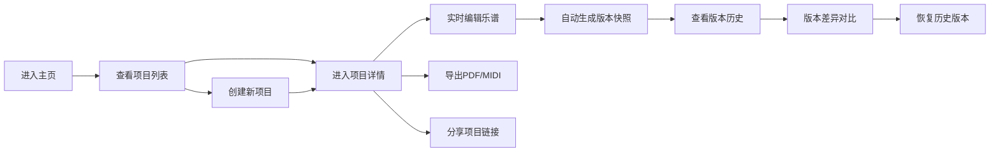

## 1. 产品概述

虚拟乐队协作平台 - 为小型独立乐团提供在线虚拟排练和作曲协作的全栈应用，解决线下排练场地难订、成员异地乐谱同步效率低、编曲版本管理混乱等痛点。

- 核心目标：让乐队成员无论身处何地都能实时协作创作和排练
- 目标用户：小型独立乐团、音乐爱好者、学生乐队
- 产品价值：打破地域限制，提升编曲协作效率，精细化版本管理

## 2. 核心功能

### 2.1 用户角色
| 角色 | 加入方式 | 核心权限 |
|------|----------|----------|
| 管理员 | 创建项目者默认为管理员 | 创建/编辑项目、管理成员权限、恢复版本、导出 |
| 编辑者 | 通过6位邀请码加入 | 编辑乐谱、查看版本、导出 |
| 查看者 | 权限设置 | 查看乐谱、查看版本历史 |

### 2.2 功能模块
1. **项目协作模块**：项目创建、项目列表展示、项目详情入口
2. **实时乐谱同步编辑模块**：五线谱/Tab谱编辑、实时同步、音符高亮
3. **版本记录与回溯模块**：自动快照、版本列表、差异对比、版本恢复
4. **成员在线状态模块**：在线成员展示、加入通知、权限标识
5. **导出与分享模块**：PDF/MIDI导出、项目链接分享

### 2.3 页面详情
| 页面名称 | 模块名称 | 功能描述 |
|-----------|-------------|---------------------|
| 主页 | 左侧导航栏 | 项目图标、创建按钮、版本历史按钮、用户头像 |
| 主页 | 项目网格 | 项目卡片展示、卡片入场动画、悬停效果、点击进入详情 |
| 主页 | 创建项目弹窗 | 项目名称、调性、BPM、乐器编制选择 |
| 项目详情页 | 谱表编辑区 | Canvas绘制五线谱、鼠标点击添加音符、实时同步 |
| 项目详情页 | 成员状态栏 | 在线头像排列、加入动画、权限提示 |
| 项目详情页 | 版本侧边栏 | 版本列表、时间倒序、差异对比、恢复按钮 |
| 项目详情页 | 导出分享栏 | 导出菜单、分享复制链接 |

## 3. 核心流程

### 3.1 主流程描述
用户进入主页 → 查看已有项目列表 → 创建新项目或进入已有项目 → 实时协作编辑乐谱 → 自动生成版本快照 → 对比/恢复历史版本 → 导出或分享项目

### 3.2 流程图

## 4. 用户界面设计

### 4.1 设计风格
- **整体风格**：暗色音乐工作室风格，专业且富有创意氛围
- **主背景色**：#1a1a2e（深蓝紫底色）
- **次要背景色**：#16213e（稍亮深蓝）
- **强调色**：#e94560（红色系，用于按钮和不可逆操作）
- **辅助色**：#0f3460（深蓝，用于卡片背景）
- **文字主色**：#e1e1e1（浅米白）
- **链接色**：#00b4d8（亮蓝，悬停加深至#0096c7）
- **按钮反馈**：点击缩放至95%保持0.1秒再回弹
- **卡片悬停**：向上偏移5px并加阴影
- **动画缓动**：cubic-bezier(0.25, 0.1, 0.25, 1)
- **字体选择**：现代无衬线字体，数字使用等宽字体以提升乐谱可读性

### 4.2 页面设计概览
| 页面名称 | 模块名称 | UI元素 |
|-----------|-------------|---------|
| 主页 | 左侧导航栏 | 100px宽深色背景、垂直排列图标、悬停半透明白色背景 |
| 主页 | 项目网格 | 响应式网格布局、卡片滑入动画、深灰到灰蓝渐变悬停 |
| 主页 | 创建弹窗 | 表单输入、下拉选择、多选用乐器图标 |
| 项目详情页 | 谱表编辑区 | Canvas深色背景、亮黄色五线谱线、白色音符圆点、水平滚动 |
| 项目详情页 | 成员头像 | 圆形头像排列、掉落入场动画、气泡提示 |
| 项目详情页 | 版本侧边栏 | 时间倒序列表、圆形头像缩略图、绿红差异高亮 |
| 项目详情页 | 导出分享 | 二级菜单、旋转加载动画、复制成功勾号动画 |

### 4.3 响应式设计
- **桌面端**：左导航栏(100px) + 主内容区，谱表占70%高度，版本栏占30%宽度
- **移动端(768px以下)**：顶部导航栏(50px高)，项目网格单列，谱表全屏，版本列表折叠为底部可上拉面板
- **触摸优化**：加大点击区域，支持拖拽操作

### 4.4 动画与交互
- 项目卡片入场：从左侧横向滑入并轻微上浮（0.4秒缓动）
- 项目详情展开：从底部向上展开（0.35秒弹性动画）
- 新成员加入：头像从上方掉落入场（0.3秒弹性动画）+ 气泡提示
- 音符修改高亮：淡黄色闪烁（0.2秒）
- 版本差异：绿红高亮保持3秒后渐隐（0.8秒缓动）
- 恢复确认弹窗：中心扩散毛玻璃遮罩 + 底部滑入弹窗（0.3秒缓动）
- 全局过渡：不超过0.4秒，统一缓动曲线
