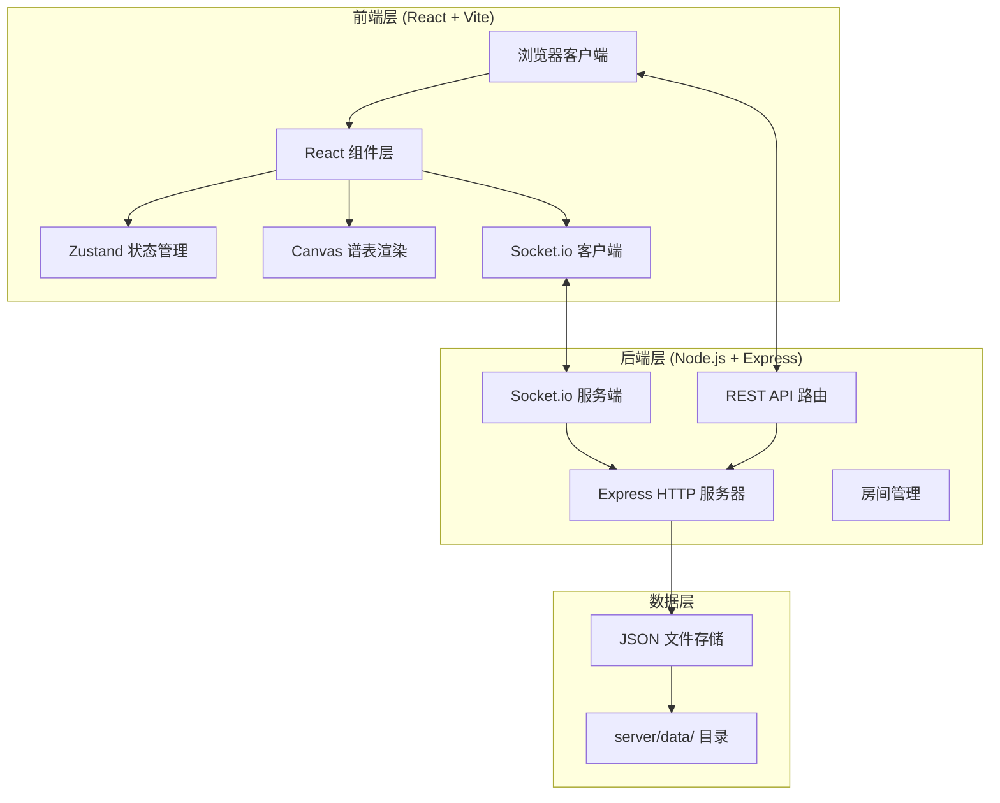
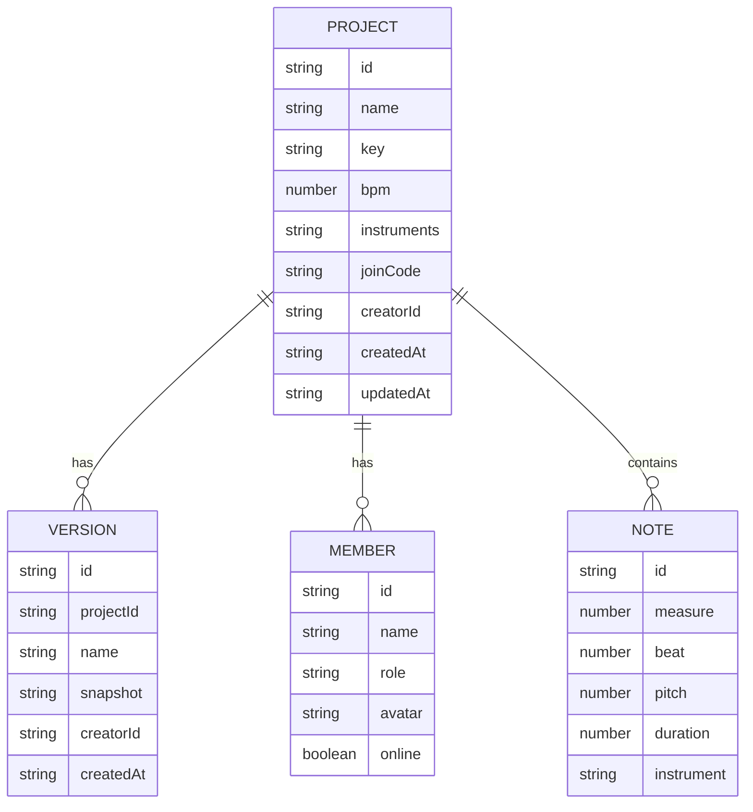

## 1. 架构设计

### 1.1 系统架构图


## 2. 技术描述

### 2.1 前端技术栈
- **框架**: React 18 + TypeScript
- **构建工具**: Vite 5
- **状态管理**: Zustand 4
- **路由**: React Router DOM 6
- **实时通信**: Socket.io Client 4
- **HTTP请求**: Axios
- **动画**: CSS Transitions + Keyframes
- **图标**: Lucide React
- **样式**: TailwindCSS 3 + CSS Variables

### 2.2 后端技术栈
- **框架**: Express 4
- **实时通信**: Socket.io 4
- **工具库**: uuid, cors, multer
- **数据存储**: 文件系统 JSON 文件
- **语言**: TypeScript

### 2.3 开发工具
- **并发启动**: concurrently
- **代码规范**: TypeScript 严格模式

## 3. 路由定义

### 3.1 前端路由
| 路由 | 页面 | 说明 |
|------|------|------|
| / | 主页 | 项目列表、创建项目 |
| /project/:id | 项目详情页 | 谱表编辑、版本管理、成员状态 |

### 3.2 后端 API 路由
| 方法 | 路径 | 说明 |
|------|------|------|
| POST | /api/projects | 创建新项目 |
| GET | /api/projects | 获取项目列表 |
| GET | /api/projects/:id | 获取项目详情 |
| POST | /api/projects/:id/versions | 创建版本快照 |
| GET | /api/projects/:id/versions | 获取版本列表 |
| POST | /api/projects/:id/join | 加入项目房间 |
| GET | /api/projects/:id/export | 导出文件 (pdf/midi) |

### 3.3 Socket.io 事件
| 事件名 | 方向 | 说明 |
|--------|------|------|
| join-room | 客户端→服务端 | 加入项目房间 |
| leave-room | 客户端→服务端 | 离开项目房间 |
| note-change | 客户端→服务端 | 音符变更 |
| note-change-broadcast | 服务端→客户端 | 广播音符变更 |
| member-join | 服务端→客户端 | 新成员加入通知 |
| member-leave | 服务端→客户端 | 成员离开通知 |
| version-create | 服务端→客户端 | 新版本创建通知 |
| project-create | 服务端→客户端 | 新项目创建广播 |

## 4. 数据模型

### 4.1 数据模型定义


### 4.2 数据文件结构
```
server/data/
├── projects.json          # 所有项目元数据
├── projects/
│   ├── {projectId}.json   # 项目详情与音符数据
│   └── {projectId}/
│       └── versions/      # 版本快照目录
│           ├── {versionId}.json
```

## 5. 目录结构

### 5.1 完整目录树
```
auto79/
├── package.json
├── vite.config.ts
├── tsconfig.json
├── tsconfig.node.json
├── index.html
├── tailwind.config.js
├── postcss.config.js
├── src/
│   ├── client/
│   │   ├── main.tsx
│   │   ├── App.tsx
│   │   ├── pages/
│   │   │   ├── HomePage.tsx
│   │   │   └── ProjectPage.tsx
│   │   ├── components/
│   │   │   ├── Sidebar.tsx
│   │   │   ├── ProjectCard.tsx
│   │   │   ├── CreateProjectModal.tsx
│   │   │   ├── SheetCanvas.tsx
│   │   │   ├── MemberList.tsx
│   │   │   ├── VersionList.tsx
│   │   │   ├── ExportMenu.tsx
│   │   │   └── ShareButton.tsx
│   │   ├── store/
│   │   │   ├── useProjectStore.ts
│   │   │   └── useSocketStore.ts
│   │   ├── hooks/
│   │   │   ├── useSocket.ts
│   │   │   └── useCanvas.ts
│   │   ├── utils/
│   │   │   ├── api.ts
│   │   │   ├── sheetUtils.ts
│   │   │   └── animationUtils.ts
│   │   ├── types/
│   │   │   └── index.ts
│   │   └── styles/
│   │       └── globals.css
│   └── server/
│       ├── index.ts
│       ├── socket.ts
│       ├── routes/
│       │   ├── projects.ts
│       │   └── versions.ts
│       ├── utils/
│       │   ├── fileStore.ts
│       │   └── exportUtils.ts
│       └── types/
│           └── index.ts
└── server/
    └── data/
        └── projects.json
```

## 6. 关键技术实现

### 6.1 Canvas 五线谱渲染
- 使用 Canvas 2D API 绘制五线谱和音符
- 支持水平滚动，每页显示4小节
- 深色背景配亮黄色五线谱线，白色音符圆点
- 每次音符添加后重绘响应 < 100ms

### 6.2 WebSocket 实时同步
- 使用 Socket.io 房间机制管理项目协作
- 音符变更通过 WebSocket 推送到房间内所有成员
- 延迟控制在 300ms 以内
- 新成员加入自动同步当前谱表状态

### 6.3 版本管理
- 每次编辑后自动生成快照版本
- 版本名称格式：项目名_v序号_年月日_时分
- 差异对比使用绿（新增）红（删除）高亮
- 版本恢复平滑过渡动画（0.5秒淡入）

### 6.4 响应式布局
- 桌面端：左侧导航 + 主内容区 + 右侧版本栏
- 移动端：顶部导航 + 单列网格 + 底部上拉面板
- 使用 CSS Media Queries + 状态判断切换布局

### 6.5 动画系统
- 统一缓动曲线：cubic-bezier(0.25, 0.1, 0.25, 1)
- 卡片入场：translateX + translateY + opacity
- 弹窗动画：scale + translateY + backdrop-blur
- 差异高亮：background-color 渐变过渡
