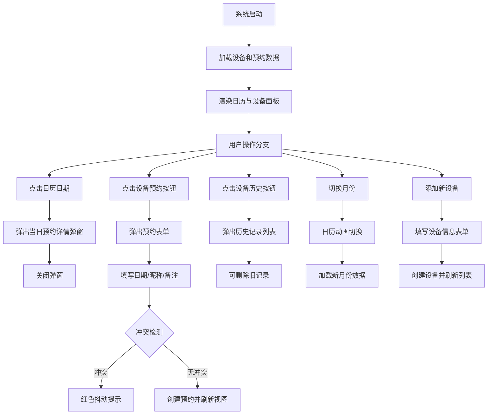

## 1. 产品概述

家庭设备共享日历与借还管理系统，用于家庭成员之间登记、预约和借用家用设备（如吸尘器、电钻、烧烤架等），记录借用历史和设备状态。

- 解决家庭共用设备借用混乱、时间冲突、状态不透明的问题，面向所有家庭成员
- 通过可视化日历+设备面板，实现家庭资源有序管理，提升家庭生活效率

## 2. 核心功能

### 2.1 用户角色

| 角色 | 注册方式 | 核心权限 |
|------|----------|----------|
| 家庭成员 | 输入昵称登记 | 浏览设备、创建预约、查看历史、删除旧记录 |

### 2.2 功能模块

1. **主应用页面**：日历视图 + 设备面板双栏布局，全局状态管理，API数据交互
2. **日历视图模块**：月历网格展示、预约标记、日期详情弹窗
3. **设备管理面板**：设备列表展示、状态标识、添加设备、筛选、预约表单、历史记录
4. **预约管理**：创建预约、冲突检测、删除预约、即时刷新

### 2.3 页面详情

| 页面名称 | 模块名称 | 功能描述 |
|----------|----------|----------|
| 主页面 | 顶部导航栏 | 显示系统标题、当前月份切换、移动端面板切换按钮 |
| 主页面 | 日历网格视图 | 月历展示，每日格子显示预约设备图标与数量刻度条，支持月份切换动画 |
| 主页面 | 日期详情弹窗 | 点击日期弹出当日所有预约列表（用户、设备、备注），淡入缩放动画 |
| 主页面 | 设备管理面板 | 右侧固定面板，磨砂玻璃背景，设备卡片2列网格，支持添加新设备与筛选 |
| 主页面 | 设备卡片 | 显示设备名称、图标、状态圆点、下次空闲日期，悬停上浮阴影，显示历史/预约按钮 |
| 主页面 | 预约表单弹窗 | 选择未来7天内日期，输入昵称与备注，冲突检测抖动提示，提交即更新视图 |
| 主页面 | 历史记录弹窗 | 展示设备过去所有借用记录列表，交错淡入动画，旧记录可删除 |

## 3. 核心流程

用户打开系统后，日历视图自动加载当前月份预约数据，设备面板展示所有设备。用户可：
1. 浏览日历 → 点击某日查看当日预约详情 → 关闭弹窗
2. 浏览设备面板 → 点击某设备「预约」→ 填写日期/昵称/备注 → 系统检测冲突 → 成功创建或冲突提示 → 视图即时刷新
3. 浏览设备面板 → 点击某设备「历史」→ 查看历史记录列表 → 删除旧记录（仅当前日期之前）
4. 切换月份 → 日历动画切换 → 加载对应月份预约数据
5. 添加新设备 → 填写名称/图标/状态 → 设备列表即时更新

## 4. 用户界面设计

### 4.1 设计风格

- **主色调**：暖木色（#8B6914、#D4A574、#F5E6D3）与淡绿色（#7CB342、#AED581、#E8F5E9）搭配，营造温馨家庭感
- **辅助色**：状态色 - 绿色可用（#4CAF50）、橙色借用中（#FF9800）、红色维修中（#F44336）
- **按钮风格**：圆角矩形（border-radius: 12px），柔和阴影（box-shadow: 0 4px 12px rgba(0,0,0,0.1)），弹性过渡
- **字体**：标题使用「思源宋体」或「Noto Serif SC」体现温暖感，正文使用「Noto Sans SC」提升可读性
- **布局风格**：桌面端双栏布局（左侧日历70% + 右侧面板30%），卡片式设计，大量圆角与柔和阴影
- **图标风格**：使用 Emoji 图标体现设备类型，简洁直观

### 4.2 页面设计概述

| 页面名称 | 模块名称 | UI元素 |
|----------|----------|--------|
| 主页面 | 日历网格 | 6x7网格布局，细圆角边框，浅阴影，日期格子悬停背景变为淡绿色，预约标记为小图标+彩色刻度条 |
| 主页面 | 设备面板 | 右侧固定宽度，backdrop-filter: blur(20px)磨砂玻璃，半透明白色背景，2列卡片网格 |
| 主页面 | 设备卡片 | 圆角16px，状态彩色圆点（绿/橙/红），悬停transform: translateY(-4px)加深阴影 |
| 主页面 | 弹窗 | 固定居中，从scale(0.8) opacity(0)缩放到scale(1) opacity(1)，背景半透明遮罩，圆角20px |
| 主页面 | 表单输入 | 圆角8px，浅木色边框，focus时淡绿色高亮，0.3s过渡 |
| 主页面 | 动画过渡 | 统一使用 cubic-bezier(0.34, 1.56, 0.64, 1) 弹性曲线，时长0.3s |

### 4.3 响应式设计

- **桌面端（≥1024px）**：左侧日历 + 右侧固定面板双栏布局
- **平板端（768px-1023px）**：单列布局，日历在上，设备面板在下，日历格子缩小为紧凑形式
- **移动端（<768px）**：单列布局，日历紧凑显示，设备面板变为底部滑入抽屉（点击按钮从底部slide-up），触控目标≥44x44px
- **月份切换动画**：使用translateX + opacity实现滑动淡入，总时长≤500ms

### 4.4 性能指标

- 日历切换月份动画：≤500ms完成
- 数据渲染延迟：≤200ms
- 预约冲突检测响应：≤100ms
