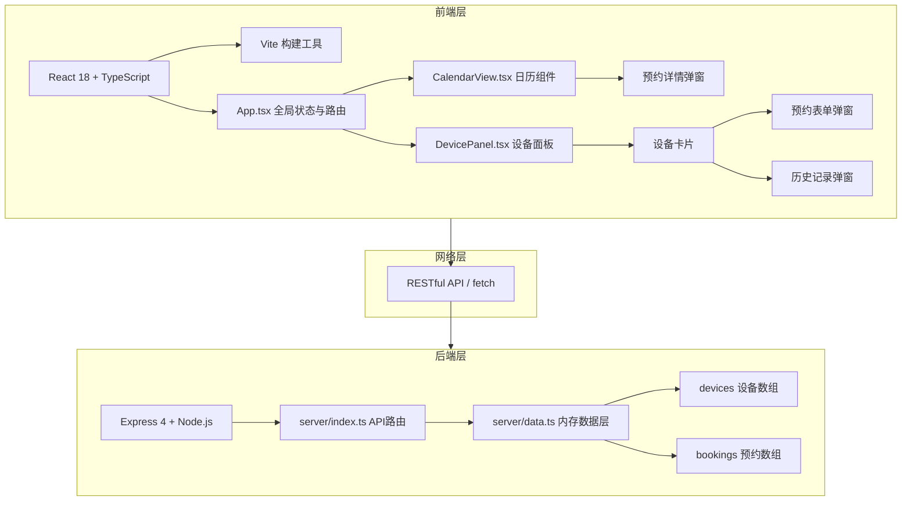
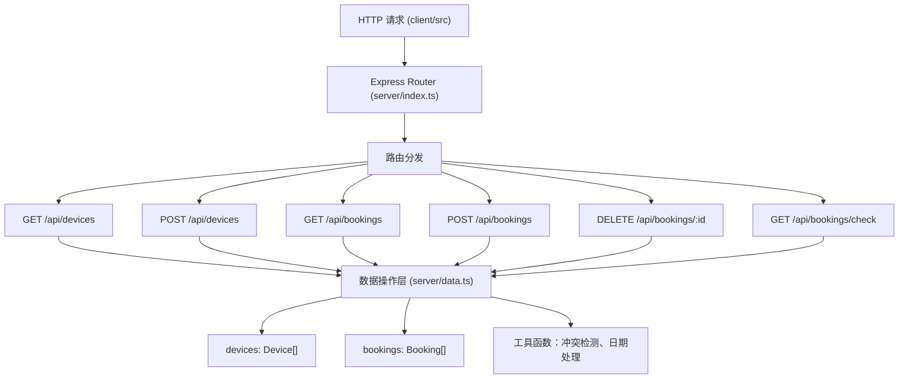
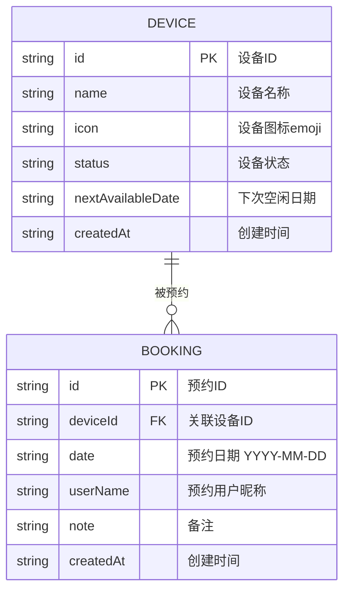

## 1. 架构设计



## 2. 技术描述

- **前端框架**：React 18 + TypeScript 5.x
- **构建工具**：Vite 5.x + @vitejs/plugin-react
- **后端框架**：Express 4.x
- **数据存储**：内存数组（server/data.ts），使用 uuid 生成唯一标识
- **开发模式**：Vite 前端开发服务器 + 后端代理（proxy 到 3001 端口）
- **样式方案**：纯 CSS（CSS Modules/内联样式），使用 CSS 变量管理主题色

## 3. 路由定义

| 路由（前端） | 用途 |
|-------|---------|
| / | 主应用页面（日历+设备面板单页应用，无多路由） |

## 4. API 定义

### 4.1 设备相关接口

| 方法 | 路径 | 功能 | 请求体 | 响应 |
|------|------|------|--------|------|
| GET | /api/devices | 获取所有设备列表 | - | `Device[]` |
| POST | /api/devices | 添加新设备 | `{ name: string, icon: string, status: 'available' \| 'borrowed' \| 'maintenance' }` | `Device` |
| GET | /api/devices/:id/history | 获取设备历史记录 | - | `Booking[]` |
| DELETE | /api/bookings/:bookingId | 删除预约记录（仅历史） | - | `{ success: boolean }` |

### 4.2 预约相关接口

| 方法 | 路径 | 功能 | 请求体 | 响应 |
|------|------|------|--------|------|
| GET | /api/bookings | 获取预约列表（可按月筛选 ?year=&month=） | - | `Booking[]` |
| POST | /api/bookings | 创建预约（自动冲突检测） | `{ deviceId: string, date: string, userName: string, note?: string }` | `Booking` 或 `{ error: string, conflict: Booking }` |
| DELETE | /api/bookings/:id | 删除预约 | - | `{ success: boolean }` |
| GET | /api/bookings/check | 检测预约冲突 | Query: `deviceId, date` | `{ conflict: boolean, booking?: Booking }` |

### 4.3 TypeScript 类型定义

```typescript
type DeviceStatus = 'available' | 'borrowed' | 'maintenance';

interface Device {
  id: string;
  name: string;
  icon: string;
  status: DeviceStatus;
  nextAvailableDate: string | null;
  createdAt: string;
}

interface Booking {
  id: string;
  deviceId: string;
  date: string; // YYYY-MM-DD
  userName: string;
  note: string;
  createdAt: string;
}

// 扩展：带设备信息的预约
interface BookingWithDevice extends Booking {
  device: Device;
}
```

## 5. 服务端架构图



## 6. 数据模型

### 6.1 数据模型ER图



### 6.2 初始化模拟数据

```typescript
// server/data.ts 初始数据
const initialDevices = [
  { id: uuid(), name: '吸尘器', icon: '🧹', status: 'available', nextAvailableDate: null },
  { id: uuid(), name: '电钻', icon: '🔩', status: 'borrowed', nextAvailableDate: '2026-06-18' },
  { id: uuid(), name: '烧烤架', icon: '🔥', status: 'available', nextAvailableDate: null },
  { id: uuid(), name: '投影仪', icon: '📽️', status: 'maintenance', nextAvailableDate: '2026-06-20' },
  { id: uuid(), name: '咖啡机', icon: '☕', status: 'available', nextAvailableDate: null },
  { id: uuid(), name: '电动螺丝刀', icon: '🪛', status: 'available', nextAvailableDate: null },
];

const initialBookings = [
  { id: uuid(), deviceId: '...', date: '2026-06-16', userName: '爸爸', note: '清理客厅地毯' },
  { id: uuid(), deviceId: '...', date: '2026-06-17', userName: '妈妈', note: '组装新柜子' },
  // ... 更多模拟数据
];
```
